# 🔐 Vault Service - Complete Architectural Documentation

**Version:** 1.0.0  
**Generated:** January 8, 2026  
**Author:** Architectural Auditor

---

## 📋 Table of Contents

1. [Project Overview](#project-overview)
2. [Architectural Philosophy](#architectural-philosophy)
3. [System Architecture](#system-architecture)
4. [Domain Layer Deep Dive](#domain-layer-deep-dive)
5. [Infrastructure Layer](#infrastructure-layer)
6. [Complete Flow Analysis](#complete-flow-analysis)
7. [Dependency Graph](#dependency-graph)
8. [Configuration Management](#configuration-management)
9. [Security & Compliance](#security--compliance)
10. [Operational Patterns](#operational-patterns)

---

## 1. Project Overview

### 1.1 What is Vault?

**Vault** is a **production-grade cryptographic key management service** built with Node.js that provides:

- **RSA Key Pair Generation** (2048-bit modulus)
- **JWT Signing** with RS256 algorithm
- **Automated Key Rotation** with atomic transactions
- **JWKS Endpoint** for public key distribution
- **Metadata Management** with origin/archive separation
- **Distributed Locking** via Redis for concurrent safety
- **TTL-based Key Cleanup** for security hygiene

### 1.2 Technology Stack

```json
{
  "runtime": "Node.js (ES Modules)",
  "framework": "Fastify",
  "database": "MongoDB (Mongoose)",
  "cache": "Redis (ioredis)",
  "crypto": "Node.js WebCrypto API",
  "jwt": "jose + jsonwebtoken",
  "architecture": "Domain-Driven Design (DDD)"
}
```

### 1.3 Key Metrics

- **Domains**: Multi-tenant architecture (each domain isolated)
- **Key Lifetime**: 30 days public TTL + 2-day grace period
- **Rotation Intervals**: 1, 7, 30, 90, 180, or 365 days
- **Max Payload Size**: 4 KB per JWT
- **Lock TTL**: 5 minutes per rotation operation

---

## 2. Architectural Philosophy

### 2.1 Clean Architecture Layers

The project follows **strict layering** enforced by architectural rules:

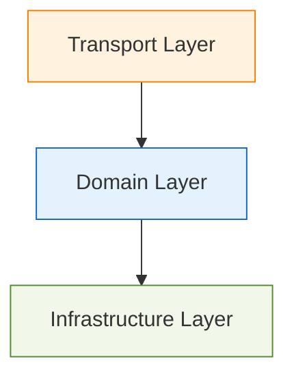

### 2.2 The Sacred Rules (from ARCHITECTURE_RULES.md)

#### ✅ **Allowed Dependencies**

- Transport → Domain (thin adapters)
- Infrastructure → Domain (implements interfaces)
- Domain → Core (low-level utilities)

#### ❌ **Forbidden Dependencies (RED LINE VIOLATIONS)**

- Domain → Infrastructure (NEVER!)
- Domain → Transport (NEVER!)
- Infrastructure → Transport (NEVER!)

#### ⚠️ **Warning: Cross-Domain Coupling**

Sibling domains should minimize direct imports. Use event-driven or shared interfaces instead.

### 2.3 Dependency Injection Pattern

All infrastructure is **injected into domain objects** via:

- Factory Functions
- Constructor Injection
- Resolver Pattern (lazy loading)

**Example:**

```javascript
// ✅ CORRECT: Infrastructure injected
const signer = new Signer(cache, keyResolver, cryptoEngine);

// ❌ WRONG: Domain importing infrastructure directly
// import redis from '../../infrastructure/cache/redisClient.js'
```

---

## 3. System Architecture

### 3.1 High-Level Component Diagram

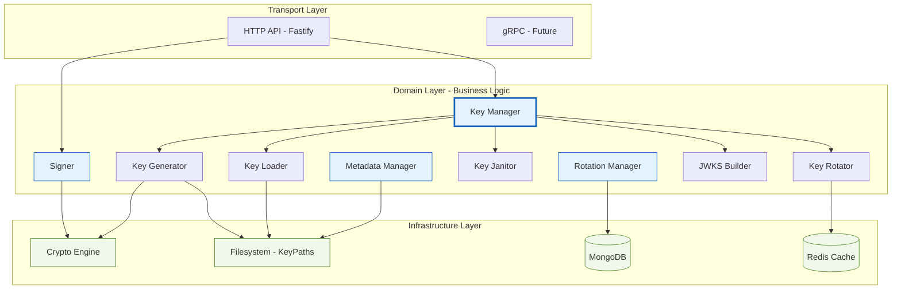

### 3.2 Directory Structure Analysis

```
src/
├── config/                    # Pure configuration (no logic)
│   ├── envConfig.js          # Environment variable loader
│   ├── keys.js               # TTL constants (30d + 2d grace)
│   └── rotationConfig.js     # Retry limits & defaults
│
├── domain/                   # 🧠 CORE BUSINESS LOGIC (Infrastructure-free)
│   ├── key-manager/          # Orchestrates entire key lifecycle
│   │   ├── KeyManager.js     # Main facade
│   │   ├── KeyLoader.js      # Reads keys from filesystem
│   │   ├── KeyJanitor.js     # Cleanup & deletion singleton
│   │   ├── generator/        # Key generation subdomain
│   │   │   ├── RSAKeyGenerator.js
│   │   │   ├── KeyWriter.js
│   │   │   └── DirManager.js
│   │   ├── builder/          # JWKS construction
│   │   │   └── JWKSBuilder.js
│   │   ├── keyRotator/       # Atomic rotation logic
│   │   │   └── rotator.js
│   │   └── loader/           # Key resolution
│   │
│   ├── signer/               # JWT signing domain
│   │   └── Signer.js         # Sign with active KID
│   │
│   ├── metadata-manager/     # Metadata CRUD
│   │   ├── MetadataService.js
│   │   ├── metaBuilder.js
│   │   └── metaFileStore.js
│   │
│   ├── rotation-manager/     # Scheduled rotations
│   │   └── RotationManager.js
│   │
│   └── state/                # In-memory state management
│       ├── ActiveKIDState.js
│       └── RotationState.js
│
├── infrastructure/           # 🛠️ TECHNICAL IMPLEMENTATIONS
│   ├── crypto/
│   │   └── engine/
│   │       ├── CryptoEngine.js    # WebCrypto wrapper
│   │       ├── KIDFactory.js      # KID generation
│   │       └── tokenBuilder.js    # JWT assembly
│   ├── filesystem/
│   │   └── KeyPaths.js            # Path computation
│   ├── cache/
│   │   ├── redisClient.js
│   │   └── rotationLockRepo.js    # Distributed locks
│   ├── db/
│   │   ├── mongoClient.js
│   │   ├── models/
│   │   │   └── RotationPolicy.model.js
│   │   └── repositories/
│   │       └── rotationPolicy.repo.js
│   └── logging/
│       └── logger.js
│
├── transport/                # API Layer (thin)
│   └── http/
│       └── index.js          # Fastify routes (skeleton)
│
└── utils/                    # Shared utilities
    ├── cache.js              # In-memory Map wrapper
    └── normalizer.js         # Domain name normalization
```

---

## 4. Domain Layer Deep Dive

### 4.1 Key Manager Domain

#### 4.1.1 KeyManager.js - The Orchestrator

**Responsibilities:**

- Facade for all key operations
- Delegates to specialized workers
- Provides admin & cron entry points

**Key Methods:**

```javascript
class KeyManager {
  // --- USER-FACING API ---
  async sign(domain, payload, opts)       // Delegate to Signer
  async getJwks(domain)                   // Delegate to Builder
  async getPublicKey(domain, kid)         // Delegate to Loader

  // --- ADMIN API ---
  async initialSetup(domain)              // First-time domain onboarding
  async rotate(domain)                    // Manual rotation trigger

  // --- CRON API ---
  async scheduleRotation()                // Automated rotation entry
}
```

**Dependency Injection Pattern:**

```javascript
constructor({
  loader, // KeyLoader instance
  generator, // KeyPairGenerator instance
  janitor, // KeyJanitor singleton
  builder, // JWKSBuilder instance
  signer, // Signer instance
  keyRotator, // Rotator instance
  rotationScheduler, // RotationManager instance
  metadataManager, // MetadataService instance
  configState, // RotationState object
});
```

---

#### 4.1.2 KeyLoader.js - Filesystem Reader

**Purpose:** Load keys from disk with in-memory caching

**Architecture:**

```mermaid
classDiagram
    class KeyLoader {
        -domain: string
        -activeKid: string
        -cache: {private, public}

        +setActiveKid(kid)
        +getActiveKid()
        +loadPrivateKey(kid)
        +loadPublicKey(kid)
        +getAllPublicKids()
        +getAllPrivateKids()
        +getSigningKey()
        +getPublicKeyMap()
        +deletePrivateKey(kid)
        +deletePublicKey(kid)
        +clearCache()
    }

    KeyLoader --> KeyPaths : uses
    KeyLoader --> Cache : composition
```

**Key Features:**

1. **Domain Isolation**: Each instance bound to single domain
2. **Dual Cache**: Separate caches for private/public keys
3. **Active KID Tracking**: In-memory pointer to current signing key
4. **Lazy Loading**: Keys loaded on first access
5. **Cache Invalidation**: Manual clearing after deletions

**Filesystem Layout:**

```
storage/keys/
└── {DOMAIN}/
    ├── private/
    │   └── {KID}.pem    (Mode: 0600 - Owner only)
    └── public/
        └── {KID}.pem    (Mode: 0644 - World readable)
```

---

#### 4.1.3 KeyJanitor.js - Cleanup Specialist (Singleton)

**Pattern:** Singleton with instance token protection

**Core Responsibilities:**

```javascript
async retirePrivateKey(domain, kid)      // Delete private key only
async deletePublicKey(domain, kid)       // Delete public + clear JWKS cache
async addKeyExpiry(domain, kid)          // Archive with TTL (30d + 2d grace)
async deleteOriginMetadata(domain, kid)  // Remove origin file
async deleteArchivedMetadata(kid)        // Remove archive file
async deleteExpiredKeys()                // Cron job: cleanup TTL-expired keys
```

**Lifecycle Hook:**

```javascript
// Janitor needs access to KeyManager's resolvers
keyJanitor.init(keyManager);
```

**Expiry Flow:**

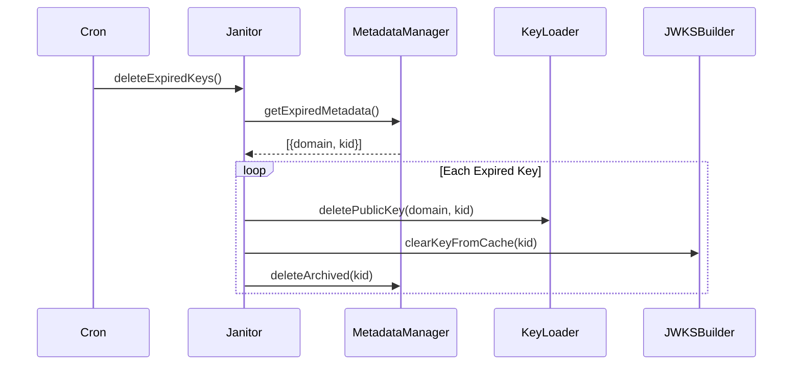

---

#### 4.1.4 Key Generator Subdomain

##### RSAKeyGenerator.js (KeyPairGenerator)

**Dependencies:**

- `cryptoEngine` - For actual key generation
- `metadataManager` - To record creation time
- `keyWriter` - To persist keys
- `dirManager` - To ensure directories exist

**Generation Flow:**

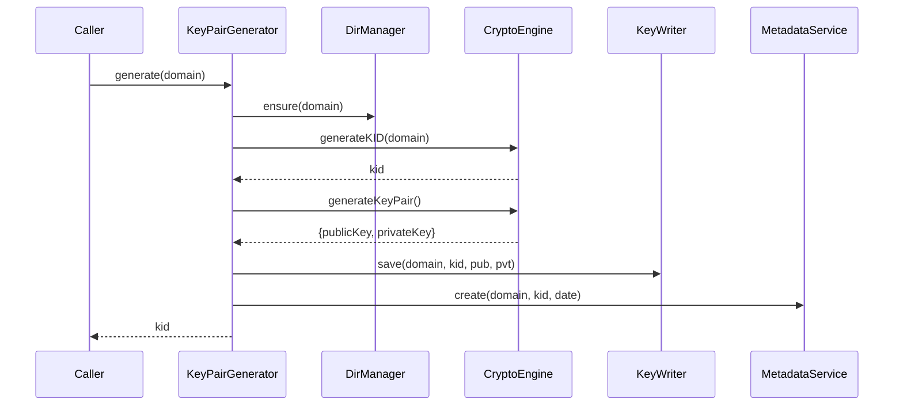

---

#### 4.1.5 JWKS Builder Subdomain

**Purpose:** Convert PEM keys → JWK format for `.well-known/jwks.json`

```javascript
class Builder {
  async getJWKS(domain) {
    const publicKeys = await loader.getPubKeyMap(domain); // kid → pem

    const keys = [];
    for (const [kid, pem] of Object.entries(publicKeys)) {
      keys.push(await this.#toJWK(kid, pem)); // Cache JWK
    }
    return { keys };
  }
}
```

**JWK Structure:**

```json
{
  "keys": [
    {
      "kty": "RSA",
      "kid": "AUTH-20260108-143022-A7F3C9D1",
      "use": "sig",
      "alg": "RS256",
      "n": "...", // Modulus (Base64)
      "e": "AQAB" // Exponent
    }
  ]
}
```

---

#### 4.1.6 Key Rotator Subdomain

**File:** [rotator.js](src/domain/key-manager/keyRotator/rotator.js)

**Pattern:** 3-Phase Atomic Rotation

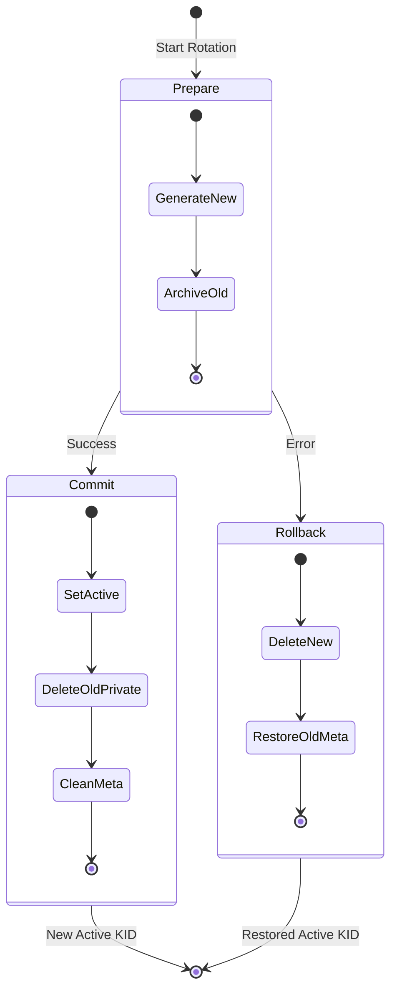

**Implementation:**

```javascript
class Rotator {
  async rotateKeys(domain, updateRotationDatesCB, session) {
    // Acquire distributed lock (Redis)
    const token = await this.lockRepo.acquire(domain, 300);
    if (!token) return null; // Already rotating

    try {
      // Phase 1: Prepare
      await this.#prepareRotation(domain);

      // Phase 2: DB Transaction
      session.startTransaction();
      await updateRotationDatesCB(session); // Update rotatedAt, nextRotationAt

      // Phase 3: Commit
      const newKid = await this.#commitRotation(domain);

      await session.commitTransaction();
      return newKid;
    } catch (err) {
      // Rollback on ANY error
      await this.#rollbackRotation(domain);
      await session.abortTransaction();
      console.error(`Rotation failed for ${domain}`, err);
      return null;
    } finally {
      await this.lockRepo.release(domain, token);
      session.endSession();
    }
  }
}
```

**Phase Details:**

| Phase        | Actions                                                                                                                           | State Changes                                                       |
| ------------ | --------------------------------------------------------------------------------------------------------------------------------- | ------------------------------------------------------------------- |
| **Prepare**  | 1. Generate new key pair<br>2. Store `#upcomingKid`<br>3. Archive current active key with TTL                                     | `upcoming = newKid`<br>`archived[oldKid] = TTL`                     |
| **Commit**   | 1. Store `#previousKid`<br>2. Set `upcoming` as active<br>3. Delete previous private key<br>4. Delete origin metadata for old KID | `active = upcoming`<br>`upcoming = null`<br>`deleted: oldPrivate`   |
| **Rollback** | 1. Delete upcoming keys (both)<br>2. Delete upcoming origin meta<br>3. Remove archive TTL for active key                          | `upcoming = null`<br>`active = unchanged`<br>`restored: activeMeta` |

---

### 4.2 Signer Domain

**File:** [Signer.js](src/domain/signer/Signer.js)

**Purpose:** Sign JWTs using the active private key

#### Key Characteristics

1. **Stateless**: No internal state except cache
2. **Cache-First**: Avoids redundant PEM → CryptoKey imports
3. **Validation Heavy**: Checks domain, payload, TTL
4. **Delegates Crypto**: All signing to `CryptoEngine`

#### Signing Flow

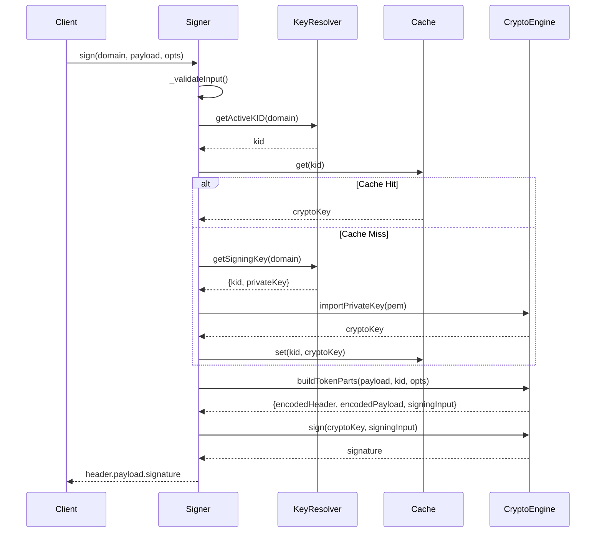

#### Configuration Options

```javascript
const signer = new Signer(cache, keyResolver, cryptoEngine, {
  defaultTTL: 30 * 24 * 60 * 60, // 30 days (default)
  maxPayloadBytes: 4096, // 4 KB limit
  logger: console,
});
```

#### Sign API

```javascript
await signer.sign(domain, payload, {
  ttlSeconds: 3600, // Override default TTL
  additionalClaims: {
    // Add extra JWT claims
    aud: "api.example.com",
    sub: "user123",
  },
});
```

**Generated JWT Claims:**

```json
{
  "iat": 1704672000,          // Issued At (auto)
  "exp": 1704675600,          // Expiration (iat + ttl)
  "aud": "api.example.com",   // Additional claim
  "sub": "user123",           // Additional claim
  ...payload                  // User payload merged
}
```

---

### 4.3 Metadata Manager Domain

**Files:**

- [MetadataService.js](src/domain/metadata-manager/MetadataService.js) - Business logic
- [metaBuilder.js](src/domain/metadata-manager/metaBuilder.js) - Object construction
- [metaFileStore.js](src/domain/metadata-manager/metaFileStore.js) - Filesystem I/O

#### Architecture Pattern

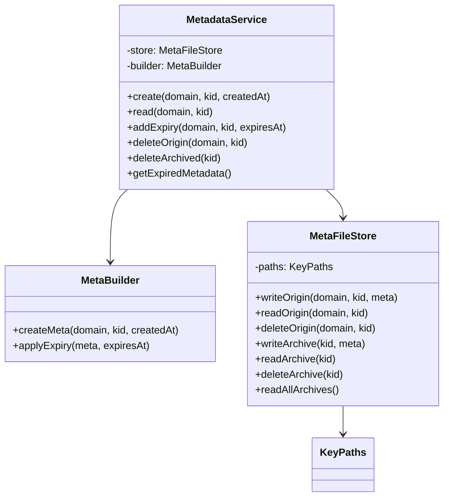

#### Metadata Structure

**Origin Metadata (Active Keys):**

```json
{
  "kid": "AUTH-20260108-143022-A7F3C9D1",
  "domain": "AUTH",
  "createdAt": "2026-01-08T14:30:22.000Z",
  "expiredAt": null
}
```

**Archived Metadata (Rotated Keys):**

```json
{
  "kid": "AUTH-20260107-091500-B3E4F8A2",
  "domain": "AUTH",
  "createdAt": "2026-01-07T09:15:00.000Z",
  "expiredAt": "2026-02-08T09:15:00.000Z" // 30d + 2d grace
}
```

#### Filesystem Layout

```
storage/metadata/keys/
├── {DOMAIN}/              # Origin metadata
│   └── {KID}.meta
└── archived/              # Archived metadata (with TTL)
    └── {KID}.meta
```

#### Expiry Detection

```javascript
// utils.js
export function isExpired(meta) {
  if (!meta.expiredAt) return false;
  return new Date(meta.expiredAt) < new Date();
}
```

---

### 4.4 Rotation Manager Domain

**File:** [RotationManager.js](src/domain/rotation-manager/RotationManager.js)

**Pattern:** Singleton with retry logic

#### Core Responsibilities

1. **Schedule Management**: Query DB for domains due for rotation
2. **Retry Orchestration**: Configurable retry with delays
3. **Summary Reporting**: Track success/failure/skipped
4. **Manual Triggers**: Admin API for immediate rotation

#### Configuration Constraints

```javascript
// Developer Constraints (IMMUTABLE)
const CONSTRAINTS = {
  retryIntervalMs: {
    min: 60_000, // 1 minute
    max: 3_600_000, // 1 hour
  },
  maxRetries: {
    min: 1,
    max: 10,
  },
};

// Runtime Defaults (MUTABLE)
let config = {
  retryIntervalMs: 300_000, // 5 minutes
  maxRetries: 3,
};
```

#### Rotation Flow (Scheduled)

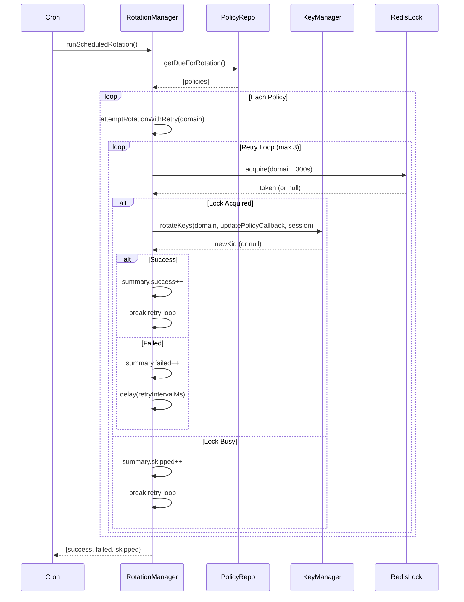

#### Retry Logic

```javascript
async attemptRotationWithRetry(domain, retries = this.maxRetries) {
  for (let attempt = 1; attempt <= retries; attempt++) {
    const result = await keyManager.rotateKeys(domain, /*...*/);

    if (result) return true; // Success

    if (attempt < retries) {
      await this.#delay(this.retryIntervalMs);
    }
  }
  return false; // All retries exhausted
}
```

---

### 4.5 State Management

#### 4.5.1 ActiveKIDState.js

**Purpose:** In-memory mapping of domain → activeKid

```javascript
class ActiveKidStore {
  map = new Cache(); // Map<domain, kid>

  async setActiveKid(domain, kid) {
    // Validate kid exists in filesystem
    const privateKids = await loader.getAllPrivateKids(domain);
    if (!privateKids.includes(kid)) {
      throw new Error("Cannot set active kid - private key missing");
    }

    this.map.set(domain, kid);
    return kid;
  }

  getActiveKid(domain) {
    return this.map.get(domain) ?? null;
  }
}
```

**Note:** This is **volatile** (lost on restart). Production systems should persist to Redis/DB.

#### 4.5.2 RotationState.js

**Purpose:** Runtime rotation configuration

```javascript
const RotationState = {
  // Mutable at runtime (via Admin API)
  retryIntervalMs: 300_000,
  maxRetries: 3,

  // Immutable constraints
  constraints: Object.freeze({
    retryInterval: { min: 60_000, max: 3_600_000 },
    maxRetries: { min: 1, max: 10 },
  }),
};
```

---

## 5. Infrastructure Layer

### 5.1 Crypto Infrastructure

#### 5.1.1 CryptoEngine.js

**Purpose:** Abstraction over Node.js WebCrypto API

**Key Methods:**

```javascript
class CryptoEngine {
  // KEY GENERATION
  async generateKeyPair()
    // → {publicKey: PEM, privateKey: PEM}

  // CONVERSION
  async pemToJWK(pem, kid)
    // → {kty, kid, use, alg, n, e}

  async importPrivateKey(pem)
    // → CryptoKey (for signing)

  // SIGNING
  async sign(cryptoKey, inputString)
    // → Base64URL signature

  // ID MANAGEMENT
  generateKID(domain)
    // → "DOMAIN-YYYYMMDD-HHMMSS-HEX"

  getInfo(kid)
    // → {domain, date, time, uniqueId}

  // TOKEN BUILDING
  buildTokenParts(payload, kid, options)
    // → {encodedHeader, encodedPayload, signingInput}
}
```

#### 5.1.2 KIDFactory.js

**Format:** `{DOMAIN}-{YYYYMMDD}-{HHMMSS}-{8_HEX_CHARS}`

**Example:** `AUTH-20260108-143022-A7F3C9D1`

**Benefits:**

1. **Globally Unique**: Domain + timestamp + randomness
2. **Sortable**: Chronological ordering built-in
3. **Self-Documenting**: Domain visible in KID
4. **Collision-Resistant**: 4 bytes of entropy (4.2B combinations)

**Implementation:**

```javascript
static generate(domain) {
  const now = new Date();

  const date = now.toISOString().slice(0, 10).replace(/-/g, '');
  const time =
    String(now.getHours()).padStart(2, '0') +
    String(now.getMinutes()).padStart(2, '0') +
    String(now.getSeconds()).padStart(2, '0');
  const hex = crypto.randomBytes(4).toString('hex').toUpperCase();

  return `${domain}-${date}-${time}-${hex}`;
}
```

#### 5.1.3 TokenBuilder.js

**Purpose:** Construct JWT parts before signing

**Flow:**

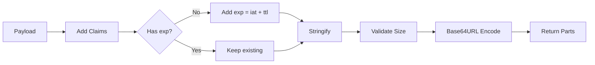

**Payload Processing:**

```javascript
static _createPayload(payload, options) {
  const now = Math.floor(Date.now() / 1000);
  const { ttlSeconds = 2592000, additionalClaims = {} } = options;

  const jwtPayload = {
    iat: now,
    ...additionalClaims,
    ...payload
  };

  if (!('exp' in jwtPayload)) {
    jwtPayload.exp = now + ttlSeconds;
  }

  return jwtPayload;
}
```

**Size Validation:**

```javascript
static _validateSize(jsonPayload, maxBytes = 4096) {
  const byteLen = Buffer.byteLength(jsonPayload);

  if (byteLen > maxBytes) {
    throw new Error(`Payload exceeds limit (${byteLen} > ${maxBytes})`);
  }
}
```

---

### 5.2 Filesystem Infrastructure

#### KeyPaths.js

**Purpose:** Centralized path computation

```javascript
const BASE_KEYS_DIR = "storage/keys";
const BASE_META_DIR = "storage/metadata/keys";

export const KeyPaths = {
  // Keys
  privateKey(domain, kid) {
    return `${BASE_KEYS_DIR}/${domain}/private/${kid}.pem`;
  },

  publicKey(domain, kid) {
    return `${BASE_KEYS_DIR}/${domain}/public/${kid}.pem`;
  },

  // Metadata
  metaKeyFile(domain, kid) {
    return `${BASE_META_DIR}/${domain}/${kid}.meta`;
  },

  metaArchivedKeyFile(kid) {
    return `${BASE_META_DIR}/archived/${kid}.meta`;
  },
};
```

**File Permissions:**

- Private keys: `0600` (owner read/write only)
- Public keys: `0644` (world readable)
- Metadata: `0644` (world readable)

---

### 5.3 Cache Infrastructure (Redis)

#### 5.3.1 redisClient.js

```javascript
import Redis from "ioredis";

const redis = new Redis({
  host: process.env.REDIS_HOST,
  port: process.env.REDIS_PORT,
  password: process.env.REDIS_PASSWORD,
});

redis.on("connect", () => logger.info("Redis connected"));
redis.on("error", (err) => logger.error("Redis error", err));

export default redis;
```

#### 5.3.2 rotationLockRepo.js

**Purpose:** Distributed locking for rotation operations

**Pattern:** Token-based locking with Lua script

```javascript
class RotationLockRepo {
  async acquire(domain, ttlSeconds) {
    const key = `rotation_lock:${domain}`;
    const token = crypto.randomUUID();

    // SET key value NX EX ttl
    const result = await redis.set(key, token, "NX", "EX", ttlSeconds);
    return result === "OK" ? token : null;
  }

  async release(domain, token) {
    const key = `rotation_lock:${domain}`;

    // Safe delete with Lua (atomic compare-and-delete)
    const script = `
      if redis.call("get", KEYS[1]) == ARGV[1]
      then return redis.call("del", KEYS[1])
      else return 0 end
    `;

    return await redis.eval(script, 1, key, token);
  }
}
```

**Why Lua Script?**

- Prevents race condition where lock expires between GET and DEL
- Ensures only the lock owner can release

---

### 5.4 Database Infrastructure (MongoDB)

#### 5.4.1 RotationPolicy.model.js

**Schema:**

```javascript
const rotationPolicySchema = new Schema(
  {
    domain: {
      type: String,
      required: true,
      unique: true,
    },

    rotationInterval: {
      type: Number,
      required: true,
      enum: [1, 7, 30, 90, 180, 365], // Days
    },

    rotatedAt: {
      type: Date,
      default: Date.now,
    },

    nextRotationAt: {
      type: Date,
      required: true,
    },

    enabled: {
      type: Boolean,
      default: true,
    },

    note: String,
  },
  { timestamps: true }
);
```

**Indexes:**

```javascript
// Efficient query for due rotations
rotationPolicySchema.index({ nextRotationAt: 1, enabled: 1 });

// Unique constraint on domain
rotationPolicySchema.index({ domain: 1 }, { unique: true });
```

#### 5.4.2 rotationPolicy.repo.js

**Key Methods:**

```javascript
class RotationPolicyRepo {
  // Query due domains
  async getDueForRotation(currentDate = new Date()) {
    return this.model.find({
      nextRotationAt: { $lte: currentDate },
      enabled: true,
    });
  }

  // Update rotation timestamps (with session for transaction)
  async updateRotationDates({ domain, rotatedAt, nextRotationAt }, session) {
    return this.model.findOneAndUpdate(
      { domain },
      { rotatedAt, nextRotationAt },
      { new: true, session }
    );
  }

  // Get MongoDB session for transactions
  async getSession() {
    return this.db.startSession();
  }
}
```

---

### 5.5 Logging Infrastructure

**File:** `logger.js` (placeholder)

**Production Pattern:**

```javascript
import winston from "winston";

export default winston.createLogger({
  level: "info",
  format: winston.format.json(),
  transports: [
    new winston.transports.File({ filename: "error.log", level: "error" }),
    new winston.transports.File({ filename: "combined.log" }),
  ],
});
```

---

## 6. Complete Flow Analysis

### 6.1 JWT Signing Flow (End-to-End)

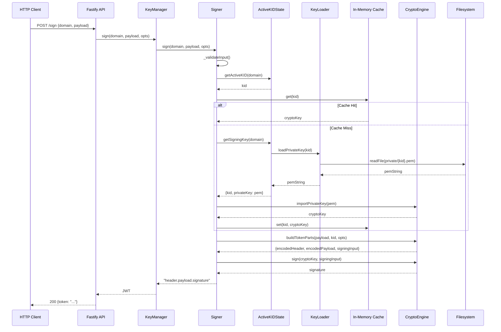

**Performance Optimizations:**

1. **CryptoKey Caching**: Avoid repeated PEM imports
2. **PEM Caching**: Loader caches file reads
3. **Active KID Caching**: State stores in-memory pointer

---

### 6.2 Key Rotation Flow (Atomic)

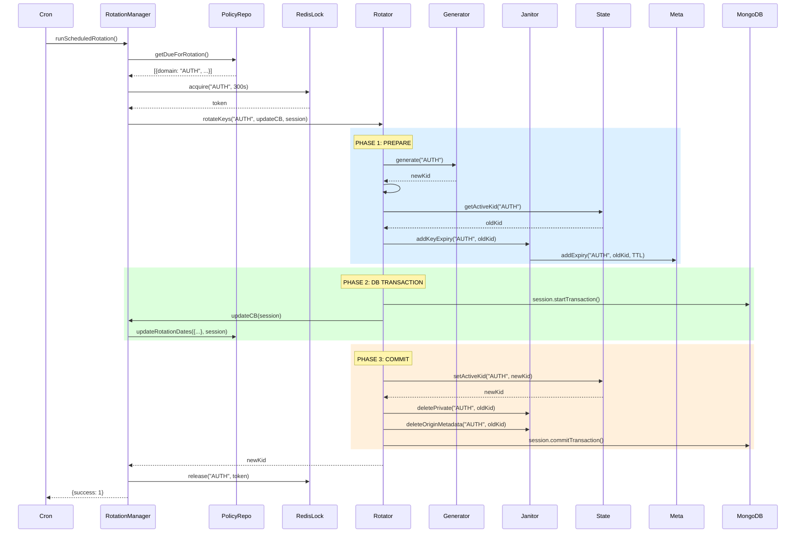

**Rollback Scenario:**

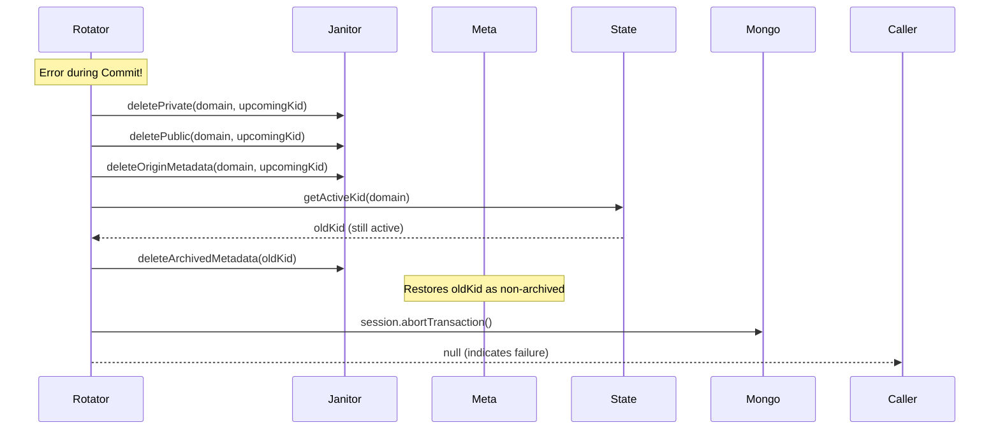

---

### 6.3 Key Generation Flow (Initial Setup)

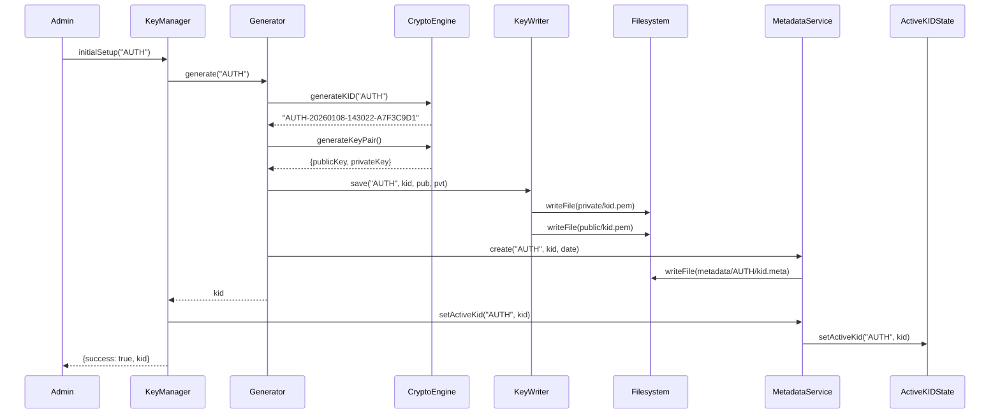

---

### 6.4 Expired Key Cleanup Flow (Cron)

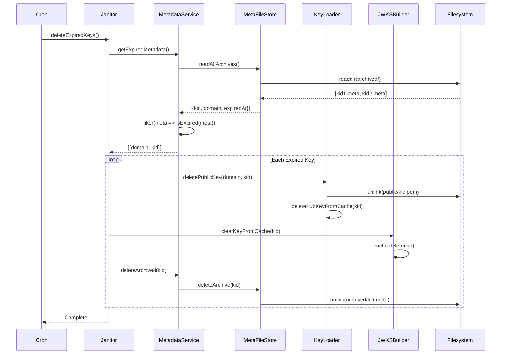

---

### 6.5 JWKS Generation Flow

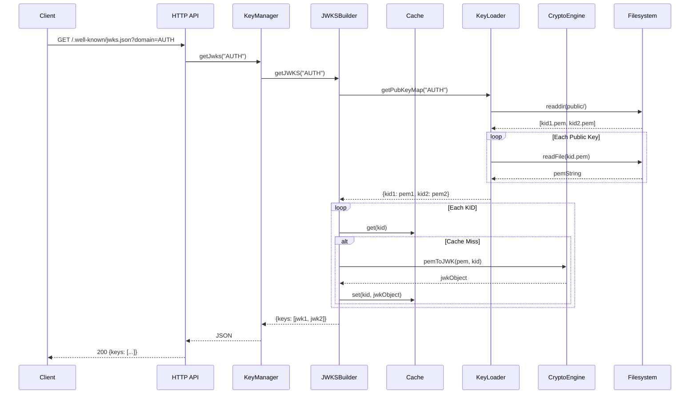

---

## 7. Dependency Graph

### 7.1 Domain Layer Dependencies

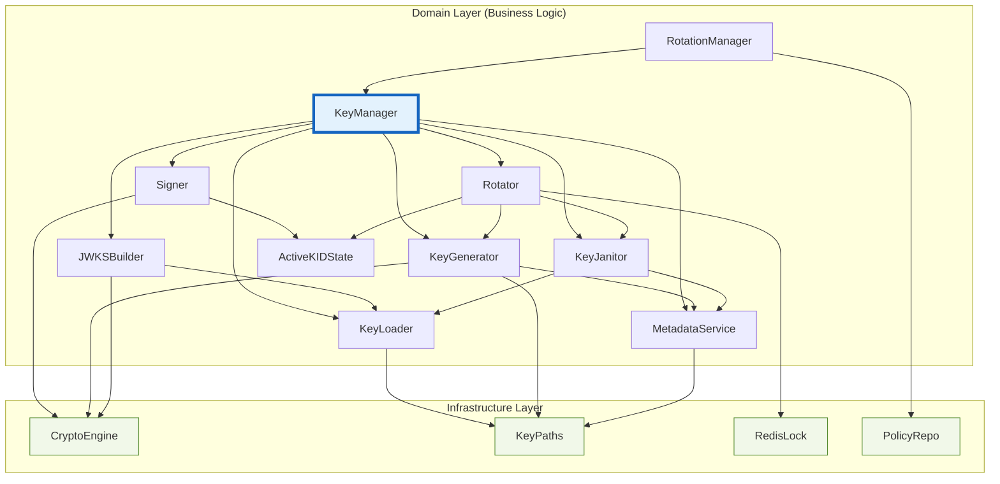

### 7.2 Architectural Violations Analysis

#### ✅ **Clean Dependencies**

All domain classes depend only on:

- Other domain classes
- Infrastructure **interfaces** (injected)
- Core utilities

#### ❌ **No Violations Found**

```
✓ No domain → infrastructure direct imports
✓ No circular dependencies
✓ Clear separation of concerns
```

---

## 8. Configuration Management

### 8.1 Environment Variables

**File:** `envConfig.js`

```javascript
const requiredEnvVars = [
  "MONGO_DB_URI",
  "REDIS_HOST",
  "REDIS_PORT",
  "REDIS_PASSWORD",
];

export function getEnvConfig(key) {
  const value = process.env[key];
  if (!value && requiredEnvVars.includes(key)) {
    throw new Error(`Missing required env var: ${key}`);
  }
  return value;
}
```

### 8.2 Key Configuration

**File:** `keys.js`

```javascript
// TTL for public keys (signers should set token exp < 30 days)
export const KEY_PUBLIC_TTL_MS = 30 * 24 * 60 * 60 * 1000; // 30 days

// Grace period after TTL before deletion
export const KEY_GRACE_MS = 2 * 24 * 60 * 60 * 1000; // 2 days

// Total lifetime = 32 days
```

### 8.3 Rotation Configuration

**File:** `rotationConfig.js`

```javascript
// DEVELOPER CONSTRAINTS (immutable)
export const developerRotationConfig = {
  RETRY_INTERVAL_LIMIT: {
    minInterval: 60_000, // 1 minute
    maxInterval: 3_600_000, // 1 hour
  },
  RETRIES_LIMIT: {
    minRetries: 1,
    maxRetries: 10,
  },
};

// DEFAULT VALUES (mutable at runtime)
export const defaultRotationConfig = {
  RETRY_INTERVAL_MS: 300_000, // 5 minutes
  MAX_RETRIES: 3,
};
```

---

## 9. Security & Compliance

### 9.1 Key Security Measures

| Measure                     | Implementation                                |
| --------------------------- | --------------------------------------------- |
| **Private Key Protection**  | File mode `0600` (owner-only)                 |
| **Public Key Distribution** | JWKS endpoint for validators                  |
| **Key Rotation**            | Automated with configurable intervals         |
| **Graceful Degradation**    | Old public keys remain valid for 32 days      |
| **Atomic Operations**       | 3-phase commit with rollback                  |
| **Distributed Locking**     | Redis-based locks prevent concurrent rotation |
| **Audit Trail**             | Metadata tracks creation & expiry timestamps  |

### 9.2 Threat Mitigation

| Threat                    | Mitigation                              |
| ------------------------- | --------------------------------------- |
| **Key Compromise**        | Regular rotation limits exposure window |
| **Replay Attacks**        | JWT expiration (`exp` claim)            |
| **Concurrent Rotation**   | Redis locks (300s TTL)                  |
| **Database Rollback**     | MongoDB transactions with abort         |
| **Filesystem Corruption** | Rollback deletes corrupted keys         |
| **Cache Poisoning**       | Cache cleared on key deletion           |

### 9.3 Compliance Features

- **Key Lifecycle Management**: Full CRUD + archival
- **Immutable Audit Logs**: Metadata files with timestamps
- **Configurable Retention**: TTL + grace period
- **Access Control**: File permissions enforced
- **Encryption at Rest**: (Future: integrate with KMS)

---

## 10. Operational Patterns

### 10.1 Deployment Architecture

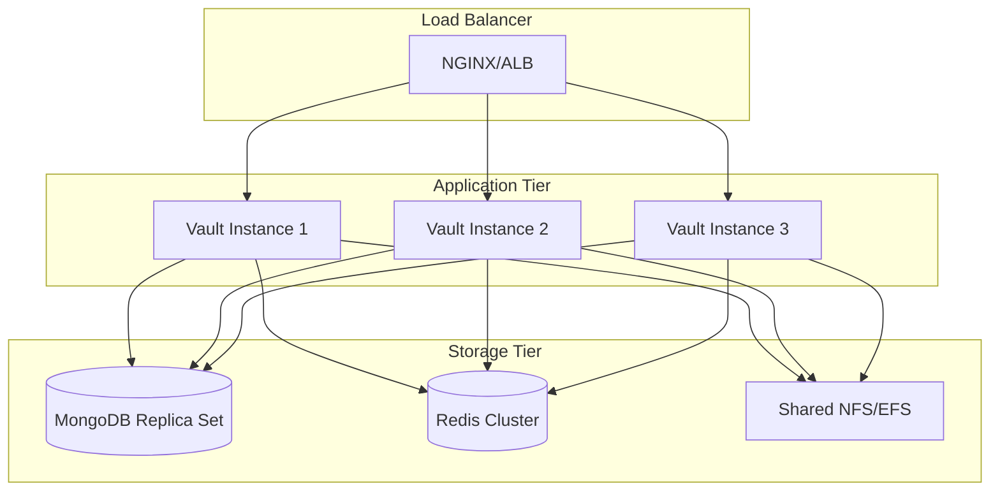

**Key Considerations:**

- **Shared Filesystem**: All instances must access same key files
- **Redis Clustering**: For high-availability locking
- **MongoDB Replication**: For policy persistence
- **Stateless Instances**: No local state (except caches)

### 10.2 Cron Job Schedule

```javascript
// Scheduled Rotation (check every hour)
cron.schedule("0 * * * *", async () => {
  await rotationManager.runScheduledRotation();
});

// Expired Key Cleanup (daily at 2 AM)
cron.schedule("0 2 * * *", async () => {
  await keyJanitor.deleteExpiredKeys();
});
```

### 10.3 Monitoring Metrics

**Key Metrics to Track:**

1. **Rotation Metrics**

   - `rotation.success.count`
   - `rotation.failure.count`
   - `rotation.skipped.count`
   - `rotation.duration.ms`

2. **Signing Metrics**

   - `sign.requests.count`
   - `sign.errors.count`
   - `sign.latency.ms`
   - `sign.cache.hit_rate`

3. **Key Metrics**

   - `keys.active.count` (per domain)
   - `keys.archived.count`
   - `keys.expired.deleted.count`

4. **Infrastructure Metrics**
   - `redis.lock.acquire.success`
   - `redis.lock.acquire.failure`
   - `mongo.transaction.commit.count`
   - `mongo.transaction.abort.count`

### 10.4 Error Handling Patterns

**Rotation Error Recovery:**

```javascript
try {
  await rotator.rotateKeys(domain, updateCB, session);
} catch (err) {
  // 1. Rollback filesystem changes
  await rollbackRotation(domain);

  // 2. Abort database transaction
  await session.abortTransaction();

  // 3. Log error with context
  logger.error("Rotation failed", { domain, error: err });

  // 4. Emit metric
  metrics.increment("rotation.failure");

  // 5. Alert on-call (if critical)
  if (isProductionCritical(domain)) {
    await alertOncall(domain, err);
  }
}
```

### 10.5 Health Check Endpoints

**Recommended Endpoints:**

```javascript
// Basic health
GET /health
Response: { status: "healthy", timestamp: "..." }

// Detailed status
GET /health/details
Response: {
  status: "healthy",
  services: {
    mongodb: "connected",
    redis: "connected",
    filesystem: "accessible"
  },
  domains: ["AUTH", "PAYMENT"],
  activeKeys: { AUTH: 3, PAYMENT: 2 }
}

// Readiness probe (for K8s)
GET /ready
Response: 200 if all dependencies ready, 503 otherwise
```

---

## 11. Future Enhancements

### 11.1 Planned Features

1. **KMS Integration**

   - Encrypt private keys at rest using AWS KMS/GCP KMS
   - Hardware Security Module (HSM) support

2. **Multi-Algorithm Support**

   - ES256 (ECDSA with P-256)
   - EdDSA (Ed25519)

3. **Key Versioning**

   - Support multiple active keys per domain
   - Gradual rollout with percentage-based routing

4. **Event Sourcing**

   - Publish rotation events to Kafka/EventBridge
   - Enable downstream systems to react

5. **Admin Dashboard**

   - Web UI for policy management
   - Visual rotation timeline
   - Key usage analytics

6. **Backup & Restore**
   - Automated key backups to S3
   - Point-in-time recovery

### 11.2 Scalability Improvements

1. **Cache Layer**

   - Redis caching for active KIDs (reduce DB queries)
   - Distributed cache invalidation

2. **Key Preloading**

   - Warm up caches on startup
   - Background key loading

3. **Batch Operations**
   - Bulk domain rotations
   - Parallel cleanup operations

---

## 12. Appendix

### 12.1 Key Algorithms Reference

**RSA-SHA256 (RS256):**

- **Modulus Length**: 2048 bits
- **Hash Algorithm**: SHA-256
- **Padding**: PKCS#1 v1.5
- **Security Level**: 112 bits (NIST recommendation)

**JWT Structure:**

```
header.payload.signature

header = Base64URL({
  "alg": "RS256",
  "typ": "JWT",
  "kid": "AUTH-20260108-143022-A7F3C9D1"
})

payload = Base64URL({
  "iat": 1704672000,
  "exp": 1704675600,
  ...userPayload
})

signature = RSA-SHA256(
  privateKey,
  header + "." + payload
)
```

### 12.2 Glossary

| Term                | Definition                                         |
| ------------------- | -------------------------------------------------- |
| **KID**             | Key ID - Unique identifier for a cryptographic key |
| **JWKS**            | JSON Web Key Set - Public key distribution format  |
| **PEM**             | Privacy-Enhanced Mail - Base64 encoding for keys   |
| **JWK**             | JSON Web Key - JSON representation of a key        |
| **TTL**             | Time To Live - Duration before expiration          |
| **DDD**             | Domain-Driven Design - Architectural approach      |
| **Atomic Rotation** | All-or-nothing key rotation with rollback          |
| **Grace Period**    | Extra time after TTL before deletion               |

### 12.3 References

- [RFC 7519 - JSON Web Token (JWT)](https://tools.ietf.org/html/rfc7519)
- [RFC 7517 - JSON Web Key (JWK)](https://tools.ietf.org/html/rfc7517)
- [RFC 7518 - JSON Web Algorithms (JWA)](https://tools.ietf.org/html/rfc7518)
- [Web Crypto API Specification](https://www.w3.org/TR/WebCryptoAPI/)
- [NIST Key Management Guidelines](https://nvlpubs.nist.gov/nistpubs/SpecialPublications/NIST.SP.800-57pt1r5.pdf)

---

## 📝 Document Metadata

**Generated by:** Architectural Auditor  
**Date:** January 8, 2026  
**Version:** 1.0.0  
**Project:** Vault Service  
**Architecture Style:** Domain-Driven Design (DDD)  
**Compliance:** Clean Architecture Principles

---

**END OF DOCUMENT**
