# Key Generator – Modular Refactoring (Design Overview)

This document describes how the **Key Generation subsystem** was fully modularized to improve
maintainability, testability, and architectural clarity.  
Originally, key generation logic lived inside a single large class.  
It is now broken down into focused SRP-compliant units, with a clean orchestrator coordinating them.

---

## 📁 Goals of the Refactor

- Enforce **Single Responsibility Principle** for each internal operation.
- Create **dumb modules** that do *only one thing* without knowing the overall flow.
- Make the generator **easier to test**, mock, and replace.
- Prevent circular dependencies with other subsystems (manager, signer, loader).
- Improve transparency of the generation pipeline through visual documentation.

---

## 🧩 Final Module Structure

### ✔ **Insider Modules (pure generation logic)**  
These modules contain no high-level logic.  
They only perform isolated operations when invoked.

| Module | Responsibility |
|--------|----------------|
| `DirManager` | Ensures filesystem directories exist for domain keys |
| `KIDFactory` | Generates KIDs in `DOMAIN-YYYYMMDD-HHMMSS-RANDOMHEX` format |
| `RSAKeyGen` | Generates RSA keypair using crypto |
| `KeyWriter` | Writes private/public PEM files to disk (get paths from keyPath repo ) |

Each insider module is independent and side-effect aware.

---

### ✔ **Outsider Module (system metadata)**

| Module | Responsibility |
|--------|----------------|
| `MetadataManager` | Stores metadata for the generated key (origin info, timestamps, etc.) |

MetaManager stays *outside* the cryptographic boundary.  
This enforces correct separation of cryptographic generation vs business lifecycle.

---

## 🎯 Orchestrator: `KeyPairGenerator`

This is the **only public entry point**.

### **Exposed Public API**

generateKeyPair(domain): kid

## The orchestrator coordinates the generation flow:

→ ensure directories exist
→ generate KID
→ generate RSA keypair
→ write keys to filesystem
→ write origin metadata
→ return kid

It knows *the order*, modules do not.

---

## Architecture Diagram

---

## 🧪 Testability Benefits

- Each module can be unit tested independently.
- No global state.
- No crypto coupling inside orchestrator.
- Easy to mock `KeyWriter`, `RSAKeyGen`, metadata, etc.
- The orchestrator can be tested with full or partial mocks.

---

## 🚀 Summary

The Key Generator subsystem is now:

- **cleaner**
- **safer**
- **more explicit**
- **modular**
- **better for future features**
- **ready for integration with KeyManager and RotationEngine**

This refactor lays the foundation for clean orchestration across all key lifecycle operations.
