# Metadata Manager – Modular Refactoring (Design Overview)

This document describes how the **Metadata Management subsystem** was refactored into clean, modular units to improve maintainability, safety, and lifecycle clarity.

Originally, all metadata responsibilities were bundled inside a single large class — making rotation, rollback, and expiry handling harder to reason about.  
The refactor breaks the module into focused SRP-compliant units, with a clear orchestrator coordinating the correct metadata flow.

---

## 📁 Goals of the Refactor

- Enforce **Single Responsibility Principle** across all metadata operations  
- Decouple metadata responsibilities from KeyManager, KeyLoader, and KeyJanitor  
- Improve **testability** by splitting operations into isolated pure modules  
- Separate **origin metadata** lifecycle from **archived metadata** lifecycle  
- Prepare the system for future features (cron cleanup, reporting, auditing)  
- Maintain a predictable and explicit metadata pipeline

---

## 🧩 Final Module Structure

### ✔ Insider Modules (pure metadata operations)

Dumb, minimal, deterministic modules with exactly one responsibility.

| Module | Responsibility |
|--------|----------------|
| `MetadataCreator` | Creates origin metadata for a domain key |
| `MetadataReader` | Reads metadata (origin first, fallback to archive) |
| `MetadataArchiver` | Moves metadata to archive & adds expiration timestamp |
| `MetadataCleaner` | Removes origin or archived metadata |
| `MetadataExpiration` | Retrieves expired archived metadata |
| `parseJson` | Safe JSON parsing helper |

These modules are not aware of key rotation, signing, or cleanup rules.

---

### ✔ Outsider Module (Public Orchestrator)

| Module | Responsibility |
|--------|----------------|
| `MetadataManager` | Unified entry point coordinating all metadata lifecycle actions |

This orchestrator ensures the correct order of operations without leaking complexity into other layers.

---

## 🎯 Orchestrator: `MetadataManager`

### **Public API**

- `create(domain, kid, createdAt)`
- `read(domain, kid)`
- `addExpiry(domain, kid, expiresAt)`
- `deleteOrigin(domain, kid)`
- `deleteArchived(kid)`
- `getExpiredMetadata()`

### **Responsibilities of the orchestrator**

- create origin metadata  
- read correct metadata location (origin → archive fallback)  
- archive metadata on key rotation  
- attach expiration timestamp  
- clean metadata (either origin or archived)  
- provide expired metadata list for janitor cleanup  

It manages the lifecycle; insider modules only perform atomic FS operations.

---

## Architecture Diagram

---

## 🧪 Testability Benefits

- Every operation testable in isolation  
- Easy to mock FS reads/writes  
- Rotation & rollback workflows testable without touching crypto  
- Transparent failure behavior for missing/invalid metadata  
- Cleaner integration tests with KeyManager and Janitor  

---

## 🚀 Summary

After refactoring, the Metadata Manager subsystem is:

- **modular**
- **explicit**
- **easy to test**
- **predictable**
- **future-proof**
- **aligned with rotation + janitor system design**

This refactor strengthens the entire key lifecycle pipeline and provides a solid foundation for rotation, cleanup, and signing flows.

