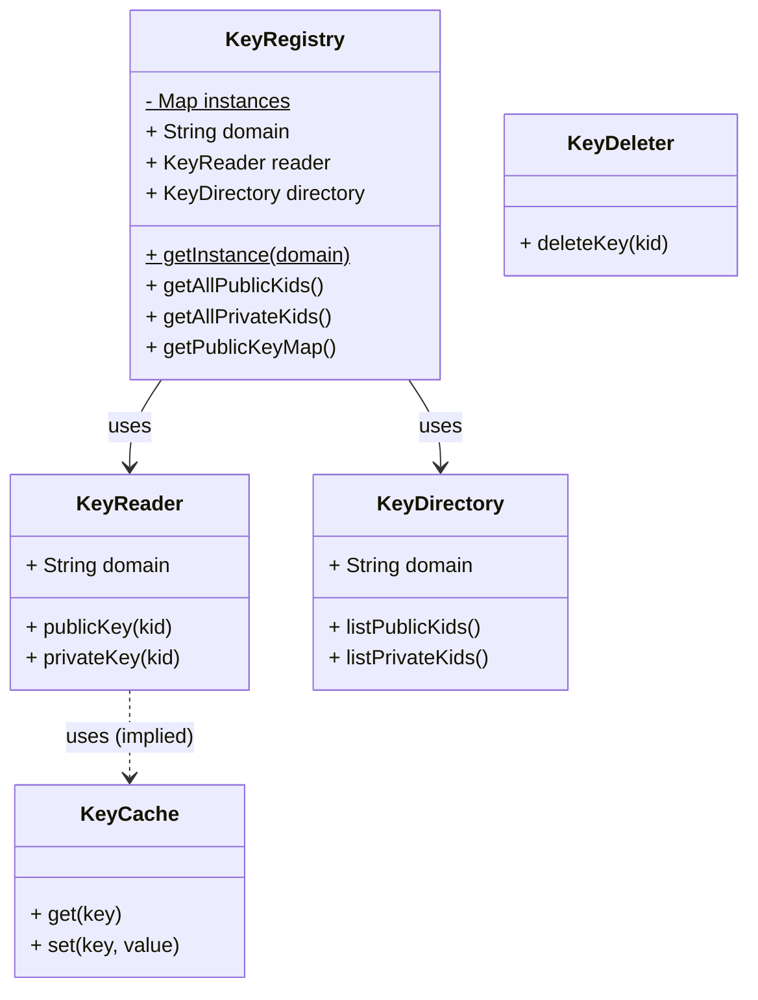

# Key Loader Architecture

```mermaid
classDiagram
    class KeyRegistry {
        - Map instances$
        + String domain
        + KeyReader reader
        + KeyDirectory directory
        + getInstance(domain)$
        + getAllPublicKids()
        + getAllPrivateKids()
        + getPublicKeyMap()
    }

    class KeyReader {
        + String domain
        + publicKey(kid)
        + privateKey(kid)
    }

    class KeyDirectory {
        + String domain
        + listPublicKids()
        + listPrivateKids()
    }

    class KeyCache {
        + get(key)
        + set(key, value)
    }

    class KeyDeleter {
        + deleteKey(kid)
    }

    KeyRegistry --> KeyReader : uses
    KeyRegistry --> KeyDirectory : uses
    KeyReader ..> KeyCache : uses (implied)
```
