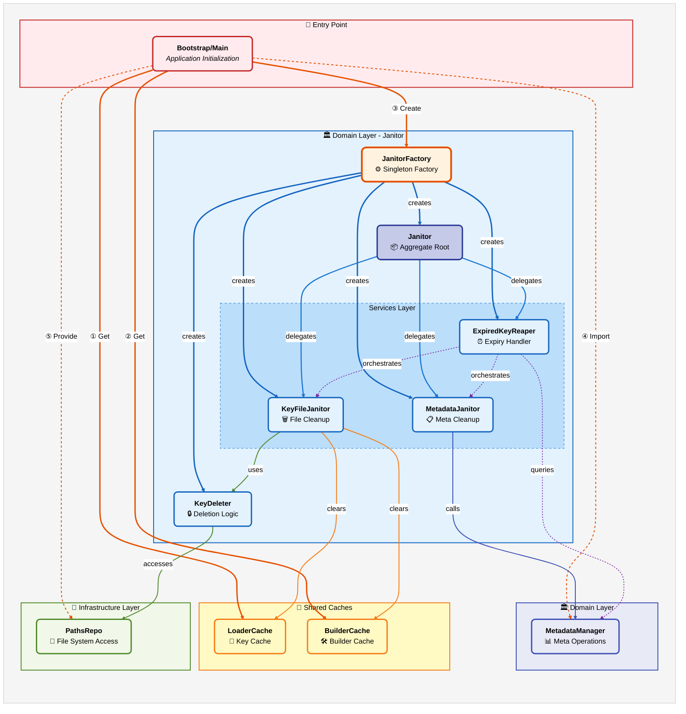

```mermaid
%%{init: {'theme':'base','themeVariables': {'primaryColor':'#ffffff','primaryTextColor':'#000','primaryBorderColor':'#333','lineColor':'#2c3e50','tertiaryColor':'#ffffff'}}}%%
graph TB
    %% ============================================
    %% SUBGRAPHS - Layered Architecture
    %% ============================================

    subgraph MAIN[" "]
        direction TB

    subgraph EP["🚀 Entry Point"]
        direction TB
        Bootstrap["<b>Bootstrap/Main</b><br/><i>Application Initialization</i>"]
    end

    subgraph DL["🏛️ Domain Layer - Janitor"]
        direction TB
        Factory["<b>JanitorFactory</b><br/>⚙️ Singleton Factory"]
        Janitor["<b>Janitor</b><br/>📦 Aggregate Root"]

        subgraph Services["Services Layer"]
            direction LR
            FileJanitor["<b>KeyFileJanitor</b><br/>🗑️ File Cleanup"]
            MetaJanitor["<b>MetadataJanitor</b><br/>📋 Meta Cleanup"]
            Reaper["<b>ExpiredKeyReaper</b><br/>⏰ Expiry Handler"]
        end

        Deleter["<b>KeyDeleter</b><br/>🔒 Deletion Logic"]
    end

    %% Bottom layer - aligned horizontally
    subgraph BOTTOM[" "]
        direction LR

    subgraph CACHE["💾 Shared Caches"]
        direction LR
        LoaderCache["<b>LoaderCache</b><br/>🔑 Key Cache"]
        BuilderCache["<b>BuilderCache</b><br/>🛠️ Builder Cache"]
    end

    subgraph MD["🏛️ Domain Layer"]
        direction TB
        MetaManager["<b>MetadataManager</b><br/>📊 Meta Operations"]
    end

    subgraph INFRA["🔧 Infrastructure Layer"]
        direction LR
        Paths["<b>PathsRepo</b><br/>📁 File System Access"]
    end

    end

    %% ============================================
    %% PHASE 1: Bootstrap Initialization (numbered sequence)
    %% ============================================
    Bootstrap ==>|"① Get"| LoaderCache
    Bootstrap ==>|"② Get"| BuilderCache
    Bootstrap ==>|"③ Create"| Factory
    Bootstrap -.->|"④ Import"| MetaManager
    Bootstrap -.->|"⑤ Provide"| Paths

    %% ============================================
    %% PHASE 2: Factory Creates Components
    %% ============================================
    Factory ==>|"creates"| Janitor
    Factory ==>|"creates"| FileJanitor
    Factory ==>|"creates"| MetaJanitor
    Factory ==>|"creates"| Reaper
    Factory ==>|"creates"| Deleter

    %% ============================================
    %% PHASE 3: Janitor Delegates (clean vertical flow)
    %% ============================================
    Janitor -->|"delegates"| FileJanitor
    Janitor -->|"delegates"| MetaJanitor
    Janitor -->|"delegates"| Reaper

    %% ============================================
    %% PHASE 4: Service Dependencies (grouped by service)
    %% ============================================
    
    %% FileJanitor dependencies (left side)
    FileJanitor -->|"clears"| LoaderCache
    FileJanitor -->|"clears"| BuilderCache
    FileJanitor -->|"uses"| Deleter

    %% MetaJanitor dependencies (center)
    MetaJanitor -->|"calls"| MetaManager

    %% Reaper dependencies (right side)
    Reaper -.->|"orchestrates"| FileJanitor
    Reaper -.->|"orchestrates"| MetaJanitor
    Reaper -.->|"queries"| MetaManager

    %% Deleter dependencies (bottom)
    Deleter -->|"accesses"| Paths

    end

    %% ============================================
    %% STYLING - Professional Color Scheme
    %% ============================================

    classDef factory fill:#FFF3E0,stroke:#E65100,stroke-width:4px,color:#000,rx:10,ry:10
    classDef domain fill:#E3F2FD,stroke:#1565C0,stroke-width:3px,color:#000,rx:8,ry:8
    classDef aggregate fill:#C5CAE9,stroke:#283593,stroke-width:3px,color:#000,rx:8,ry:8
    classDef cache fill:#FFF9C4,stroke:#F57F17,stroke-width:3px,color:#000,rx:8,ry:8
    classDef infra fill:#F1F8E9,stroke:#558B2F,stroke-width:3px,color:#000,rx:8,ry:8
    classDef external fill:#FFEBEE,stroke:#C62828,stroke-width:3px,color:#000,rx:8,ry:8
    classDef meta fill:#E8EAF6,stroke:#3F51B5,stroke-width:3px,color:#000,rx:8,ry:8

    class Factory factory
    class Janitor aggregate
    class FileJanitor,MetaJanitor,Reaper,Deleter domain
    class LoaderCache,BuilderCache cache
    class MetaManager meta
    class Paths infra
    class Bootstrap external

    %% Subgraph styling
    style MAIN fill:#f5f5f5,stroke:#e0e0e0,stroke-width:2px
    style BOTTOM fill:transparent,stroke:transparent
    style EP fill:#FFEBEE,stroke:#C62828,stroke-width:2px
    style DL fill:#E3F2FD,stroke:#1565C0,stroke-width:2px
    style MD fill:#E8EAF6,stroke:#3F51B5,stroke-width:2px
    style CACHE fill:#FFF9C4,stroke:#F57F17,stroke-width:2px
    style INFRA fill:#F1F8E9,stroke:#558B2F,stroke-width:2px
    style Services fill:#BBDEFB,stroke:#1976D2,stroke-width:1px,stroke-dasharray: 5 5

    %% ============================================
    %% LINK STYLING - Different styles for different flows
    %% ============================================
    
    %% Phase 1: Bootstrap (thick orange)
    linkStyle 0,1,2 stroke:#E65100,stroke-width:3px
    linkStyle 3,4 stroke:#E65100,stroke-width:2px,stroke-dasharray:5 5

    %% Phase 2: Factory creates (thick blue)
    linkStyle 5,6,7,8,9 stroke:#1565C0,stroke-width:3px

    %% Phase 3: Janitor delegates (medium blue)
    linkStyle 10,11,12 stroke:#1976D2,stroke-width:2.5px

    %% Phase 4: Service dependencies (thin, varied colors)
    linkStyle 13,14 stroke:#F57F17,stroke-width:2px
    linkStyle 15 stroke:#558B2F,stroke-width:2px
    linkStyle 16 stroke:#3F51B5,stroke-width:2px
    linkStyle 17,18,19 stroke:#7B1FA2,stroke-width:1.5px,stroke-dasharray:3 3
    linkStyle 20 stroke:#558B2F,stroke-width:2px
```
