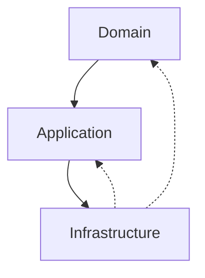
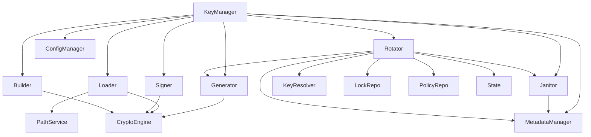

# System Architecture Overview

## Why this overview exists

The system architecture overview provides new developers and maintainers with a high-level map of the Vault's design. It explains the major layers, the rules that govern dependencies, and the rationale behind the system's organization. This document is the starting point for understanding how all the pieces fit together and why the architecture enables security, maintainability, and extensibility.

## How the system is structured

The Vault is organized according to Domain-Driven Design (DDD) and Clean Architecture principles. The system is divided into three main layers:

- **Domain Layer:** Contains all business logic, key lifecycle management, and orchestration. No direct dependencies on infrastructure.
- **Application Layer:** (Optional in this system) Coordinates use cases and application services, but does not contain business rules.
- **Infrastructure Layer:** Provides concrete implementations for cryptography, storage, caching, and external integrations. Infrastructure never depends on domain.

Modules are grouped by responsibility, and each module exposes a clear contract. Dependency rules are strictly enforced to prevent cross-layer violations.

```mermaid
flowchart TD
    UI[Transport Layer (HTTP/gRPC)] --> App[Application Layer]
    App --> Domain[Domain Layer]
    Domain --> Infra[Infrastructure Layer]
    Infra --> External[External Systems]
```

## Layer dependency rules

- Domain may depend on application (if present), but never on infrastructure.
- Application may depend on both domain and infrastructure.
- Infrastructure may never depend on domain or application.
- Cross-domain dependencies are forbidden unless explicitly allowed.



## Module dependency map

Each major module is isolated and communicates through explicit interfaces. The KeyManager facade orchestrates all domain modules, which in turn depend on infrastructure services via injected interfaces.



## Forbidden dependency violations

- Domain modules must never import from infrastructure directly.
- Infrastructure must never import from domain.
- Cross-domain imports are only allowed via explicit interfaces.

## The mental model to keep

Think of the Vault as a layered fortress: each layer protects the next, dependencies flow inward, and every module has a clear, enforceable boundary.
