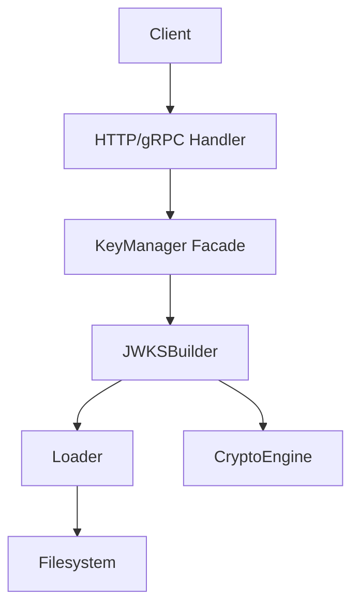
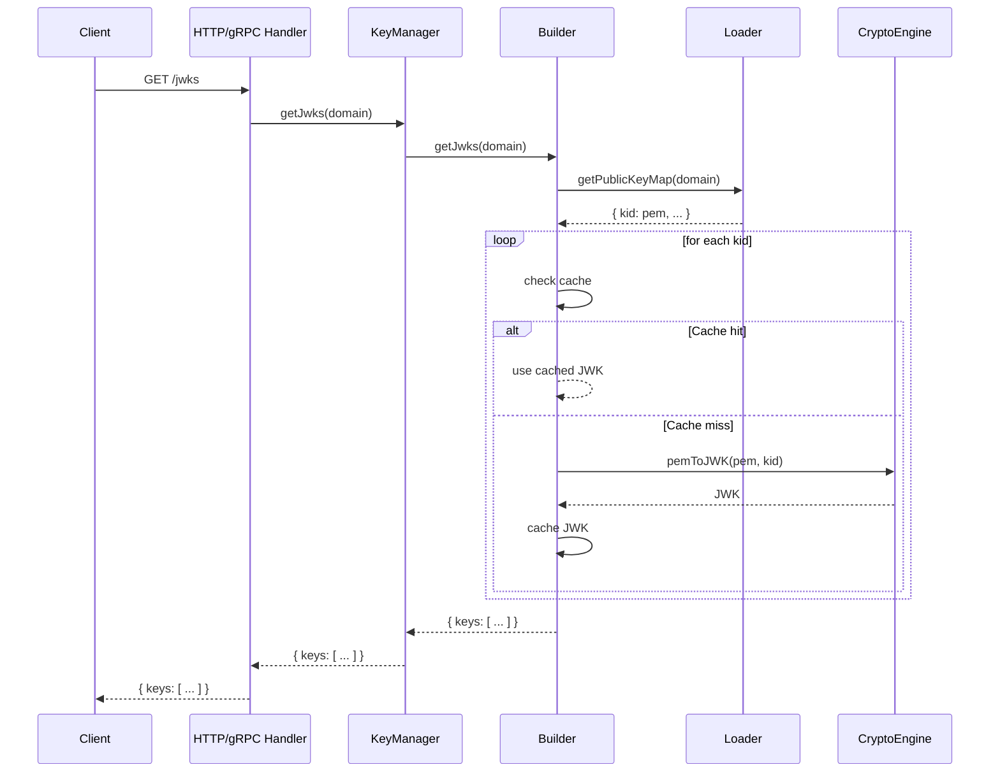

# JWKS Builder

## Why the JWKS builder exists

When external clients or services need to verify JWTs issued by the Vault, they require access to the public keys in a standardized format. The JWKS (JSON Web Key Set) builder exists to expose all active public keys for a domain in the JWKS format, enabling seamless interoperability with OAuth2, OpenID Connect, and other JWT consumers. The builder does not generate keys, manage their lifecycle, or perform signing—it simply assembles and exposes the current set of public keys.

The builder's responsibility is deliberately narrow: given a domain, return a JWKS object containing all public keys as JWKs. It does not decide which keys are active, when to rotate, or how to sign tokens. It is a pure data transformation and exposure layer.

## How the JWKS builder fits into the Vault

The JWKS builder is consumed by the KeyManager facade, which exposes a `getJwks(domain)` method. This method is called by HTTP and gRPC transport handlers when a client requests the JWKS endpoint. The builder never interacts directly with the filesystem or cryptographic primitives; it relies on the loader to retrieve PEM-encoded public keys and the cryptoEngine to convert them to JWK format.

## Keeping JWKS exposure deliberately simple

The JWKSBuilder class is a single orchestrator. Its public API exposes `getJWKS(domain)` and an alias `getJwks(domain)`. The builder retrieves all public keys for the domain from the loader, then converts each PEM string to a JWK using the cryptoEngine. To avoid redundant conversions, the builder caches JWKs by KID. If a JWK is already cached, it is returned immediately; otherwise, it is built and cached on demand.

The builder does not filter or select keys—it exposes all public keys present in the domain's directory. The loader is responsible for listing available KIDs, and the builder simply transforms each one. This design ensures that any key present on disk is available for verification, supporting smooth key rotation and rollover scenarios.

## What happens when a JWKS is requested

When a client requests the JWKS endpoint, the HTTP or gRPC handler calls `jwksService.getJwks(domain)`, which delegates to `keyManager.getJwks(domain)`. The KeyManager normalizes the domain and calls `builder.getJwks(domain)`. The builder retrieves all public keys for the domain from the loader as a map of `kid -> pem`.

For each KID, the builder checks its cache for a JWK. On a cache hit, the cached JWK is used. On a miss, the builder calls `cryptoEngine.pemToJWK(pem, kid)`, which parses the PEM, extracts the modulus and exponent, and constructs a JWK object. The new JWK is cached and added to the JWKS array. Once all keys are processed, the builder returns a JWKS object: `{ keys: [ ... ] }`.

## The tradeoffs behind this design

The builder could have been designed to filter keys based on metadata or active status. Instead, it exposes all public keys present in the directory, trusting the loader to provide the complete set. This supports key rollover, where multiple keys may be valid for verification during a transition period. The builder's cache is keyed by KID, ensuring that repeated requests for the same key are efficient.

Another choice: the builder does not parse or validate the contents of the PEM beyond what is required to construct a JWK. It trusts the cryptoEngine to handle parsing and conversion. This keeps the builder focused on data transformation, not cryptographic validation.

The builder also does not handle errors from the loader or cryptoEngine beyond propagating them upward. If a key cannot be read or converted, the builder fails the entire JWKS request. This is a deliberate tradeoff: partial JWKS responses could lead to verification failures, so the builder prefers to fail fast and visibly.

## What the JWKS builder guarantees — and what it doesn't

The builder guarantees that all public keys present in the domain's directory will be exposed as JWKs in the JWKS response. It guarantees that repeated requests for the same key will be served from cache, avoiding redundant conversions. It guarantees that the JWKS format conforms to the standard expected by JWT consumers.

The builder does not guarantee that the keys are valid or unexpired. It does not filter out expired or revoked keys—such filtering, if needed, should be implemented in the loader or by removing keys from the directory. The builder does not guarantee that the JWKS contains only the active key; it exposes all available keys.

The builder also does not guarantee transactional consistency if keys are added or removed during a JWKS request. The response reflects the state of the directory at the time of the loader's call.

## Who depends on the JWKS builder (and who doesn't)

The builder is consumed by the KeyManager facade, which exposes it to the application and transport layers. The HTTP and gRPC handlers call the KeyManager's `getJwks()` method, which delegates to the builder. No other domain modules interact with the builder—signing, key generation, rotation, and cleanup do not require JWKS exposure.

The builder does not call the loader, generator, or metadata manager directly. It is a pure consumer, transforming and exposing public keys for verification.

This isolation ensures the builder can change its caching strategy, conversion logic, or error handling without affecting other domain operations. The builder's interface—`getJwks(domain)` returning a JWKS object—remains stable even if the implementation evolves.

## Following the implementation

Start with [JWKSBuilder.js](src/domain/key-manager/modules/builder/JWKSBuilder.js), which implements the entire JWKS exposure flow. The builder is wired with its dependencies in [builderFactory.js](src/domain/key-manager/modules/builder/builderFactory.js). The builder is invoked through [KeyManager.js](src/domain/key-manager/KeyManager.js), which normalizes the domain and forwards the request. The application and transport layers access the builder via [JwksService.js](src/application/services/transportServices/JwksService.js), which wraps the KeyManager call.

## The mental model to keep

Think of the JWKS builder as a stateless transformer that exposes all public keys for a domain in a standard format, enabling external clients to verify tokens without ever touching key material or cryptographic details.
