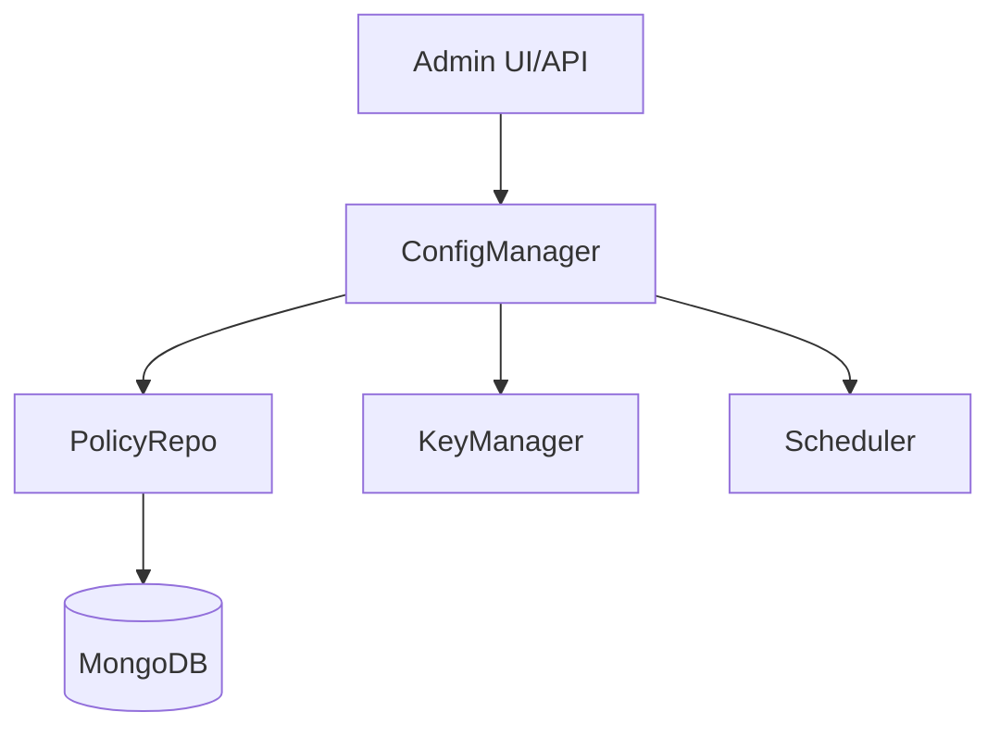
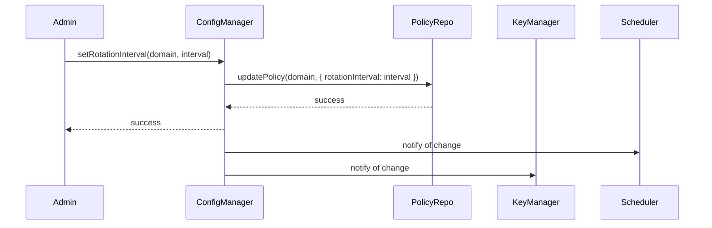

# Config Manager

## Why the config manager exists

The config manager exists to centralize the management of configuration and rotation policies for all domains in the Vault. It provides a single source of truth for settings such as rotation intervals, key lifetimes, and domain-specific overrides. By consolidating configuration, the config manager ensures that policy changes are applied consistently and that the system remains easy to audit and reason about.

The config manager does not perform key operations itself. Its responsibility is to store, retrieve, and update configuration data, and to provide this data to other modules as needed. This separation keeps configuration logic isolated from business logic.

## How the config manager fits into the Vault

The config manager is used by the KeyManager facade and rotation scheduler to retrieve and update rotation policies. It interacts with the policy repository to persist changes and to fetch current settings. The config manager is the only component that knows how to interpret and apply policy data across domains.

## Keeping configuration management deliberately simple

The config manager exposes methods to get and set rotation intervals, enable or disable rotation for domains, and retrieve current policy settings. It does not enforce policies itself; it provides data to the modules that do. This design keeps configuration logic isolated and easy to test.

The config manager validates inputs and ensures that changes are persisted atomically. It does not cache data; all reads and writes go through the policy repository. This ensures that configuration is always up to date and consistent across the system.

## What happens when a policy is updated

When an administrator updates a rotation policy (for example, changing the interval for a domain), the config manager validates the input, updates the policy repository, and notifies the relevant modules (such as the scheduler) to apply the new settings. The config manager does not apply changes directly; it relies on collaborators to enforce updated policies.

## The tradeoffs behind this design

The config manager could have been implemented as a set of global variables or environment files. Instead, it is a dedicated module with explicit methods for all configuration operations. This makes it easier to audit, test, and evolve configuration logic over time.

Another choice: the config manager does not cache configuration data. This ensures that all reads reflect the current state of the policy repository, avoiding stale or inconsistent settings.

The config manager also does not enforce policies itself. It provides data to the modules that do, keeping configuration logic separate from enforcement logic.

## What the config manager guarantees — and what it doesn't

The config manager guarantees that all configuration changes are persisted and that current settings are always available to other modules. It does not guarantee that policies are enforced; it relies on collaborators to apply changes.

The config manager does not guarantee transactional consistency across modules. If a policy update fails, it does not roll back changes in other modules. This is a deliberate tradeoff for simplicity.

## Who depends on the config manager (and who doesn't)

The config manager is used by administrators, the KeyManager facade, and the rotation scheduler. No other modules depend on the config manager. It is a pure configuration component, isolated from business logic.

This isolation ensures the config manager can evolve its API, add new settings, or change persistence logic without affecting other modules. The config manager's interface remains stable even as the system grows.

## Following the implementation

Start with [configManager.js](src/domain/key-manager/config/configManager.js), which implements the config manager. The policy repository is implemented in [rotationPolicyRepository.js](src/infrastructure/db/repositories/rotationPolicyRepository.js). Administrators and orchestration modules call the config manager to manage policies.

## The mental model to keep

Think of the config manager as the Vault's policy desk: it records every rule, ensures changes are saved, and keeps the system's configuration consistent and auditable.
