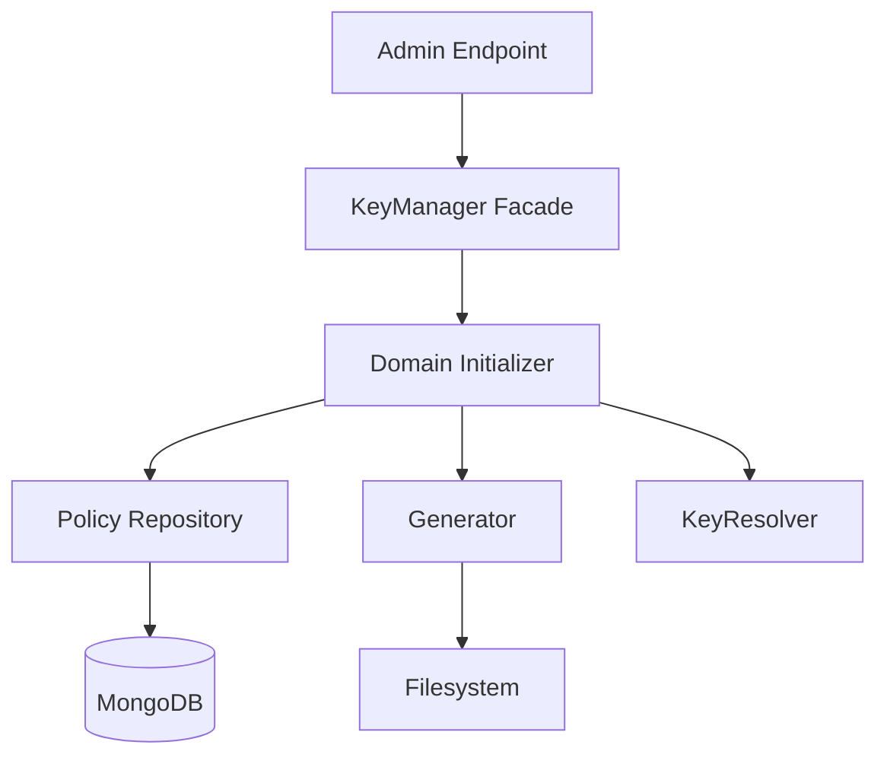
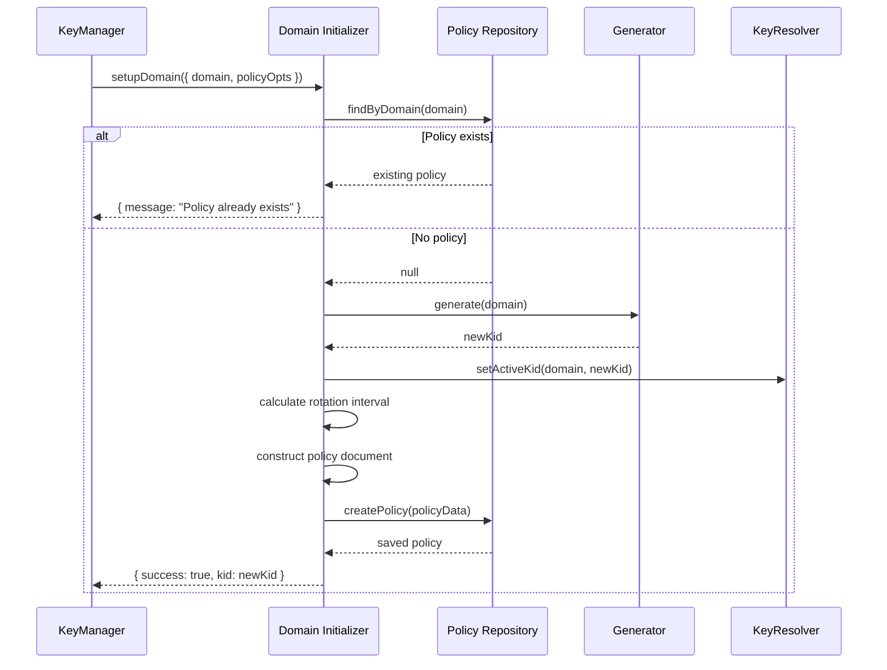

# Domain Initializer

## Why the domain initializer exists

When the Vault onboards a new authentication domain—like "user", "service", or "user-admin"—it needs to generate the first RSA key pair, mark it as active, and establish a rotation policy that defines when the next key should be generated. This setup cannot follow the normal rotation flow because there is no previous key to rotate from. The domain initializer exists to handle this special case: bootstrapping a domain's cryptographic lifecycle from nothing.

The initializer runs exactly once per domain. If called again for an existing domain, it detects the existing policy and exits without modification. This prevents accidental key regeneration or policy conflicts. The initializer's job is narrow: generate the first key, activate it, and record the rotation schedule. Once complete, the domain is ready for normal signing and rotation operations.

## How the domain initializer fits into the Vault

The domain initializer is invoked through the KeyManager facade, which exposes an `initialSetupDomain(domain, policyOpts)` method. This method is typically called during system startup or by an administrative endpoint when adding a new authentication domain. The KeyManager normalizes the domain and delegates to the initializer.

The initializer depends on four components: the generator (to create the first key pair), the keyResolver (to set the active KID), the policyRepository (to persist rotation policy in MongoDB), and the RotationState (to provide default rotation interval configuration). The initializer does not perform signing, JWKS building, or cleanup—it focuses entirely on first-time setup.

## Keeping first-time setup deliberately simple

The initializeDomain class is a single orchestrator with no helper classes. Its public API exposes one method: `setupDomain({ domain, policyOpts })`. The method performs four sequential steps: check for existing policy, generate the first key, activate it, and create a rotation policy document.

The policy check prevents duplicate initialization. If a rotation policy already exists for the domain, the initializer logs a message and returns immediately. This ensures that calling `initialSetupDomain()` multiple times on the same domain is safe and idempotent—it only succeeds once.

Key generation delegates to `generator.generate(domain)`, which returns the new KID. The initializer then calls `keyResolver.setActiveKid(domain, newKid)`, marking this key as the current signing key. No manual file operations or metadata manipulation occur at this layer—those responsibilities belong to the generator and keyResolver.

Finally, the initializer constructs a policy document with the domain, rotation interval (defaulting to the system's configured interval), the current timestamp as `rotatedAt`, the next rotation timestamp as `nextRotationAt`, and an enabled flag set to true. This document is saved to MongoDB via `policyRepo.createPolicy(policyData)`, establishing the rotation schedule that the rotation scheduler will later query.

## What happens when a domain is initialized

When the KeyManager receives an `initialSetupDomain(domain, policyOpts)` call, it normalizes the domain to uppercase and forwards the request to `domainInitializer.setupDomain({ domain, policyOpts })`. The initializer first queries `policyRepo.findByDomain(domain)` to check if a policy already exists. If found, the initializer returns `{ message: "Policy already exists" }` and exits.

If no policy exists, the initializer calls `generator.generate(domain)`, which creates the private key, public key, and metadata files, then returns the new KID. With the KID in hand, the initializer calls `keyResolver.setActiveKid(domain, newKid)`, updating the active KID state (stored in Redis or an in-memory cache, depending on configuration).

Next, the initializer calculates the rotation interval. If `policyOpts.rotationInterval` is provided, it uses that value; otherwise, it falls back to `state.rotationIntervalMs` (the system default). The initializer constructs a policy object with the domain, rotation interval in days, the current timestamp for `rotatedAt`, a calculated `nextRotationAt` timestamp (current time + rotation interval), the enabled flag set to true, and an optional note describing the policy.

This policy is passed to `policyRepo.createPolicy(policyData)`, which saves it to MongoDB. Once saved, the initializer returns `{ success: true, kid: newKid }`, confirming that the domain is now operational.

## The tradeoffs behind this design

The initializer could have been combined with the generator, making key generation automatically establish rotation policy. Instead, the two are separated. The generator only creates keys and metadata; the initializer orchestrates the broader setup, including policy creation and active KID assignment. This separation ensures the generator remains reusable for rotation scenarios, where policy already exists and only key generation is needed.

Another choice: the initializer accepts optional `policyOpts`, allowing the caller to override the default rotation interval or provide a custom note. This flexibility supports different rotation requirements for different domains—administrative domains might rotate less frequently than user-facing domains. The initializer applies sensible defaults but allows configuration when needed.

The initializer also relies on the policyRepository to enforce domain uniqueness. MongoDB's schema ensures only one policy document exists per domain. If multiple initialization requests arrive concurrently, the database handles the conflict. The initializer trusts the repository layer to maintain consistency and does not implement additional locking.

The design deliberately avoids retrying on failure. If key generation fails, the initializer propagates the error upward. If policy creation fails after the key is generated, the domain is left in an inconsistent state—the key exists, but no rotation policy is recorded. This is an explicit tradeoff: the initializer prioritizes simplicity over transactional guarantees. Recovery requires manual intervention or a separate reconciliation process.

## What the domain initializer guarantees — and what it doesn't

The initializer guarantees that if `setupDomain()` succeeds, a valid RSA key pair exists on disk for the domain, the key is marked as active, and a rotation policy document exists in MongoDB with a calculated `nextRotationAt` timestamp. It guarantees that calling `setupDomain()` on an already-initialized domain is safe and will not overwrite existing keys or policies.

The initializer does not guarantee transactional consistency across filesystem, cache, and database. If key generation succeeds but policy creation fails, the key remains on disk without a policy. The initializer does not roll back the generated key. This means manual cleanup or reconciliation may be required if setup fails partway through.

The initializer also does not validate that the domain name conforms to any specific format or that the rotation interval is within acceptable bounds. Those validations, if needed, should occur in the application layer before calling the initializer. The initializer treats the domain as an opaque string and the rotation interval as a numeric value, trusting the caller to provide valid inputs.

## Who depends on the domain initializer (and who doesn't)

The domain initializer is consumed exclusively by the KeyManager facade, which exposes it through the `initialSetupDomain()` method. Administrative endpoints and startup scripts call the KeyManager to onboard new domains. No other domain modules directly interact with the initializer—signing, building, rotation, and cleanup all assume domains are already initialized.

The generator does not call the initializer. The metadata manager does not call the initializer. The signer does not call the initializer. The loader does not call the initializer. The initializer is a one-time bootstrap operation, not part of the normal request-response cycle or lifecycle orchestration.

This isolation ensures the initializer can change how it structures rotation policies, how it calculates intervals, or how it handles errors without affecting ongoing operations. The initializer's interface—`setupDomain({ domain, policyOpts })` returning success status and KID—remains stable even if the implementation evolves.

## Following the implementation

Start with [initlizeDomain.js](src/domain/key-manager/init/initlizeDomain.js), which implements the entire setup flow in the `setupDomain()` method. The method checks for existing policies, generates the first key, activates it, and creates the policy document. The initializer is invoked through [KeyManager.js](src/domain/key-manager/KeyManager.js), which normalizes the domain and forwards the request.

The rotation policy is persisted using [rotationPolicyRepository.js](src/infrastructure/db/repositories/rotationPolicyRepository.js), which wraps MongoDB operations. The policy schema is defined in [RotationPolicy.model.js](src/infrastructure/db/models/RotationPolicy.model.js), specifying fields like `domain`, `rotationInterval`, `rotatedAt`, `nextRotationAt`, and `enabled`.

## The mental model to keep

Think of the domain initializer as a one-time bootstrap script that generates the first key, activates it, and records the rotation schedule—after which the domain enters normal operation and never needs initialization again.
