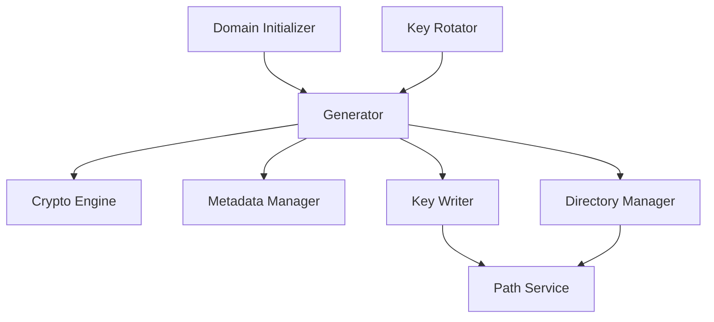
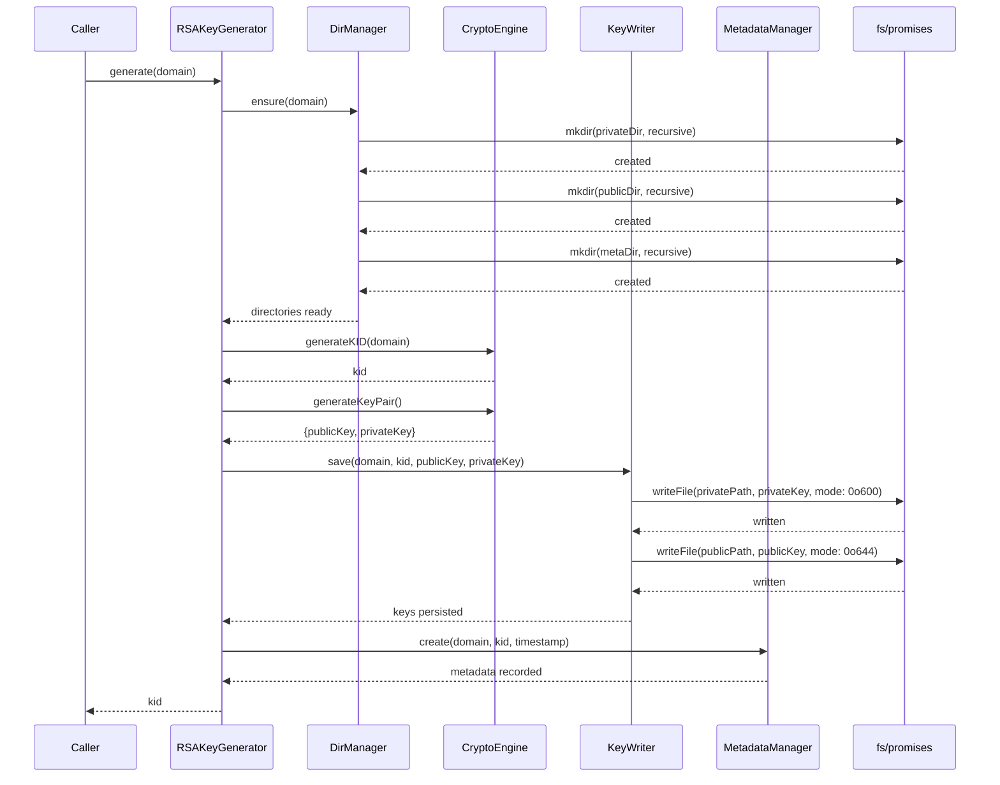

# Generator

## Why the generator exists

The generator exists to create new cryptographic key pairs and persist them to disk in the exact structure the system expects. It orchestrates a five-step sequence: ensure directories exist, generate a unique key identifier, produce an RSA key pair, write both keys to their proper locations, and record metadata about the newly created key. This module does not decide when keys should be generated or validate rotation policies—it only executes the creation workflow when instructed. It accepts a domain name and returns a KID, treating key generation as a pure operation without side knowledge of system state. By isolating generation logic, the system can create keys during both initial domain setup and key rotation using the same primitive.

## How the generator fits into the Vault

The generator sits in the domain layer and is called by exactly two orchestrators: the domain initializer when setting up a brand new domain for the first time, and the key rotator when creating a new key to replace an expiring one. No other modules call the generator because key creation is deliberately controlled through these entry points. The generator delegates cryptographic operations to the crypto engine, file operations to the key writer and directory manager, and metadata tracking to the metadata manager. It never imports Node.js filesystem primitives or crypto libraries directly, keeping itself focused solely on orchestrating the sequence of operations that constitute key generation.

## Keeping key generation deliberately simple

The generator is structured as a single orchestrator that coordinates three narrow helpers. The `RSAKeyGenerator` class knows the full sequence: create directories, generate identifier, generate key pair, write files, record metadata. Each helper is deliberately ignorant of the larger workflow. `DirManager` only creates the three required directories for a domain—private keys, public keys, and metadata—without knowing why these directories are needed or what will be written to them. `KeyWriter` only writes two files with specific permissions, setting restrictive 0o600 on private keys and readable 0o644 on public keys. Neither helper validates domain names, checks for existing keys, or understands the concept of key rotation. The factory wires dependencies together, injecting filesystem functions and path services into helpers while keeping the orchestrator's constructor simple and testable.

## What happens when a key is generated

When `generate(domain)` is called, the orchestrator first ensures the filesystem structure exists by delegating to the directory manager, which creates three directories recursively if they don't already exist. With the directories in place, it asks the crypto engine to generate a unique key identifier based on the domain name, receiving a KID string formatted as `{domain}-{YYYYMMDD}-{HHMMSS}-{HEX}`. The orchestrator then calls the crypto engine to produce an RSA key pair, receiving both public and private keys as PEM-encoded strings ready for immediate persistence. It delegates to the key writer, which writes the private key to `storage/keys/{domain}/private/{kid}.pem` with restrictive permissions and the public key to `storage/keys/{domain}/public/{kid}.pem` with world-readable permissions. Finally, the orchestrator calls the metadata manager to record the key's creation, establishing the key's existence in the tracking system. The function returns the newly generated KID to the caller, allowing them to reference the key in subsequent operations.

## The tradeoffs behind this design

The generator deliberately avoids making any decisions about key lifecycle or policy. By accepting only a domain and returning a KID, it remains a pure execution primitive that both initial setup and rotation can compose into their workflows without special casing. The sequence is ordered to fail fast: directory creation happens first because it's the cheapest operation, KID generation happens before the expensive key pair generation, and metadata is recorded last because it's the only operation that creates durable state beyond the key files. The module does not validate whether a KID already exists or check for directory conflicts—it trusts that the crypto engine produces unique identifiers and that the filesystem will error if files already exist. The key writer sets different permissions on private versus public keys at write time rather than using a separate chmod operation, avoiding a potential race condition where keys could be readable during a permission change window. The generator does not guarantee atomic cleanup if any step fails—partial state may exist on disk requiring manual cleanup or retry logic in the caller.

## What the generator guarantees — and what it doesn't

After a successful call to `generate(domain)`, the module guarantees that five things are true: the key pair exists on disk in the expected directory structure with correct permissions, the metadata manager has recorded the key's creation with the current timestamp, the returned KID is unique and formatted correctly, both key files are immediately usable without additional processing, and the directory structure is ready for additional keys to be generated for the same domain. The generator does not guarantee that the domain name is valid or normalized—input validation is the caller's responsibility. It does not check whether keys already exist for the domain or prevent duplicate generation. It does not guarantee atomic rollback if any step fails—the caller must handle cleanup of partial state. It does not track how many keys have been generated or whether the filesystem has sufficient space. Higher layers rely on the returned KID being immediately usable for signing operations and the key files being readable by the loader without additional setup.

## Who depends on the generator (and who doesn't)

The domain initializer depends on the generator to produce the first key for a new domain during onboarding, calling it once per domain to establish the initial signing capability. The key rotator depends on it to create replacement keys during rotation, calling it whenever a key needs to be replaced based on policy or manual trigger. The signer and JWKS builder never interact with the generator because they only consume keys that already exist through the loader. The metadata manager is called by the generator but doesn't call it back. The janitor never calls the generator because it only deletes keys, never creates them. If the generator's interface were to change, only the initializer and rotator would need updates, and both use it through the same `generate(domain)` method signature.

## Following the implementation

Start with [generatorFactory.js](c:/Users/Gurdev%20Singh/OneDrive/Desktop/vault/src/domain/key-manager/modules/generator/generatorFactory.js) to see how dependencies are wired together, with filesystem functions injected from `fs/promises`. Then read [RSAKeyGenerator.js](c:/Users/Gurdev%20Singh/OneDrive/Desktop/vault/src/domain/key-manager/modules/generator/RSAKeyGenerator.js) to understand the five-step orchestration sequence. The helper classes—[DirManager.js](c:/Users/Gurdev%20Singh/OneDrive/Desktop/vault/src/domain/key-manager/modules/generator/DirManager.js) and [KeyWriter.js](c:/Users/Gurdev%20Singh/OneDrive/Desktop/vault/src/domain/key-manager/modules/generator/KeyWriter.js)—are straightforward wrappers around mkdir and writeFile that accept injected functions for testability.

## The mental model to keep

Think of this module as a controlled entry point into key creation, not a policy engine.
