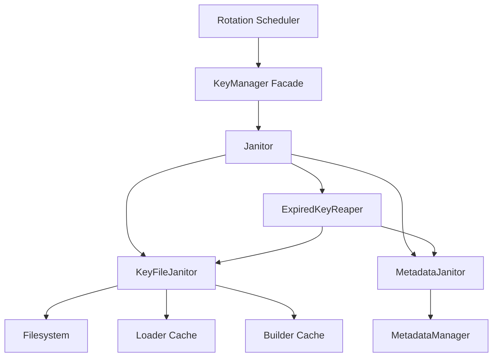
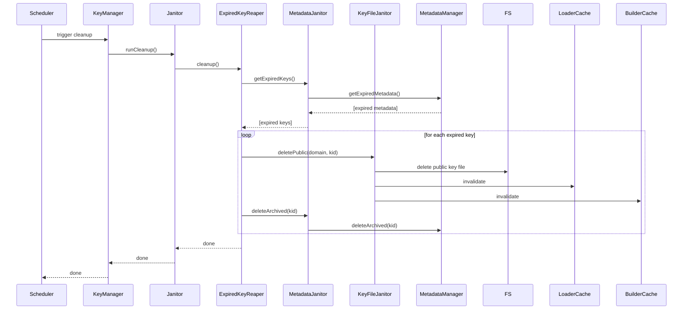

# Janitor

## Why the janitor exists

Over time, cryptographic keys and their metadata can accumulate in the Vault, especially as keys are rotated and replaced. Without a cleanup mechanism, expired keys and stale metadata would linger on disk and in memory, increasing storage usage and the risk of serving outdated material. The janitor exists to systematically remove expired keys and their associated metadata, ensuring the Vault remains lean, secure, and compliant with retention policies.

The janitor does not decide when to rotate keys or which keys are active. It operates on the assumption that key rotation and expiry are managed elsewhere. Its job is to enforce cleanup: deleting files, invalidating caches, and purging metadata for keys that are no longer valid.

## How the janitor fits into the Vault

The janitor is orchestrated by the KeyManager, which exposes cleanup operations to administrative and scheduled tasks. The janitor itself is composed of three helpers: the KeyFileJanitor (removes key files and invalidates caches), the MetadataJanitor (removes metadata and manages expiry), and the ExpiredKeyReaper (coordinates the deletion of expired keys and their metadata).

The janitor never interacts directly with signing, key generation, or JWKS exposure. It is a pure maintenance component, called only by lifecycle management flows.

## Keeping cleanup deliberately simple

The janitor is a thin orchestrator. Its public API exposes methods for running a full cleanup (`runCleanup`), deleting private or public keys (`deletePrivate`, `deletePublic`), and managing metadata (`addKeyExpiry`, `deleteOriginMetadata`, `deleteArchivedMetadata`). Each operation is delegated to the appropriate helper, which encapsulates the logic for file deletion, cache invalidation, or metadata purging.

The KeyFileJanitor deletes key files from disk using the KeyDeleter, then invalidates all relevant in-memory caches to prevent stale keys from being served. The MetadataJanitor removes metadata files and can add expiry timestamps to archived metadata, supporting delayed deletion for public keys. The ExpiredKeyReaper queries the MetadataManager for expired keys, then coordinates their deletion by calling the KeyFileJanitor and MetadataJanitor in sequence.

This separation ensures that each helper has a single responsibility, making the cleanup process easy to reason about and extend. If new cleanup requirements arise—such as purging additional caches or handling new metadata formats—they can be added to the relevant helper without affecting the janitor's orchestration logic.

## What happens when cleanup is performed

When the janitor's `runCleanup` method is called (typically by a scheduled task), it delegates to the ExpiredKeyReaper's `cleanup` method. The reaper queries the MetadataJanitor for expired keys, which in turn asks the MetadataManager for metadata entries whose expiry date has passed. For each expired key, the reaper instructs the KeyFileJanitor to delete the public key file and invalidate caches, then tells the MetadataJanitor to delete the archived metadata.

The janitor can also be called directly to delete specific private or public keys, or to add expiry to a key's metadata. These operations are delegated to the KeyFileJanitor and MetadataJanitor, which handle the necessary file and metadata operations.

## The tradeoffs behind this design

The janitor could have been implemented as a single class with all cleanup logic in one place. Instead, it is split into three helpers, each with a focused responsibility. This modularity makes it easier to test, extend, and maintain. If the cleanup process needs to support new types of files or metadata, only the relevant helper needs to change.

Another choice: the janitor does not attempt to recover from partial failures. If deleting a file or metadata entry fails, the error is propagated upward. This makes failures visible and actionable, rather than silently masking problems. The janitor prioritizes correctness and transparency over silent resilience.

The janitor also does not proactively scan for orphaned files or metadata. It relies on the MetadataManager to track expiry and on the rotation and signing flows to maintain consistency. This keeps the janitor's scope limited to explicit cleanup operations.

## What the janitor guarantees — and what it doesn't

The janitor guarantees that when `runCleanup` is called, all expired public keys and their archived metadata will be deleted, and all relevant caches will be invalidated. It guarantees that direct deletion methods remove the specified files and metadata, ensuring that stale keys cannot be served.

The janitor does not guarantee transactional consistency across file and metadata deletion. If deleting a file succeeds but metadata deletion fails (or vice versa), the system may be left in a partially cleaned state. The janitor does not roll back successful deletions. Manual intervention may be required to resolve inconsistencies.

The janitor also does not guarantee that all orphaned files or metadata will be found and deleted. It operates only on keys and metadata known to be expired, as reported by the MetadataManager.

## Who depends on the janitor (and who doesn't)

The janitor is consumed by the KeyManager, which exposes cleanup operations to administrative and scheduled flows. The rotation scheduler may trigger cleanup after a successful rotation, and administrators may invoke cleanup manually. No other domain modules interact with the janitor—signing, key generation, and JWKS exposure do not require cleanup operations.

The janitor does not call the generator, signer, or builder. It is a pure consumer of the MetadataManager and the KeyDeleter, operating only on expired or explicitly deleted keys.

This isolation ensures the janitor can evolve its cleanup logic, add new helpers, or change error handling without affecting other domain operations. The janitor's interface—`runCleanup()`, `deletePrivate()`, `deletePublic()`, `addKeyExpiry()`, etc.—remains stable even if the implementation changes.

## Following the implementation

Start with [janitor.js](src/domain/key-manager/modules/janitor/janitor.js), which exposes the public API and delegates to the helpers. The helpers are implemented in [KeyFileJanitor.js](src/domain/key-manager/modules/janitor/KeyFileJanitor.js), [MetadataJanitor.js](src/domain/key-manager/modules/janitor/MetadataJanitor.js), and [ExpiredKeyReaper.js](src/domain/key-manager/modules/janitor/ExpiredKeyReaper.js). The janitor is wired together in [janitorFactory.js](src/domain/key-manager/modules/janitor/janitorFactory.js).

## The mental model to keep

Think of the janitor as a scheduled cleaner that keeps the Vault free of expired keys and stale metadata, ensuring only valid cryptographic material remains accessible.
