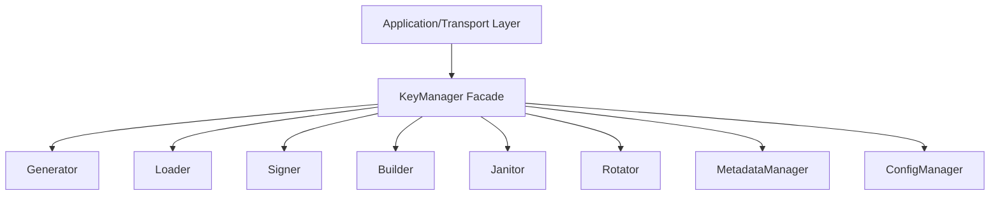
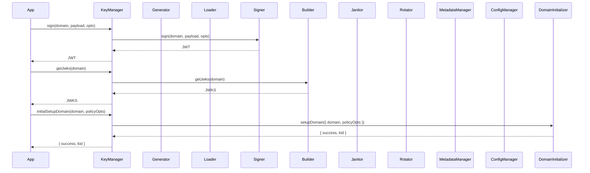

# Key Manager Facade

## Why the Key Manager facade exists

The Key Manager facade exists to provide a single, unified entry point for all key management operations in the Vault. It shields the rest of the system from the complexity of the underlying modules—generation, loading, signing, rotation, cleanup, and policy management—by exposing a stable, high-level API. This makes it possible for application services, transport layers, and administrative tools to interact with key management without needing to understand the details of each component.

The facade does not implement business logic itself. Instead, it delegates to the appropriate domain modules, orchestrating their collaboration and enforcing system-wide invariants. This separation ensures that changes to internal modules do not ripple out to consumers of the key management API.

## How the Key Manager facade fits into the Vault

The facade is the root of the domain layer for key management. All external requests—whether from HTTP, gRPC, or internal services—are routed through the Key Manager. The facade normalizes inputs, enforces access patterns, and delegates to the correct module for each operation. It is the only component that knows how to coordinate the full lifecycle of keys, from creation to deletion.

## Keeping orchestration deliberately simple

The Key Manager facade is implemented as a class with methods for each major operation: sign, getJwks, initialSetupDomain, rotate, rotateDomain, cleanup, and more. Each method normalizes inputs (such as domain names), then delegates to the appropriate module. The facade does not cache, persist, or transform data itself; it is a pure orchestrator.

This design ensures that the API remains stable even as internal modules evolve. The facade can add, remove, or change internal collaborators without breaking external consumers. It also centralizes error handling and logging, making it easier to monitor and debug the system.

## What happens when an API call is made

When an external service calls the Key Manager (for example, to sign a token), the facade normalizes the domain, validates the payload, and delegates to the signer. For JWKS requests, it delegates to the builder. For domain setup, it calls the domain initializer. For rotation, it calls the scheduler or rotator as appropriate. For cleanup, it calls the janitor. Each method returns a promise that resolves with the result or rejects with an error.

## The tradeoffs behind this design

The facade could have been omitted, with each module exposed directly to the application layer. However, this would scatter orchestration logic and error handling throughout the codebase, making it harder to maintain and evolve. By centralizing all key management operations in the facade, the Vault ensures a stable, testable, and extensible API surface.

Another choice: the facade does not expose internal module APIs. It only exposes high-level operations, hiding implementation details and enforcing invariants. This makes it easier to change internal modules without breaking consumers.

The facade also centralizes logging and error handling, making it easier to monitor and debug the system. It does not attempt to recover from all errors; some failures are propagated to the caller for manual intervention.

## What the Key Manager facade guarantees — and what it doesn't

The facade guarantees that all key management operations are routed through a single, stable API. It guarantees that inputs are normalized and validated, and that errors are handled consistently. It does not guarantee the correctness of internal modules; it trusts collaborators to implement their contracts.

The facade does not guarantee transactional consistency across modules. If an operation spans multiple modules and one fails, the facade does not roll back previous steps. This is a deliberate tradeoff for simplicity and composability.

## Who depends on the Key Manager facade (and who doesn't)

The facade is consumed by all application and transport layers that require key management. No other domain modules depend on the facade; it is the root of the dependency tree. Internal modules are not aware of the facade and do not call it.

This isolation ensures the facade can evolve its API, add new operations, or change internal collaborators without affecting other modules. The facade's interface remains stable even as the system grows.

## Following the implementation

Start with [KeyManager.js](src/domain/key-manager/KeyManager.js), which implements the facade. The facade is wired with its collaborators in [managerFactory.js](src/domain/key-manager/managerFactory.js). Application and transport layers call the facade for all key management operations.

## The mental model to keep

Think of the Key Manager facade as the Vault's front desk: it receives all requests, delegates to the right expert, and ensures every operation is handled smoothly and consistently.
