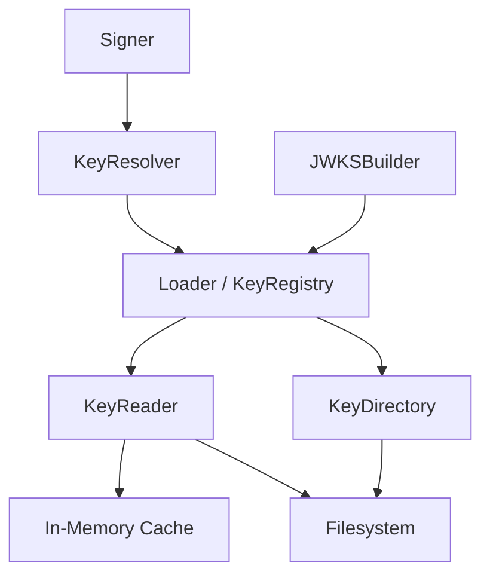
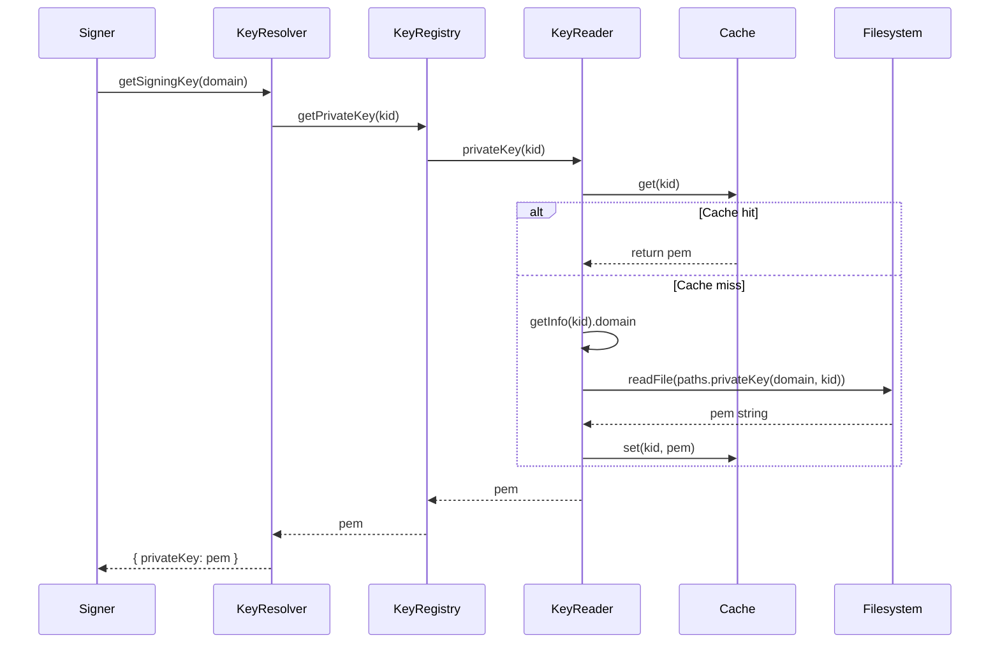

# Loader

## Why the loader exists

When the Vault signs tokens or exposes public keys, it needs access to the cryptographic material stored on disk. But reading from the filesystem on every signature request would create unnecessary I/O overhead and slow down the signing path. The loader exists to retrieve RSA key pairs from disk while caching them in memory, turning what could be a bottleneck into a fast lookup.

The loader operates in a narrow scope: it reads `.pem` files from the filesystem and returns their contents as strings. It does not parse key structure, validate cryptographic properties, or make decisions about which key to use. Those responsibilities belong to other modules. The loader simply answers two questions: what keys exist for a domain, and what does a specific key contain?

## How the loader fits into the Vault

The loader sits between the domain layer's signing and building operations and the filesystem. When the signer needs a private key to create a JWT signature, it delegates to the keyResolver, which delegates to the loader. When the builder needs all public keys for a domain to construct a JWKS response, it calls the loader directly.

The loader never decides which key is active or whether a key should be used. It retrieves key material on demand, relying on the caller to specify the KID or domain. This keeps the loader's contract simple and focused.

## Keeping key retrieval deliberately simple

The loader is implemented as three collaborating classes: `KeyRegistry`, `KeyReader`, and `KeyDirectory`. The registry acts as the public API, exposing methods to retrieve single keys or all keys for a domain. The reader handles the actual file reading and caching logic. The directory lists available KIDs by reading directory contents and filtering for `.pem` files.

This separation ensures that each class has one reason to change. The registry orchestrates retrieval but doesn't know how caching works. The reader caches but doesn't know how to list available keys. The directory lists files but doesn't know how to read them. This means adding a new caching strategy requires changing only the reader, not the entire loader.

The reader implements a cache-then-disk pattern: check the in-memory cache first, and only read from disk on a miss. Once a key is read, it's stored in the cache using the KID as the lookup key. Since KIDs are globally unique and keys are immutable after creation, this cache never needs invalidation. A key loaded once can be served from memory for the lifetime of the process.

## What happens when a key is retrieved

When the signer needs a private key, it calls `keyResolver.getSigningKey(domain)`, which calls `loader.getPrivateKey(kid)`. The loader's KeyRegistry delegates to the KeyReader, which first checks the private key cache. If the KID is found, the cached PEM string is returned immediately. If not, the reader extracts the domain from the KID using `cryptoEngine.getInfo(kid).domain`, constructs the filesystem path using `pathService.privateKey(domain, kid)`, and reads the file contents with `fs/promises.readFile()`. The PEM string is then stored in the cache before being returned to the caller.

When the builder needs all public keys for a domain, it calls `loader.getPublicKeyMap(domain)`. The registry delegates to the KeyDirectory, which reads the domain's public key directory using `readdir()`, filters for files ending in `.pem`, and strips the extension to produce a list of KIDs. The registry then loops over these KIDs, calling `reader.publicKey(kid)` for each one, and returns a map of `kid -> pem`.

The directory also validates that the expected directories exist when `ensureDirectories(domain)` is called. If any of the private, public, or metadata directories are missing, it throws an error. This check deliberately does not create directories—that responsibility belongs to the generator. The loader only reads from a structure that must already exist.

## The tradeoffs behind this design

The loader could have been designed as a single class that handled caching, reading, and listing all in one place. Instead, it splits those concerns across three classes. This adds complexity in terms of wiring and interfaces, but it preserves flexibility. If the system later needs to switch from an in-memory cache to a distributed cache like Redis, only the KeyReader needs to change. The registry and directory remain untouched.

The loader also deliberately does not parse KID structure. It relies on `cryptoEngine.getInfo(kid)` to extract the domain from the KID. This keeps the loader from duplicating parsing logic and ensures that any changes to KID format are handled in one place: the crypto engine. The loader trusts the engine to provide accurate domain information and uses it only to construct filesystem paths.

Another design choice: the loader does not validate that keys are well-formed RSA keys or that they match expected cryptographic properties. It treats keys as opaque strings. Validation happens downstream, in the crypto engine, when the key is imported for signing or conversion to JWK format. This separation ensures the loader remains a pure I/O layer, not a cryptographic validator.

## What the loader guarantees — and what it doesn't

The loader guarantees that if a key file exists on disk and the KID is known, it will return the PEM string. It guarantees that once a key is loaded, subsequent retrievals will be served from cache without additional disk I/O. It guarantees that listing KIDs for a domain returns only files with a `.pem` extension, excluding any other files that might exist in the directory.

The loader does not guarantee that the returned PEM string represents a valid RSA key. It does not guarantee that the key matches the KID structure or that it belongs to the expected domain. It does not guarantee that the key is still valid or unexpired. These validations are the responsibility of the metadata manager, the crypto engine, and the signer.

The loader also does not handle key rotation logic. When a new key is generated, the loader does not automatically refresh its cache or become aware of the new key. The next time `getPublicKeyMap()` is called, the directory lists files again, and the new key appears. But the loader does not push updates or notify other parts of the system. It operates on-demand, responding to requests rather than proactively tracking changes.

## Who depends on the loader (and who doesn't)

The loader is consumed by two domain modules: the keyResolver (used by the signer) and the JWKSBuilder (used to expose public keys). The signer never calls the loader directly—it goes through the keyResolver, which abstracts the active KID retrieval. The builder calls the loader directly because it needs all public keys for a domain, not just the active one.

The generator does not use the loader. When generating keys, the generator writes files to disk and creates metadata, but it does not read keys back. The metadata manager does not use the loader either—it operates only on `.json` metadata files, not key material. The janitor does not need the loader because it deletes expired keys by file path, not by loading their contents.

This isolation means the loader can change its caching strategy, its file reading approach, or even its internal structure without affecting key generation, metadata tracking, or cleanup. The loader is a leaf dependency in the domain layer, consumed by signing and building operations but not involved in lifecycle management.

## Following the implementation

Start with [KeyRegistry.js](src/domain/key-manager/modules/loader/KeyRegistry.js), which exposes the public API methods: `getPrivateKey()`, `getPublicKey()`, `getPublicKeyMap()`, and `getPrivateKeyMap()`. Then read [KeyReader.js](src/domain/key-manager/modules/loader/KeyReader.js) to see how cache-then-disk retrieval works. Finally, check [KeyDirectory.js](src/domain/key-manager/modules/loader/KeyDirectory.js) to understand how KID listing and directory validation are implemented.

The factory in [loaderFactory.js](src/domain/key-manager/modules/loader/loaderFactory.js) wires these three classes together with their dependencies: `loaderCache` (in-memory cache), `pathService` (filesystem paths), and `cryptoEngine` (KID parsing).

## The mental model to keep

Think of the loader as a cache-aware filesystem reader that treats keys as opaque strings and serves them on demand without interpreting their contents.
