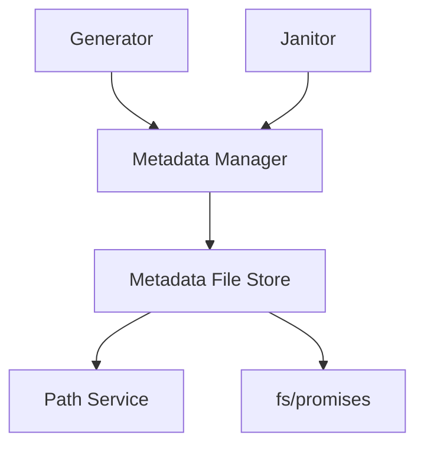
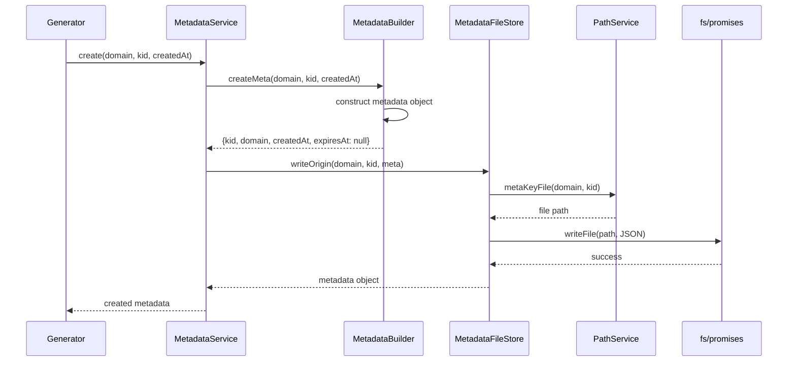
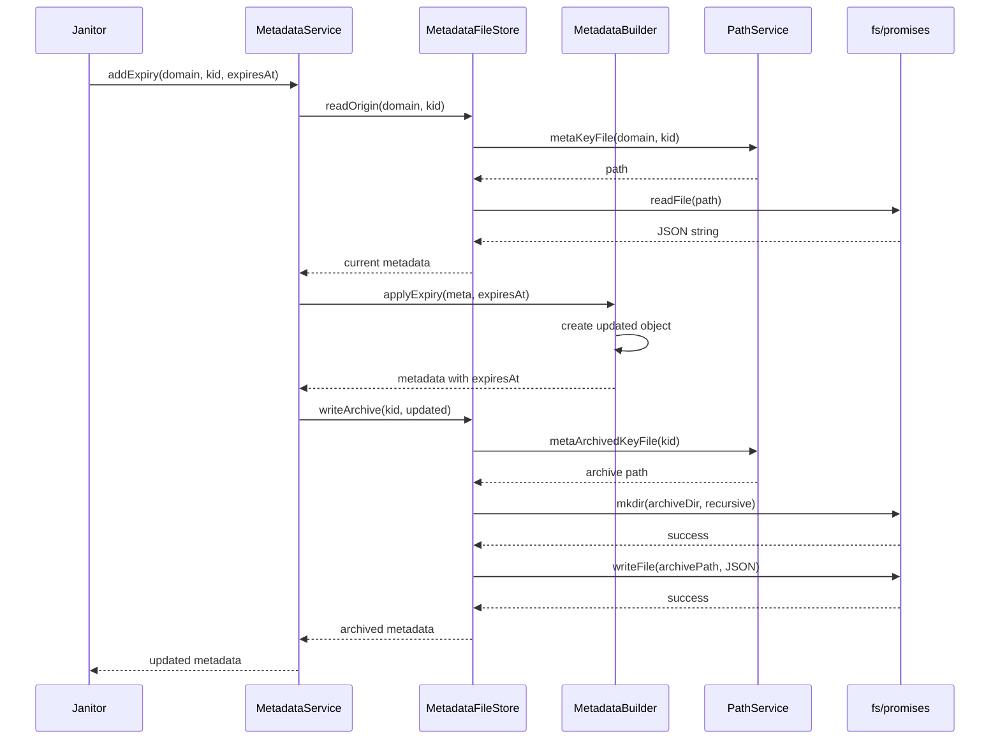
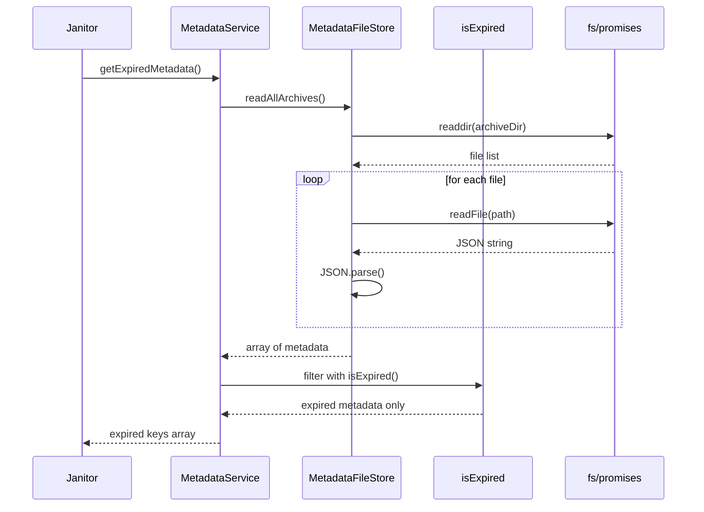

# Metadata Manager

## Why the metadata manager exists

The metadata manager exists to track the lifecycle of every cryptographic key in the system without touching the keys themselves. It maintains JSON metadata files that record when a key was created, which domain it belongs to, and when it expires. This module does not generate keys, sign tokens, or perform cryptographic operations—it only manages the bookkeeping that tells the rest of the system which keys exist, whether they're still active, and when they should be cleaned up. By separating metadata from key material, the system can make lifecycle decisions without loading private keys into memory. The metadata structure is deliberately simple, containing only four fields: kid, domain, createdAt, and expiresAt.

## How the metadata manager fits into the Vault

The metadata manager sits in the domain layer and is consumed by modules that need to track key lifecycle. The generator calls it immediately after creating a new key pair to record the key's birth. The janitor calls it to mark keys for expiry, retrieve expired keys for deletion, and clean up metadata files after keys are removed. No other modules currently call the metadata manager directly—the signer and builder work with keys but don't need to know about expiry dates or creation timestamps. The manager delegates all file operations to an injected file store, keeping the service layer focused on business logic while the store handles IO concerns.

## Keeping metadata tracking deliberately simple

The manager is structured as a service layer that coordinates three helpers. The `MetadataService` class exposes the public interface with methods for CRUD operations and higher-level queries. The `MetadataFileStore` handles all filesystem interactions, reading and writing JSON files to two separate locations: active metadata in domain-specific directories and archived metadata in a global directory. The `MetadataBuilder` creates metadata objects with the correct structure and applies expiry timestamps without mutating existing objects. The utility function `isExpired` checks whether a metadata record has passed its expiration date. The service never directly touches the filesystem—all paths and file operations are delegated to the store, and all object construction is delegated to the builder.

## What happens when metadata is created

When the generator creates a new key pair, it calls `metadataManager.create(domain, kid, createdAt)` to establish the key's existence in the tracking system. The service delegates to the builder, which constructs a metadata object with the kid as the identifier, the domain for organizational grouping, the creation timestamp in ISO format, and a null expiresAt field indicating the key is currently active. The service then delegates to the file store, which uses the path service to determine the correct file path under `storage/metadata/keys/{domain}/{kid}.meta`, serializes the metadata object as pretty-printed JSON, and writes it to disk with readable permissions. The operation returns the created metadata object, allowing the generator to verify what was persisted.

## What happens when a key is marked for expiry

When the janitor determines a key should expire, it calls `metadataManager.addExpiry(domain, kid, expiresAt)` to move the key into the expiration pipeline. The service first reads the current metadata by calling `read(domain, kid)`, which checks the active directory first and falls back to the archived directory if not found. If no metadata exists, the operation returns null. Otherwise, the service delegates to the builder to create an updated metadata object with the expiry timestamp added while preserving all other fields. The service then calls the store to write this updated metadata to the archive directory at `storage/metadata/keys/archived/{kid}.meta`, creating the directory if needed. The metadata now exists in two places: the original location and the archive. The janitor is responsible for deleting the original after the key files are removed.

## What happens when finding expired keys

When the janitor runs cleanup, it calls `metadataManager.getExpiredMetadata()` to find all keys that have passed their expiration date. The service delegates to the file store to read all files from the archive directory. The store lists all files in `storage/metadata/keys/archived/`, reads each one, parses the JSON, and returns an array of metadata objects. The service then filters this array using the `isExpired` utility function, which checks whether the `expiresAt` timestamp is less than or equal to the current time. Only metadata with expiry dates in the past are returned. The service does not read metadata from active directories because keys without expiry timestamps are by definition not expired.

## The tradeoffs behind this design

The metadata manager separates active and archived metadata into different directory structures, allowing fast cleanup queries without scanning every domain directory. Archived metadata uses a flat structure without domain separation because expired keys from all domains need to be discovered together during cleanup. The service allows metadata to exist in both active and archived locations simultaneously during the expiry window, accepting temporary duplication to avoid coordination complexity between the metadata manager and janitor. Metadata files are human-readable JSON rather than binary formats, trading storage efficiency for debuggability and manual inspection. The builder creates new objects rather than mutating existing metadata, following immutable data patterns that prevent accidental state corruption. The service does not validate whether keys actually exist on disk—it trusts that the generator and janitor maintain consistency between keys and metadata.

## What the metadata manager guarantees — and what it doesn't

After a successful `create()` call, the manager guarantees that a metadata file exists in the active directory with the correct structure and all required fields. After a successful `addExpiry()` call, it guarantees that the metadata exists in the archive directory with an expiry timestamp, but does not automatically delete the active version. After a successful `getExpiredMetadata()` call, it guarantees that all returned metadata has passed its expiration date according to the current system time. The manager does not guarantee atomicity between metadata operations and key file operations—the generator and janitor must coordinate to maintain consistency. It does not prevent duplicate KIDs across domains—uniqueness is the crypto engine's responsibility. It does not validate expiry dates are in the future when applying them. It does not automatically clean up metadata when keys are deleted. Higher layers rely on the manager to persist metadata durably and retrieve it accurately, but must handle coordination and validation themselves.

## Who depends on the metadata manager (and who doesn't)

The generator depends on the metadata manager to record every new key immediately after creation, establishing the key's presence in the system's tracking layer. The janitor depends on it to mark keys for expiry, discover which keys need deletion, and clean up metadata after keys are removed. The signer and builder do not call the metadata manager because they retrieve keys through the loader and don't need lifecycle information. The loader does not call it because metadata is tracked separately from key material. The rotator does not directly call it but depends on it indirectly through the generator when creating new keys. If the metadata format changes, only this module and its consumers need updates, though a migration would be needed for existing metadata files.

## Following the implementation

Start with [MetadataService.js](c:/Users/Gurdev%20Singh/OneDrive/Desktop/vault/src/domain/key-manager/modules/metadata/MetadataService.js) to see the public interface and how it coordinates the builder and store. Then read [MetadataFileStore.js](c:/Users/Gurdev%20Singh/OneDrive/Desktop/vault/src/domain/key-manager/modules/metadata/metadataFileStore.js) to understand the file operations for both active and archived metadata. The [MetadataBuilder.js](c:/Users/Gurdev%20Singh/OneDrive/Desktop/vault/src/domain/key-manager/modules/metadata/metadataBuilder.js) shows object construction logic, and [utils.js](c:/Users/Gurdev%20Singh/OneDrive/Desktop/vault/src/domain/key-manager/modules/metadata/utils.js) contains the expiry checking function. The [metadataFactory.js](c:/Users/Gurdev%20Singh/OneDrive/Desktop/vault/src/domain/key-manager/modules/metadata/metadataFactory.js) shows how dependencies are wired together.

## The mental model to keep

Think of this module as the system's memory—it remembers when keys were born and when they should die, without touching the keys themselves.
