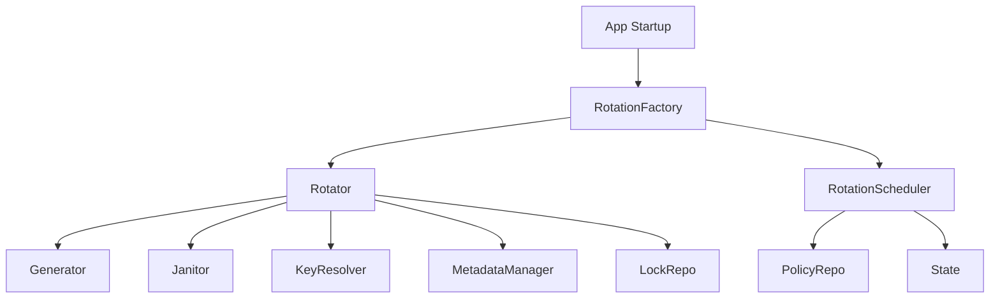
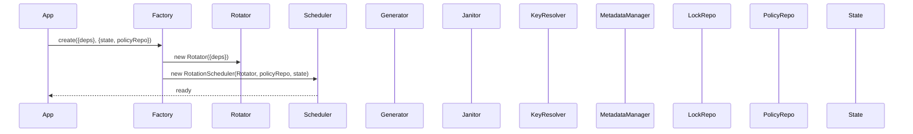

# Rotation Factory

## Why the rotation factory exists

The rotation factory exists to wire together the complex dependencies required for key rotation and scheduling in the Vault. Key rotation involves multiple collaborating components—generators, janitors, resolvers, metadata managers, lock repositories, policy repositories, and configuration state. The factory centralizes the construction and assembly of these objects, ensuring that the rotator and scheduler are always created with the correct dependencies.

The factory does not perform rotation or scheduling itself. Its sole responsibility is to encapsulate the wiring logic, making it easy to instantiate the rotation subsystem in a consistent, testable, and maintainable way.

## How the rotation factory fits into the Vault

The rotation factory is used by the domain layer to create a fully-wired RotationScheduler, which in turn orchestrates all key rotation operations. The factory receives all required dependencies as constructor arguments, then creates a Rotator (the atomic key replacement engine) and a RotationScheduler (the orchestrator and retry manager). The factory exposes a `create()` method to produce a new scheduler, and a `getInstance()` static method to provide a singleton if needed.

The factory never interacts directly with key files, metadata, or cryptographic operations. It is a pure assembly component, responsible for dependency injection and lifecycle management.

## Keeping dependency wiring deliberately simple

The RotationFactory class exposes two methods: `create()` (to produce a new scheduler with all dependencies) and `getInstance()` (to provide a singleton scheduler for the process). The factory receives all dependencies as arguments, avoiding hardcoded imports or global state. This makes the rotation subsystem easy to test, mock, and reconfigure.

The factory wires the Rotator with its required collaborators, then passes the Rotator, policy repository, and state to the RotationScheduler. This separation ensures that the scheduler and rotator are always constructed with the correct objects, and that changes to dependency wiring are localized to the factory.

## What happens when the rotation subsystem is initialized

When the Vault starts up, the domain layer calls `RotationFactory.create()` (or `getInstance()`) with all required dependencies. The factory constructs a Rotator, passing in the generator, janitor, key resolver, metadata manager, and lock repository. It then constructs a RotationScheduler, passing in the Rotator, policy repository, and configuration state. The fully-wired scheduler is returned to the caller, ready to orchestrate key rotation across all domains.

## The tradeoffs behind this design

The factory could have been omitted, with the scheduler and rotator constructed directly in the application layer. However, this would scatter dependency wiring throughout the codebase, making it harder to test, maintain, and evolve. By centralizing construction in the factory, the Vault ensures that all rotation logic is consistently and correctly assembled.

Another choice: the factory supports both per-call construction (`create()`) and singleton access (`getInstance()`). This allows the Vault to use a single scheduler instance for the process, or to create new schedulers for testing or reconfiguration. The factory does not manage the lifecycle of its dependencies—it assumes they are provided by the caller.

The factory also does not perform any logic beyond construction. It does not validate dependencies, manage state, or handle errors. This keeps the factory focused and easy to reason about.

## What the rotation factory guarantees — and what it doesn't

The factory guarantees that every RotationScheduler it produces is fully wired with the correct dependencies. It guarantees that the rotator and scheduler are constructed consistently, with no missing or misconfigured collaborators. It does not guarantee the correctness of the dependencies themselves—that is the caller's responsibility.

The factory does not guarantee singleton behavior unless `getInstance()` is used. It does not manage the lifecycle or disposal of dependencies. It does not perform any logic beyond construction.

## Who depends on the rotation factory (and who doesn't)

The rotation factory is used by the domain layer to assemble the rotation subsystem. No other modules interact with the factory—signing, key generation, JWKS exposure, and cleanup do not require dependency wiring. The factory is a pure assembly component, isolated from business logic.

This isolation ensures the factory can evolve its wiring logic, add new dependencies, or change construction order without affecting other domain operations. The factory's interface—`create()` and `getInstance()`—remains stable even if the implementation changes.

## Following the implementation

Start with [rotationFactory.js](src/domain/key-manager/modules/keyRotator/rotationFactory.js), which implements the wiring logic. The factory is invoked by the domain layer at startup or when a new scheduler is needed. The rotator and scheduler are constructed and returned, ready for use.

## The mental model to keep

Think of the rotation factory as the Vault's assembly line: it wires together all the moving parts required for key rotation, ensuring the system is always ready to rotate keys on schedule.
