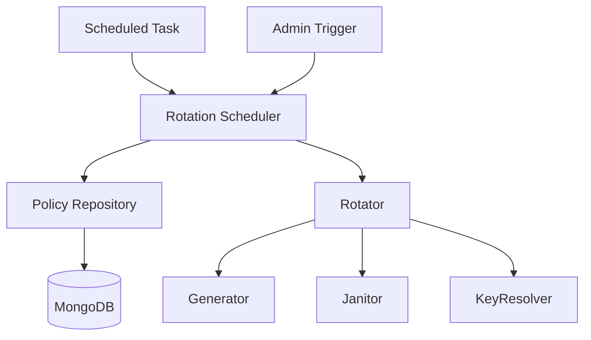

# Rotation Scheduler

## Why the rotation scheduler exists

Key rotation is only effective if it happens reliably and on schedule. The rotation scheduler exists to automate the process of determining when each domain is due for key rotation, triggering the rotation process, and retrying failed rotations. Without a scheduler, key rotation would be a manual, error-prone process, risking stale keys and security lapses.

The scheduler does not generate keys, update policies, or perform file operations itself. Its responsibility is to orchestrate: it queries the policy repository for domains due for rotation, delegates the actual rotation to the rotator, and manages retries and error reporting. The scheduler ensures that every domain's rotation policy is enforced consistently.

## How the rotation scheduler fits into the Vault

The scheduler is a domain service, invoked by cron jobs, administrative triggers, or manual commands. It is the only component responsible for initiating key rotation across all domains. The scheduler depends on the policy repository (to find due domains and update rotation metadata), the rotator (to perform the actual rotation), and the rotation state (to read retry and interval configuration).

The scheduler never interacts directly with key files, metadata, or cryptographic operations. It is a pure orchestrator, ensuring that the right domains are rotated at the right time.



## Keeping rotation orchestration deliberately simple

The RotationScheduler class exposes three public methods: `runScheduledRotation()` (for cron jobs), `triggerImmediateRotation()` (for admin triggers), and `triggerDomainRotation(domain)` (for manual, domain-specific rotation). All three methods delegate to a private method that ensures all due domains are rotated, with retries for failures.

The scheduler reads retry configuration from the rotation state, including the maximum number of retries and the interval between attempts. For each rotation attempt, it queries the policy repository for all domains due for rotation, then processes each one in turn. If a rotation fails, the scheduler retries up to the configured maximum, waiting the specified interval between attempts.

The scheduler never performs rotation itself. For each domain, it delegates to the rotator, passing a callback to update rotation metadata in the policy repository and a database session for transactional safety. The scheduler tracks the outcome of each rotation, logging successes, failures, and skipped domains.

## What happens when scheduled rotation runs

When a scheduled rotation is triggered (by cron or admin), the scheduler calls `_ensureSuccessfulRotation()`. This method reads retry configuration and attempts to rotate all due domains. For each attempt, it calls `_rotateDueDomains()`, which queries the policy repository for due domains and processes each one by calling `_processSingleDomain(policy)`.

For each domain, the scheduler creates a database update callback and session, then calls `rotator.rotateKeys(domain, dbUpdateCallback, session)`. If the rotation succeeds, the scheduler logs success; if it fails, it logs failure and retries as needed. Once all domains are processed, the scheduler returns a summary of successes, failures, and skipped domains.

```mermaid
sequenceDiagram
    participant Cron as Cron/Admin
    participant Scheduler
    participant PolicyRepo
    participant Rotator
    participant Session

    Cron->>Scheduler: runScheduledRotation()
    Scheduler->>Scheduler: _ensureSuccessfulRotation()
    loop maxRetries
        Scheduler->>PolicyRepo: getDueForRotation()
        PolicyRepo-->>Scheduler: [policies]
        loop for each policy
            Scheduler->>Scheduler: _processSingleDomain(policy)
            Scheduler->>Session: getSession()
            Scheduler->>Rotator: rotateKeys(domain, dbUpdateCallback, session)
            Rotator-->>Scheduler: result
        end
        alt all succeeded
            Scheduler-->>Cron: done
            break
        else some failed
            Scheduler->>Scheduler: wait retryIntervalMs
        end
    end
```

## The tradeoffs behind this design

The scheduler could have been implemented as a background loop or as part of the rotator. Instead, it is a separate orchestrator, making it easy to trigger rotation from multiple sources (cron, admin, manual) and to configure retry logic independently. This separation keeps the rotator focused on atomic key replacement, while the scheduler manages orchestration and error handling.

Another choice: the scheduler does not attempt to parallelize rotations. It processes each domain in sequence, ensuring that database transactions and locks are respected. This avoids race conditions and ensures that each rotation is fully committed before the next begins.

The scheduler also does not attempt to recover from persistent failures. If a domain cannot be rotated after all retries, the scheduler logs the error and moves on. This makes failures visible and actionable, rather than silently masking problems.

## What the rotation scheduler guarantees — and what it doesn't

The scheduler guarantees that all domains due for rotation will be processed, with retries for failures up to the configured maximum. It guarantees that each rotation is performed in a database transaction, with policy metadata updated on success. It guarantees that failures are logged and visible for manual intervention.

The scheduler does not guarantee that all rotations will succeed. If a domain cannot be rotated after all retries, it is skipped and must be handled manually. The scheduler does not guarantee parallel execution or transactional consistency across domains—each rotation is independent.

## Who depends on the rotation scheduler (and who doesn't)

The scheduler is invoked by cron jobs, admin triggers, and manual commands. No other domain modules interact with the scheduler—signing, key generation, JWKS exposure, and cleanup do not require rotation orchestration.

The scheduler does not call the signer, builder, or loader. It is a pure orchestrator, focused on policy enforcement and error handling.

This isolation ensures the scheduler can evolve its retry logic, error handling, or invocation sources without affecting other domain operations. The scheduler's interface—`runScheduledRotation()`, `triggerImmediateRotation()`, `triggerDomainRotation(domain)`—remains stable even if the implementation changes.

## Following the implementation

Start with [rotationScheduler.js](src/domain/key-manager/modules/keyRotator/rotationScheduler.js), which implements the orchestration logic. The scheduler is wired with its dependencies in [rotationFactory.js](src/domain/key-manager/modules/keyRotator/rotationFactory.js). The rotator is invoked for each domain due for rotation, with policy updates and session management handled by the scheduler.

## The mental model to keep

Think of the rotation scheduler as the Vault's timekeeper: it ensures every domain is rotated on schedule, with retries for failures, and never lets a stale key linger unnoticed.
