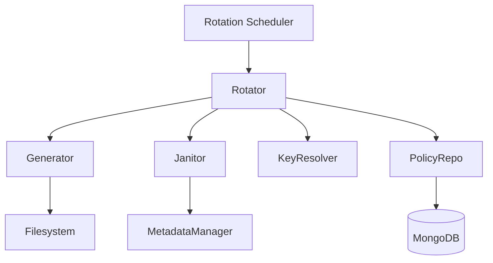
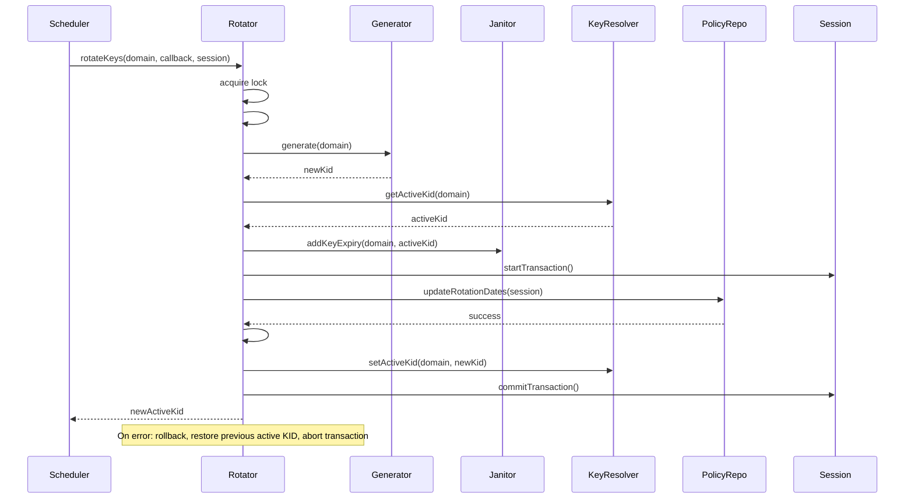

# Rotator

## Why the rotator exists

Key rotation is essential for maintaining the security and integrity of cryptographic systems. Over time, even strong keys can become vulnerable due to advances in computing or accidental exposure. The rotator exists to automate the process of replacing old keys with new ones, ensuring that every domain in the Vault regularly receives fresh cryptographic material according to its rotation policy.

The rotator does not decide when to rotate or which domains are due. It is a pure executor: given a domain and a policy, it generates a new key, archives the old one, and updates the system state. The rotator is never called for first-time setup—that is the domain initializer's job. It only handles ongoing, scheduled, or manually triggered rotations.

## How the rotator fits into the Vault

The rotator is orchestrated by the RotationScheduler, which determines when each domain is due for rotation based on its policy. The scheduler calls the rotator for each eligible domain, passing in the necessary callbacks and database session. The rotator coordinates with the generator (to create the new key), the janitor (to archive the old key), the keyResolver (to update the active KID), and the policy repository (to update rotation metadata).

The rotator never interacts directly with signing, JWKS exposure, or metadata management outside of rotation. It is a pure lifecycle component, focused on the atomic process of key replacement.

## Keeping rotation deliberately simple

The Rotator class is a single orchestrator. Its public API exposes `rotateKeys(domain, updateRotationDatesCallback, session)`, which performs the entire rotation process in a database transaction. The rotator acquires a lock for the domain to prevent concurrent rotations, then calls a private method to execute the rotation steps.

Rotation consists of three phases: preparation, commit, and rollback. In preparation, the rotator generates a new key using the generator, sets it as the upcoming KID, and archives the current active key by instructing the janitor to add an expiry to its metadata. In commit, the rotator updates the active KID to the new key and finalizes the rotation. If any step fails, the rotator rolls back to the previous active KID and aborts the transaction, ensuring the system remains consistent.

The rotator never exposes partial state. If rotation fails, it restores the previous active key and logs the error. This ensures that only fully successful rotations are visible to the rest of the system.

## What happens when a rotation is performed

When the scheduler determines a domain is due for rotation, it calls `rotator.rotateKeys(domain, updateRotationDatesCallback, session)`. The rotator acquires a lock for the domain to prevent concurrent rotations. It then calls `#prepareRotation(domain)`, which generates a new key and archives the current active key by adding an expiry to its metadata.

Next, the rotator starts a database transaction and calls the provided callback to update rotation dates in the policy repository. It then calls `#commitRotation(domain)`, which sets the new key as active. If all steps succeed, the transaction is committed and the new key becomes active.

If any step fails, the rotator calls `#rollbackRotation(domain)`, restoring the previous active key, and aborts the transaction. The error is logged, and the rotation is marked as failed.

## The tradeoffs behind this design

The rotator could have been implemented as a single method in the scheduler, but separating it into its own class clarifies responsibilities and makes the rotation process easier to test and maintain. The rotator's use of explicit locking and transactions ensures that only one rotation can occur per domain at a time, and that partial failures do not leave the system in an inconsistent state.

Another choice: the rotator does not attempt to retry failed rotations. If a rotation fails, it logs the error and leaves the previous key active. The scheduler is responsible for retrying as needed. This separation of concerns keeps the rotator focused on atomic operations.

The rotator also does not handle first-time key setup. If no active key exists, rotation is not possible and an error is thrown. This ensures that only domains with an established key lifecycle can be rotated.

## What the rotator guarantees — and what it doesn't

The rotator guarantees that if rotation succeeds, a new key is generated, the previous key is archived, the new key is set as active, and the rotation policy is updated in the database. It guarantees that only one rotation can occur per domain at a time, and that failed rotations are rolled back cleanly.

The rotator does not guarantee that all domains will be rotated on schedule. It relies on the scheduler to determine when rotation is due and to retry failed rotations. The rotator does not guarantee that keys are deleted immediately after rotation; it only archives the old key by adding an expiry to its metadata. Actual deletion is handled by the janitor.

## Who depends on the rotator (and who doesn't)

The rotator is consumed exclusively by the RotationScheduler, which orchestrates scheduled and manual rotations. No other domain modules interact with the rotator—signing, key generation, JWKS exposure, and cleanup do not require direct access to rotation logic.

The rotator does not call the signer, builder, or loader. It is a pure lifecycle component, focused on key replacement and archival.

This isolation ensures the rotator can evolve its locking, transaction, or error handling logic without affecting other domain operations. The rotator's interface—`rotateKeys(domain, callback, session)`—remains stable even if the implementation changes.

## Following the implementation

Start with [rotator.js](src/domain/key-manager/modules/keyRotator/rotator.js), which implements the rotation flow. The scheduler is implemented in [rotationScheduler.js](src/domain/key-manager/modules/keyRotator/rotationScheduler.js), which determines when to call the rotator. The rotator is wired with its dependencies in [rotationFactory.js](src/domain/key-manager/modules/keyRotator/rotationFactory.js).

## The mental model to keep

Think of the rotator as a transactional key surgeon: it replaces old keys with new ones, archives the previous key, and ensures the system state is always consistent—even in the face of errors.
