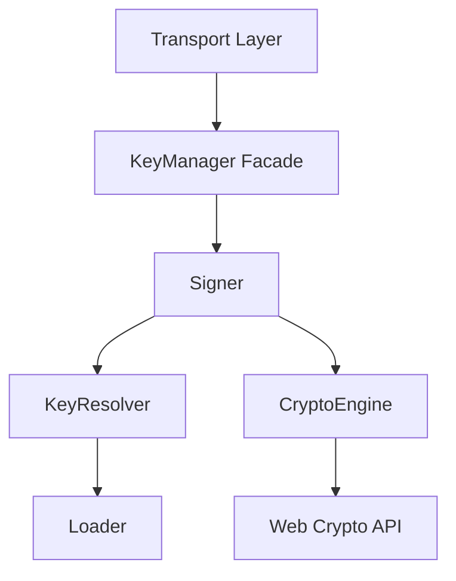
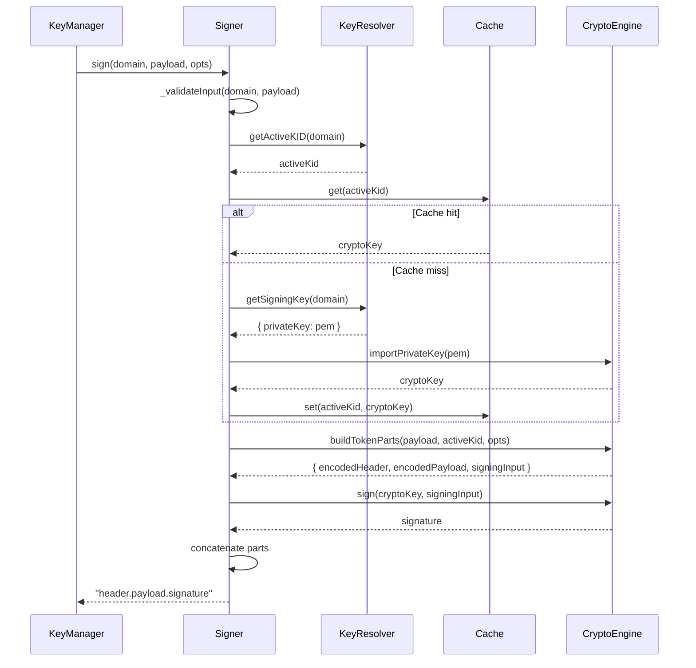

# Signer

## Why the signer exists

The Vault's primary responsibility is creating cryptographically signed JWTs for authentication and authorization. When an application service requests a token, it provides a domain and payload, but it should not need to know which key to use, how to format the token, or how to perform the signing operation. The signer exists to orchestrate this process: determine the active signing key, build the token structure, execute the cryptographic signature, and return a valid JWT string.

The signer does not generate keys, manage their lifecycle, or decide rotation timing. It operates on the assumption that an active key already exists for the requested domain. If no active key is available, the signer fails fast. This keeps the signer focused on one job: converting a payload into a signed token using the current active key.

## How the signer fits into the Vault

The signer is consumed by the KeyManager facade, which exposes a simple `sign(domain, payload, opts)` method to application services. The application layer calls the KeyManager, which normalizes the domain and delegates to the signer. The signer never communicates directly with transport handlers or external clients—it operates entirely within the domain layer.

To perform signing, the signer depends on the keyResolver (to determine the active KID and retrieve the private key PEM), the cryptoEngine (to build token parts and execute the RS256 signature), and an in-memory cache (to avoid repeatedly importing the same private key into Web Crypto API format). The signer coordinates these dependencies without implementing low-level cryptography or filesystem I/O itself.

## Keeping token signing deliberately simple

The Signer class is a single orchestrator with no helper classes. Its public API exposes one method: `sign(domain, payload, options)`. Internally, it breaks signing into three phases: validation, token building, and cryptographic signing. Each phase is handled by a private method or delegated to an infrastructure component.

Validation ensures the domain is a string and the payload is a plain object. Token building delegates to `cryptoEngine.buildTokenParts()`, which constructs the JWT header and payload, applies the TTL, encodes both as base64url, and returns the signing input. Cryptographic signing retrieves the active KID, loads the corresponding private key (checking cache first), converts the PEM string to a Web Crypto API `CryptoKey` object, and delegates to `cryptoEngine.sign()` to produce the signature.

The signer caches imported `CryptoKey` objects using the KID as the lookup key. This avoids the overhead of importing the same PEM string repeatedly. Since KIDs are immutable and keys never change after creation, the cache never requires invalidation. Once a key is imported, it remains in cache for the lifetime of the process.

## What happens when a token is signed

When the KeyManager receives a signing request, it normalizes the domain and calls `signer.sign(domain, payload, opts)`. The signer validates the input, then calls `keyResolver.getActiveKID(domain)` to determine which KID is currently active for the domain. If no active KID exists, the signer throws an error immediately—token signing cannot proceed without an active key.

With the active KID identified, the signer checks its cache for the corresponding `CryptoKey` object. On a cache hit, the key is retrieved instantly. On a miss, the signer calls `keyResolver.getSigningKey(domain)`, which returns the private key PEM string. The signer then calls `cryptoEngine.importPrivateKey(pem)` to convert the PEM into a `CryptoKey` object, stores it in the cache, and logs the cache update.

Next, the signer delegates token construction to `cryptoEngine.buildTokenParts(payload, activeKid, options)`, which returns an object containing the base64url-encoded header, the base64url-encoded payload, and the raw signing input (header + "." + payload). The signer passes the `CryptoKey` and signing input to `cryptoEngine.sign(cryptoKey, signingInput)`, which executes the RS256 signature and returns the base64url-encoded signature.

Finally, the signer concatenates the three parts—header, payload, signature—into the standard JWT format: `header.payload.signature`, and returns the complete token string to the KeyManager.

## The tradeoffs behind this design

The signer could have been designed to accept a specific KID rather than a domain, forcing the caller to determine which key to use. Instead, the signer accepts a domain and delegates active KID resolution to the keyResolver. This keeps signing callers from needing knowledge of the active key state. The keyResolver abstracts that logic, and the signer trusts its result.

Another choice: the signer caches `CryptoKey` objects, not PEM strings. This means the cache holds Web Crypto API key objects, which are already imported and ready for signing. Caching PEM strings would require importing the key on every sign operation, adding unnecessary overhead. Caching `CryptoKey` objects removes that bottleneck entirely.

The signer also configures a default TTL of 30 days if no TTL is specified in the options. This ensures tokens have a reasonable expiration without requiring the caller to specify it every time. The caller can override this by passing `ttlSeconds` in the options, but the default prevents unbounded token lifetimes.

The signer deliberately does not validate that the payload conforms to any specific schema or claim structure. It treats the payload as an opaque object and passes it directly to the crypto engine for encoding. Schema validation, if needed, should happen in the application layer before reaching the signer. The signer's contract is simple: given a valid domain and plain object payload, produce a signed JWT.

## What the signer guarantees — and what it doesn't

The signer guarantees that if an active key exists for the requested domain, a valid RS256-signed JWT will be returned. It guarantees that the token includes the correct `kid` header, the payload with applied TTL and any additional claims, and a cryptographic signature that can be verified with the corresponding public key.

The signer does not guarantee that the payload is semantically valid or conforms to JWT best practices. It does not validate claim structure, audience, issuer, or subject fields. Those validations belong to the application layer or a separate authorization service. The signer only ensures the token is cryptographically sound.

The signer also does not guarantee availability if no active key exists. If the domain has no active KID, the signer throws an error immediately. It does not attempt to generate a new key or rotate keys automatically. Key availability is the responsibility of the domain initializer and the rotation scheduler. The signer operates on existing state, not lifecycle management.

## Who depends on the signer (and who doesn't)

The signer is consumed exclusively by the KeyManager facade, which exposes it to the application and transport layers. The HTTP and gRPC handlers call the KeyManager's `sign()` method, which delegates to the signer. No other domain modules directly interact with the signer—signing is an endpoint operation, not an internal orchestration step.

The generator does not use the signer. The metadata manager does not use the signer. The loader does not use the signer. The builder does not use the signer—it exposes public keys in JWKS format, but it never signs tokens. The janitor does not use the signer. The signer is a leaf module in the domain layer, consumed only by the facade and isolated from key lifecycle operations.

This isolation ensures the signer can evolve its caching strategy, change how it interacts with the keyResolver, or adjust TTL defaults without affecting key generation, rotation, cleanup, or public key exposure. The signer's interface—`sign(domain, payload, opts)` returning a JWT string—remains stable even if the implementation changes.

## Following the implementation

Start with [Signer.js](src/domain/key-manager/modules/signer/Signer.js), which implements the entire signing flow in the `sign()` method. The private methods `_validateInput()`, `_getActiveKid()`, `_getCryptoKeyForKid()`, and `_convertToCryptoKey()` handle validation and key retrieval. The factory in [signerFactory.js](src/domain/key-manager/modules/signer/signerFactory.js) wires the signer with its dependencies: cache, keyResolver, cryptoEngine, and optional configuration.

The signer is invoked through [KeyManager.js](src/domain/key-manager/KeyManager.js), which normalizes the domain and forwards the request. The application layer accesses the signer via [signerService.js](src/application/services/transportServices/signerService.js), which wraps the KeyManager call.

## The mental model to keep

Think of the signer as a token assembly line that determines the active key, builds the JWT structure, and applies a cryptographic signature—without ever managing key lifecycle or deciding which key should be active.
