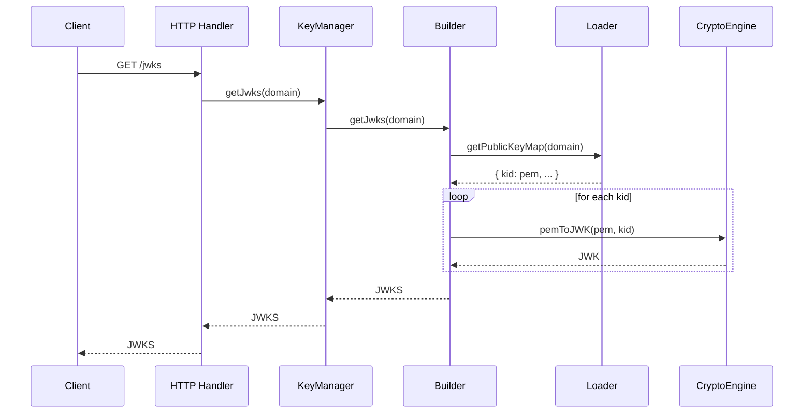

# JWKS Serving Flow

## Why this flow matters

The JWKS serving flow enables external clients and services to verify JWTs issued by the Vault. By exposing all public keys in JWKS format, the Vault ensures interoperability with OAuth2, OpenID Connect, and other standards. This flow is essential for secure, standards-compliant token verification.

## How the flow unfolds in the Vault

The process begins when a client requests the JWKS endpoint (typically via HTTP). The request is routed to the KeyManager, which delegates to the builder. The builder retrieves all public keys for the domain from the loader, converts them to JWK format using the crypto engine, and assembles the JWKS response.

## The tradeoffs behind this flow

The JWKS serving flow is designed for maximum compatibility and reliability. All public keys are exposed, supporting key rollover and multiple active keys. The builder caches JWKs for efficiency, and errors are propagated upward for visibility.

## What this flow guarantees — and what it doesn't

The JWKS serving flow guarantees that all public keys for a domain are exposed in JWKS format, ready for external verification. It does not guarantee that keys are valid or unexpired; it exposes all present keys. The flow is designed for interoperability and auditability.

## The mental model to keep

Think of the JWKS serving flow as the Vault's public window: it lets the world see which keys are valid for verifying tokens, with no secrets exposed.
