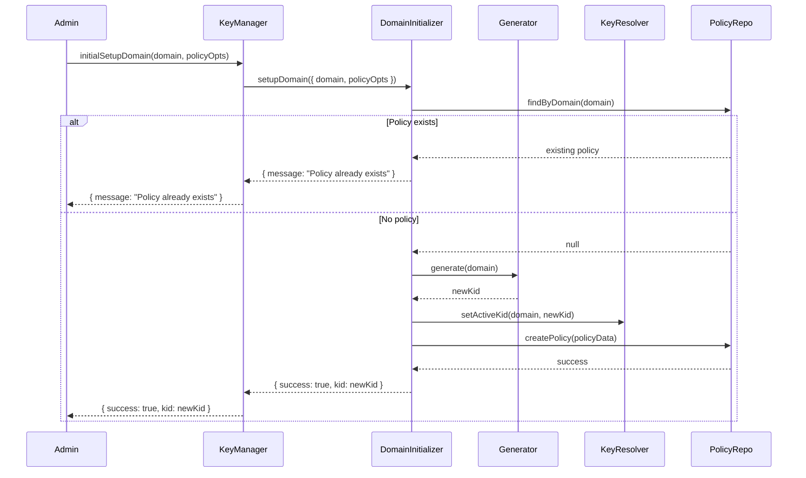

# Key Generation Flow

## Why this flow matters

The key generation flow is the foundation of the Vault's security. It describes how a brand new domain is onboarded, receives its first cryptographic key pair, and becomes operational for signing tokens. This flow ensures that every domain starts with a unique, securely generated key, and that the system's invariants are established from the very beginning.

## How the flow unfolds in the Vault

The process begins when an administrator or automated process calls the KeyManager's `initialSetupDomain()` method for a new domain. The KeyManager delegates to the domain initializer, which checks for an existing policy, generates the first key pair, marks it as active, and creates a rotation policy. The generator, keyResolver, and policy repository all play critical roles in this flow.

## The tradeoffs behind this flow

This flow is deliberately linear and idempotent. If a domain is already initialized, the process exits early without making changes. This prevents accidental key regeneration or policy conflicts. The generator and keyResolver are kept decoupled, allowing for flexible key creation and activation logic.

## What this flow guarantees — and what it doesn't

The key generation flow guarantees that every new domain starts with a securely generated key pair, an active KID, and a rotation policy. It does not guarantee transactional consistency across all steps; if policy creation fails after key generation, manual intervention may be required. The flow is designed for clarity and safety, ensuring that onboarding is predictable and auditable.

## The mental model to keep

Think of the key generation flow as the Vault's onboarding handshake: it establishes trust, sets the rules, and ensures every domain starts with a strong foundation.
