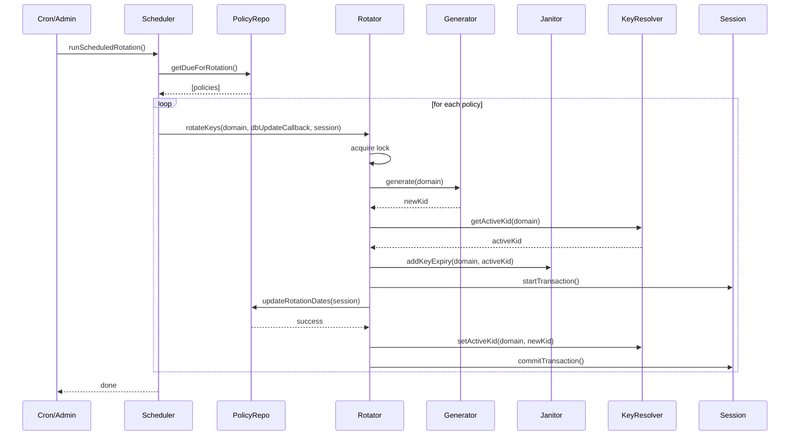

# Key Rotation Flow

## Why this flow matters

Key rotation is the heart of the Vault's security lifecycle. It ensures that cryptographic keys are regularly replaced, reducing the risk of compromise and keeping the system resilient against evolving threats. The key rotation flow describes how the system determines when a domain is due for rotation, generates a new key, archives the old one, and updates all relevant state.

## How the flow unfolds in the Vault

The process begins when the rotation scheduler (triggered by cron, admin, or manual command) queries the policy repository for domains due for rotation. For each domain, the scheduler delegates to the rotator, which acquires a lock, generates a new key, archives the old key, and updates the rotation policy in a database transaction. The janitor and keyResolver ensure that old keys are safely archived and that the new key becomes active.

## The tradeoffs behind this flow

The rotation flow is transactional per domain. If any step fails, the rotator rolls back to the previous active key and aborts the transaction. This ensures that only fully successful rotations are visible to the system. The scheduler manages retries for failed rotations, making the process robust against transient errors.

## What this flow guarantees — and what it doesn't

The key rotation flow guarantees that keys are rotated on schedule, with transactional safety and clear error handling. It does not guarantee parallel execution or transactional consistency across domains; each rotation is independent. The flow is designed for reliability and auditability.

## The mental model to keep

Think of the key rotation flow as the Vault's heartbeat: it keeps cryptographic material fresh, secure, and ready for the future.
