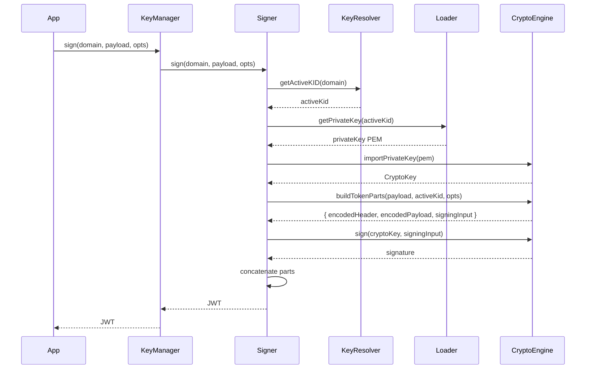

# Signing Flow

## Why this flow matters

The signing flow is the primary use case for the Vault: transforming a payload into a cryptographically signed JWT. This flow ensures that every token issued is signed with the current active key, validated, and ready for external verification. It is the critical path for authentication and authorization in any system relying on the Vault.

## How the flow unfolds in the Vault

The process begins when an application or service calls the KeyManager's `sign()` method with a domain and payload. The KeyManager normalizes the domain and delegates to the signer, which resolves the active KID, loads the private key (using the loader), imports it into the crypto engine, and builds the JWT structure. The crypto engine signs the token, and the result is returned to the caller.

## The tradeoffs behind this flow

The signing flow is optimized for speed and reliability. Caching is used for imported keys, and the loader ensures minimal disk I/O. The flow is strictly linear, with each step depending on the previous one. Errors are propagated upward, making failures visible and actionable.

## What this flow guarantees — and what it doesn't

The signing flow guarantees that every JWT is signed with the current active key for the domain, and that the token structure is valid. It does not guarantee payload semantics or claim validation; those are the responsibility of the caller. The flow is designed for clarity, speed, and auditability.

## The mental model to keep

Think of the signing flow as the Vault's signature line: every token passes through, is stamped with cryptographic proof, and is ready for the world to trust.
