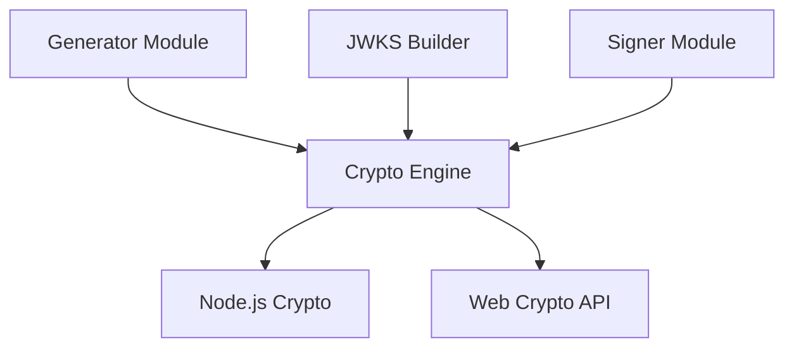
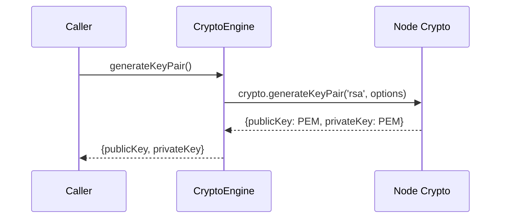
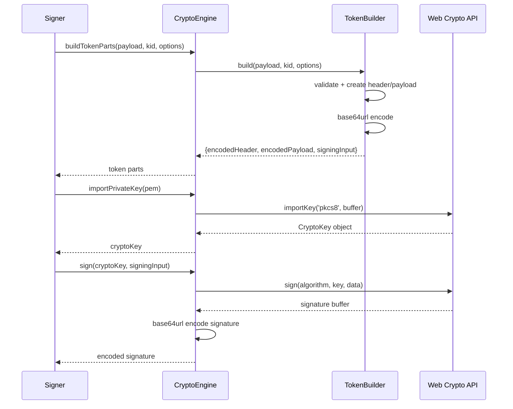
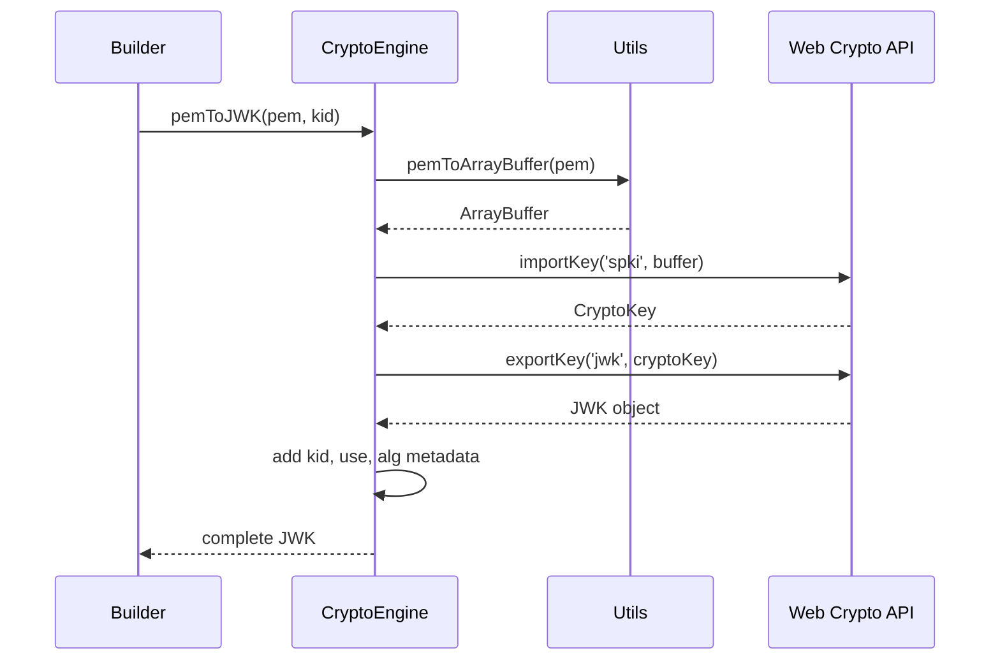
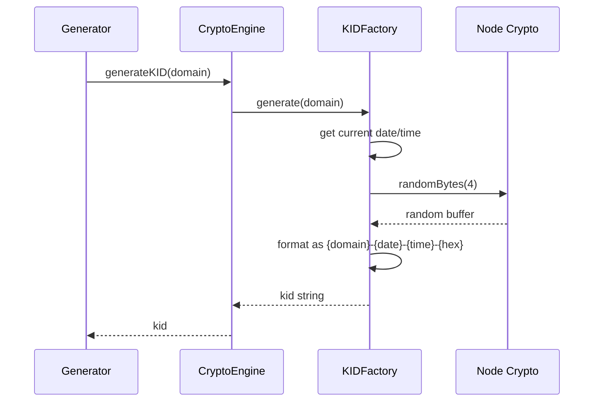

# Crypto Engine

## Why the crypto engine exists

The crypto engine exists to wrap Node.js cryptographic primitives with domain-friendly operations that the rest of the system can call without understanding the underlying complexity. It provides five core capabilities: generating RSA key pairs in PEM format, converting PEM-encoded public keys to JWK format for JWKS endpoints, importing private keys for signing, signing JWT payload strings, and generating unique key identifiers. This module does not decide when keys should be created or which key should sign a token—it only performs the cryptographic operations when asked. It isolates all crypto complexity behind a clean interface, ensuring domain modules never directly interact with Node's crypto APIs or deal with encoding conversions.

## How the crypto engine fits into the Vault

The crypto engine sits at the infrastructure layer and is consumed by domain modules that perform cryptographic operations. The generator calls it to create new key pairs and generate unique identifiers. The builder calls it to convert public keys from PEM to JWK format for external consumption. The signer calls it to import private keys and sign token payloads. No domain module imports Node's crypto library directly—all cryptographic operations flow through this engine. This keeps the domain layer pure and makes testing easier since crypto operations can be mocked through a single interface.

## Keeping cryptographic operations deliberately isolated

The engine is structured as a single orchestrator that coordinates four specialized helpers. The main `CryptoEngine` class exposes the public interface and delegates to helpers for specific concerns. `KIDFactory` handles key identifier generation and parsing, following a strict format that embeds domain and timestamp information. `TokenBuilder` constructs JWT header and payload structures, adding standard claims and validating payload size before encoding. The utility functions handle low-level conversions like PEM to ArrayBuffer and Base64URL encoding, accounting for differences between Node and browser environments. The config object centralizes all cryptographic parameters like modulus length, hash algorithms, and payload size limits. Each helper is ignorant of the others—the engine knows when to call each one, but the helpers themselves are narrow and focused.

## What happens during key pair generation

When `generateKeyPair()` is called, the engine delegates to Node's `crypto.generateKeyPair` function with preconfigured parameters from the crypto config. It wraps the callback-style Node API in a Promise to match the async patterns used throughout the system. The operation specifies RSA as the algorithm, uses a 2048-bit modulus length for security without excessive overhead, and requests PEM encoding for both keys. The private key is encoded in PKCS8 format and the public key in SPKI format. When generation completes, the engine returns both keys as PEM strings ready for immediate persistence. The domain layer receives raw PEM strings and never sees the underlying key objects or deals with encoding formats.

## What happens during token signing

When the signer needs to create a JWT, it first calls `buildTokenParts(payload, kid, options)` to construct the token structure. The engine delegates to TokenBuilder, which validates the payload is a plain object, creates a standard JWT header with RS256 algorithm and the provided kid, merges the payload with standard claims like `iat` and `exp`, validates the payload size doesn't exceed limits, and base64url-encodes both header and payload. The builder returns the encoded parts and a signing input string. Next, the signer calls `importPrivateKey(pem)` to convert the PEM string into a CryptoKey object using the Web Crypto API. Finally, it calls `sign(cryptoKey, signingInput)` which uses Web Crypto's sign function to produce a signature, base64url-encodes it, and returns it. The signer assembles the final JWT by concatenating the encoded parts with the signature.

## What happens during JWK conversion

When the builder needs to expose public keys in JWKS format, it calls `pemToJWK(pem, kid)` for each public key. The engine first converts the PEM string to an ArrayBuffer using utility functions that strip headers and whitespace, then decode base64. It uses the Web Crypto API to import this buffer as a CryptoKey object with the `spki` format and RSA-PSS algorithm configured for verification. With the key imported, it calls `exportKey('jwk')` to get the JSON Web Key representation. The engine enhances this JWK with standard metadata: the kid for identification, `use: 'sig'` to indicate signing purpose, and `alg: 'RS256'` to specify the signing algorithm. The builder receives a complete JWK ready for inclusion in a JWKS response.

## What happens during KID generation

When the generator needs a unique identifier for a new key, it calls `generateKID(domain)`. The engine delegates to KIDFactory which constructs an identifier following the pattern `{domain}-{YYYYMMDD}-{HHMMSS}-{HEX}`. The factory takes the domain name as the prefix, captures the current date in YYYYMMDD format, captures the current time in HHMMSS format, generates 4 random bytes and converts them to uppercase hex, then concatenates these parts with hyphens. The resulting KID is both human-readable and unique, embedding timestamp information that helps with debugging and auditing. Later, when any module needs to extract information from a KID, it calls `getInfo(kid)` which parses the KID string and returns an object containing the domain, date, time, and unique identifier components.

## The tradeoffs behind this design

The crypto engine deliberately exposes high-level operations rather than low-level primitives. By returning PEM strings instead of key objects, the domain layer can persist keys immediately without understanding crypto internals. By handling all encoding conversions internally, domain modules avoid dealing with Buffer-to-ArrayBuffer transformations or base64url differences between Node and browsers. The engine uses Web Crypto API for signing operations because it provides a standard, promise-based interface that works across environments, even though Node's native crypto module might be slightly faster. The KID format embeds timestamp and domain information directly in the identifier, avoiding the need for separate timestamp tracking, at the cost of making KIDs slightly longer and more opaque to external consumers. The TokenBuilder validates payload size before encoding, preventing oversized JWTs from reaching the signing stage where failures would be harder to diagnose.

## What the crypto engine guarantees — and what it doesn't

After a successful call to `generateKeyPair()`, the engine guarantees that both keys are valid RSA key pairs in PEM format, properly encoded for immediate file persistence or further processing. After a successful JWK conversion, the returned object is guaranteed to be valid JSON and compatible with standard JWKS consumers. After a successful signing operation, the signature is guaranteed to be verifiable using the corresponding public key. The engine does not guarantee that key generation will complete quickly—large key sizes or entropy starvation can cause delays. It does not validate whether a KID already exists or whether it collides with existing identifiers—uniqueness relies on timestamp precision and randomness. It does not check whether a payload contains sensitive information that shouldn't be in a JWT—payload validation is the caller's responsibility. Higher layers rely on the engine to fail loudly with exceptions rather than return corrupted or incomplete results.

## Who depends on the crypto engine (and who doesn't)

Every module that touches cryptographic material depends on the crypto engine. The generator uses it for both key creation and KID generation. The signer uses it for key importing, token construction, and signing. The builder uses it for PEM-to-JWK conversion. The metadata manager uses it to parse KID information. The key rotator indirectly depends on it through the generator. The janitor does not call the crypto engine because it only deletes files and metadata without performing cryptographic operations. The loader does not call it for normal operations because it only reads PEM files from disk, but the cache might use `getInfo()` to extract domain information from KIDs. No module bypasses the engine to call Node crypto directly, ensuring all cryptographic behavior is centralized and testable.
performs cryptographic operations depends on the crypto engine. The generator uses it for both key creation and KID generation. The signer uses it for key importing, token construction, and signing. The builder uses it for PEM-to-JWK conversion. The key rotator indirectly depends on it through the generator. The metadata manager does not use the crypto engine—it only manages JSON metadata files without performing cryptographic operations. The janitor does not call the crypto engine because it only deletes files and metadata. The loader does not call it because it only reads PEM files from disk as string

## Following the implementation

Start with [CryptoEngine.js](c:/Users/Gurdev%20Singh/OneDrive/Desktop/vault/src/infrastructure/cryptoEngine/CryptoEngine.js) to see the public interface and how it delegates to helpers. Then read [KIDFactory.js](c:/Users/Gurdev%20Singh/OneDrive/Desktop/vault/src/infrastructure/cryptoEngine/KIDFactory.js) for identifier generation logic and [TokenBuilder.js](c:/Users/Gurdev%20Singh/OneDrive/Desktop/vault/src/infrastructure/cryptoEngine/tokenBuilder.js) for JWT construction. The [utils.js](c:/Users/Gurdev%20Singh/OneDrive/Desktop/vault/src/infrastructure/cryptoEngine/utils.js) file contains encoding helpers. The [engineFactory.js](c:/Users/Gurdev%20Singh/OneDrive/Desktop/vault/src/infrastructure/cryptoEngine/engineFactory.js) shows dependency wiring.

## The mental model to keep

Think of this module as the system's cryptographic boundary—domain logic stays pure, crypto complexity stays here.
