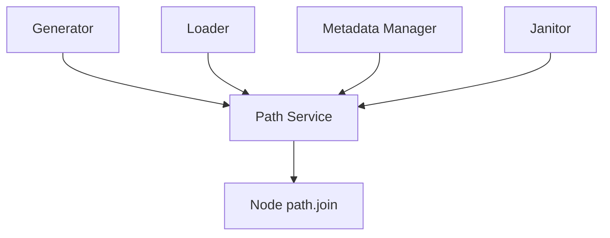
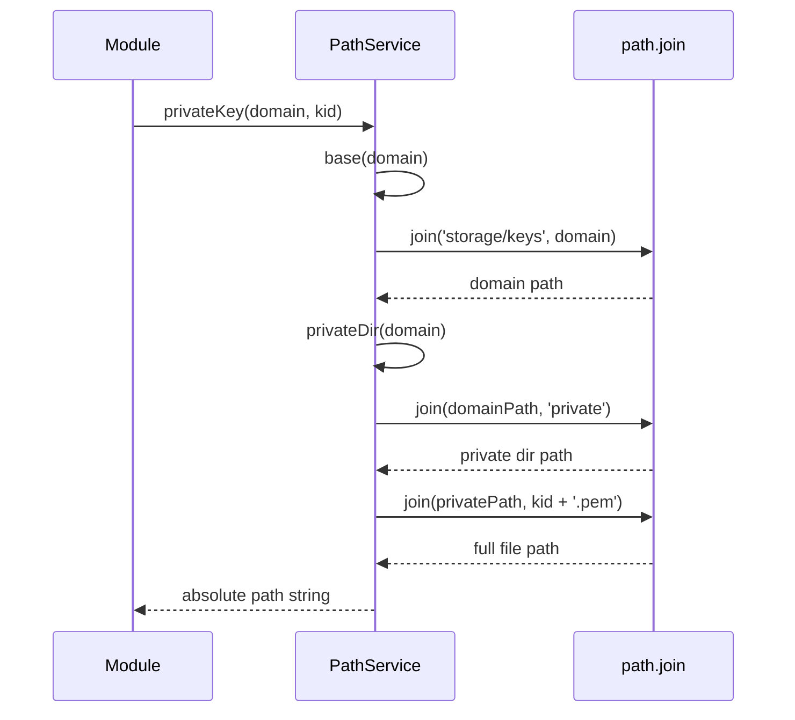
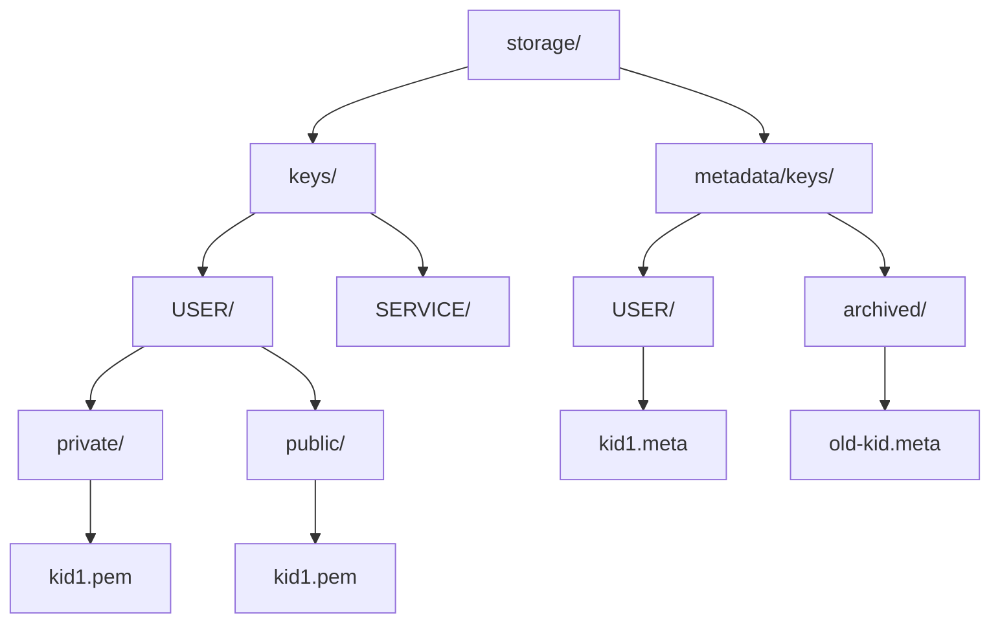

# Path Service

## Why the path service exists

The path service exists to centralize all filesystem path construction for the key management system. It provides a single source of truth for where keys and metadata live on disk, ensuring that every module constructing file paths uses identical directory structures and naming conventions. This module does not create directories, read files, or perform any IO operations—it only computes absolute paths as strings. It deliberately avoids embedding business logic about which keys exist or which paths are valid, focusing solely on translating domain names and key identifiers into consistent file system locations. By centralizing path logic, the system can change storage structure in one place without touching every module that touches files.

## How the path service fits into the Vault

The path service sits at the infrastructure layer and is consumed by any module that performs file operations. The generator uses it to determine where to write new key files and metadata. The loader uses it to construct paths for reading keys from disk. The metadata manager uses it for both active and archived metadata file locations. The janitor uses it to find files that need deletion. No domain module constructs paths manually using string concatenation—all paths flow through this service. This creates a dependency bottleneck by design, ensuring that changing from `storage/keys/{domain}/private` to a different structure requires updating only this service, not every file operation across the codebase.

## Keeping path construction deliberately simple

The service is structured as a single object with methods grouped by concern. Key file paths include functions for the base domain directory, separate subdirectories for private and public keys, and full file paths for individual keys. Metadata file paths include functions for the active metadata directory per domain and full file paths for metadata files. Archive paths provide a separate directory and file path construction for expired key metadata. Each method accepts only the minimal information needed—a domain name, a key identifier, or nothing for global paths. No method performs validation, checks whether files exist, or makes filesystem calls. The service uses Node's `path.join` exclusively to ensure cross-platform compatibility, avoiding manual string concatenation that could break on Windows versus Unix systems.

## What happens during path resolution

When a module needs to write a new private key, it calls `pathService.privateKey(domain, kid)`. The service first calls `base(domain)` internally, which joins the base keys directory with the domain name. Then it calls `privateDir(domain)`, which appends `'private'` to the base path. Finally, it constructs the full file path by joining the private directory with the KID and `.pem` extension. The entire operation performs string manipulations without touching the filesystem. When metadata needs to be archived, a module calls `pathService.metaArchivedKeyFile(kid)`, which constructs a path in a global archived directory without any domain segmentation, allowing expired keys from all domains to live in one location.

## The directory structure this service enforces

The service enforces a specific directory hierarchy rooted at `storage/keys` for key files and `storage/metadata/keys` for metadata. Each domain gets its own subdirectory under the base, ensuring keys from different domains never mix. Within each domain directory, keys are separated into `private/` and `public/` subdirectories with different access permissions applied by the writer. Metadata files live in a parallel structure under `storage/metadata/keys/{domain}/` where each key gets a `.meta` file. When keys expire, their metadata moves to `storage/metadata/keys/archived/` as a flat directory without domain separation. This structure allows filesystem-level permissions to isolate private keys, enables easy backup by domain, and keeps active metadata separate from archived metadata for performance reasons.

## The tradeoffs behind this design

The service uses a singleton object pattern rather than a class because path construction is stateless and needs no instance-specific configuration. Base directories are hardcoded relative to `process.cwd()` because the system assumes it runs from the project root, trading flexibility for simplicity. This breaks if the process is started from a different directory, but environment-based configuration would add complexity for a deployment scenario the system doesn't currently support. The service separates metadata from keys into different directory trees even though they share the same domain structure, allowing independent backup strategies and different retention policies. Archive metadata lives in a flat directory to simplify cleanup logic—the janitor doesn't need to scan every domain directory to find expired metadata. File extensions are hardcoded (`.pem`, `.meta`) rather than configurable because changing them would break existing deployments without providing clear benefits.

## What the path service guarantees — and what it doesn't

The service guarantees that all paths returned are absolute, starting from the current working directory, and cross-platform compatible through Node's `path.join`. It guarantees that paths for the same domain and KID will always be identical across invocations, providing referential stability. It does not guarantee that the returned paths point to existing directories or files—callers must handle ENOENT errors. It does not create directories as a side effect of path construction. It does not validate domain names or KIDs—passing invalid input produces valid paths pointing to invalid locations. It does not prevent directory traversal attacks if a malicious domain name contains `../` sequences, though the system's domain normalizer handles this at a higher layer. Callers rely on the service to provide consistent paths but must handle filesystem race conditions and missing directories themselves.

## Who depends on the path service (and who doesn't)

Every module that performs file operations depends on the path service. The generator's `DirManager` uses it to create directory structures, and `KeyWriter` uses it to determine where to write key files. The loader's `KeyDirectory` uses it to list directories and `KeyReader` uses it to construct file paths for reading. The metadata manager uses it for both active and archived metadata file locations. The janitor uses it to locate files for deletion. The crypto engine does not use the path service because it never touches the filesystem—it only operates on strings and buffers in memory. The signer does not directly use the path service because it retrieves keys through the loader abstraction. If the directory structure changes, only this service needs updating, though a data migration would be needed for existing deployments.

## Following the implementation

Read [pathService.js](c:/Users/Gurdev%20Singh/OneDrive/Desktop/vault/src/infrastructure/filesystem/pathService.js) to see all path construction methods. The file is self-contained and has no dependencies beyond Node's `path` module. The structure is straightforward: base paths at the top, then methods grouped by concern (key paths, metadata paths, archive paths).

## The mental model to keep

Think of this module as the filesystem contract—change paths here, update nowhere else.
