# Key-Manager Janitor Structure

## Architectural Overview

This diagram represents the **Janitor Mechanism** within the Key Manager domain. It visualizes the cleaning/deletion logic with three specialized services (File, Metadata, and Reaper) coordinated through a central orchestrator, with dependency injection of caches and repositories.

```mermaid
%%{init: {'theme':'base','themeVariables': {'primaryColor':'#ffffff','primaryTextColor':'#000','primaryBorderColor':'#333','lineColor':'#2c3e50','tertiaryColor':'#ffffff'}}}%%
graph TB
    %% ============================================
    %% SUBGRAPHS - Layered Architecture
    %% ============================================

    subgraph MAIN[" "]
        direction TB

    subgraph EP["🚀 Entry Point"]
        direction TB
        Bootstrap["<b>Bootstrap/Main</b><br/><i>Application Initialization</i>"]
    end

    subgraph DL["🏛️ Domain Layer - Janitor"]
        direction TB
        Factory["<b>JanitorFactory</b><br/>⚙️ Singleton Factory"]
        Janitor["<b>Janitor</b><br/>📦 Aggregate Root"]

        subgraph Services["Services Layer"]
            direction LR
            FileJanitor["<b>KeyFileJanitor</b><br/>🗑️ File Cleanup"]
            MetaJanitor["<b>MetadataJanitor</b><br/>📋 Meta Cleanup"]
            Reaper["<b>ExpiredKeyReaper</b><br/>⏰ Expiry Handler"]
        end

        Deleter["<b>KeyDeleter</b><br/>🔒 Deletion Logic"]
    end

    %% Bottom layer - aligned horizontally
    subgraph BOTTOM[" "]
        direction LR

    subgraph CACHE["💾 Shared Caches"]
        direction LR
        LoaderCache["<b>LoaderCache</b><br/>🔑 Key Cache"]
        BuilderCache["<b>BuilderCache</b><br/>🛠️ Builder Cache"]
    end

    subgraph MD["🏛️ Domain Layer"]
        direction TB
        MetaManager["<b>MetadataManager</b><br/>📊 Meta Operations"]
    end

    subgraph INFRA["🔧 Infrastructure Layer"]
        direction LR
        Paths["<b>PathsRepo</b><br/>📁 File System Access"]
    end

    end

    %% ============================================
    %% PHASE 1: Bootstrap Initialization (numbered sequence)
    %% ============================================
    Bootstrap ==>|"① Get"| LoaderCache
    Bootstrap ==>|"② Get"| BuilderCache
    Bootstrap ==>|"③ Create"| Factory
    Bootstrap -.->|"④ Import"| MetaManager
    Bootstrap -.->|"⑤ Provide"| Paths

    %% ============================================
    %% PHASE 2: Factory Creates Components
    %% ============================================
    Factory ==>|"creates"| Janitor
    Factory ==>|"creates"| FileJanitor
    Factory ==>|"creates"| MetaJanitor
    Factory ==>|"creates"| Reaper
    Factory ==>|"creates"| Deleter

    %% ============================================
    %% PHASE 3: Janitor Delegates (clean vertical flow)
    %% ============================================
    Janitor -->|"delegates"| FileJanitor
    Janitor -->|"delegates"| MetaJanitor
    Janitor -->|"delegates"| Reaper

    %% ============================================
    %% PHASE 4: Service Dependencies (grouped by service)
    %% ============================================

    %% FileJanitor dependencies (left side)
    FileJanitor -->|"clears"| LoaderCache
    FileJanitor -->|"clears"| BuilderCache
    FileJanitor -->|"uses"| Deleter

    %% MetaJanitor dependencies (center)
    MetaJanitor -->|"calls"| MetaManager

    %% Reaper dependencies (right side)
    Reaper -.->|"orchestrates"| FileJanitor
    Reaper -.->|"orchestrates"| MetaJanitor
    Reaper -.->|"queries"| MetaManager

    %% Deleter dependencies (bottom)
    Deleter -->|"accesses"| Paths

    end

    %% ============================================
    %% STYLING - Professional Color Scheme
    %% ============================================

    classDef factory fill:#FFF3E0,stroke:#E65100,stroke-width:4px,color:#000,rx:10,ry:10
    classDef domain fill:#E3F2FD,stroke:#1565C0,stroke-width:3px,color:#000,rx:8,ry:8
    classDef aggregate fill:#C5CAE9,stroke:#283593,stroke-width:3px,color:#000,rx:8,ry:8
    classDef cache fill:#FFF9C4,stroke:#F57F17,stroke-width:3px,color:#000,rx:8,ry:8
    classDef infra fill:#F1F8E9,stroke:#558B2F,stroke-width:3px,color:#000,rx:8,ry:8
    classDef external fill:#FFEBEE,stroke:#C62828,stroke-width:3px,color:#000,rx:8,ry:8
    classDef meta fill:#E8EAF6,stroke:#3F51B5,stroke-width:3px,color:#000,rx:8,ry:8

    class Factory factory
    class Janitor aggregate
    class FileJanitor,MetaJanitor,Reaper,Deleter domain
    class LoaderCache,BuilderCache cache
    class MetaManager meta
    class Paths infra
    class Bootstrap external

    %% Subgraph styling
    style MAIN fill:#f5f5f5,stroke:#e0e0e0,stroke-width:2px
    style BOTTOM fill:transparent,stroke:transparent
    style EP fill:#FFEBEE,stroke:#C62828,stroke-width:2px
    style DL fill:#E3F2FD,stroke:#1565C0,stroke-width:2px
    style MD fill:#E8EAF6,stroke:#3F51B5,stroke-width:2px
    style CACHE fill:#FFF9C4,stroke:#F57F17,stroke-width:2px
    style INFRA fill:#F1F8E9,stroke:#558B2F,stroke-width:2px
    style Services fill:#BBDEFB,stroke:#1976D2,stroke-width:1px,stroke-dasharray: 5 5

    %% ============================================
    %% LINK STYLING - Different styles for different flows
    %% ============================================

    %% Phase 1: Bootstrap (thick orange)
    linkStyle 0,1,2 stroke:#E65100,stroke-width:3px
    linkStyle 3,4 stroke:#E65100,stroke-width:2px,stroke-dasharray:5 5

    %% Phase 2: Factory creates (thick blue)
    linkStyle 5,6,7,8,9 stroke:#1565C0,stroke-width:3px

    %% Phase 3: Janitor delegates (medium blue)
    linkStyle 10,11,12 stroke:#1976D2,stroke-width:2.5px

    %% Phase 4: Service dependencies (thin, varied colors)
    linkStyle 13,14 stroke:#F57F17,stroke-width:2px
    linkStyle 15 stroke:#558B2F,stroke-width:2px
    linkStyle 16 stroke:#3F51B5,stroke-width:2px
    linkStyle 17,18,19 stroke:#7B1FA2,stroke-width:1.5px,stroke-dasharray:3 3
    linkStyle 20 stroke:#558B2F,stroke-width:2px
```

## Architecture Explanation

### Layer Structure

The Key-Manager Janitor follows a **three-layer architecture** with four specialized services and an orchestrator:

#### 1. **Entry Point Layer** (Bootstrap/Main)

- Defined in `managerFactory.js`, serves as composition root
- Gets singleton `LoaderCache` instance via `KeyCache.getInstance()`
- Gets singleton `BuilderCache` instance (separate cache for builder operations)
- Creates `JanitorFactory` singleton via `JanitorFactory.getInstance(loaderCache, builderCache, metadataManager, pathsRepo)`
- Factory creates single `Janitor` orchestrator that coordinates all cleanup operations
- Both caches shared across multiple services (Loader, Builder, Janitor)

#### 2. **Domain Layer** (Core Business Logic)

The domain layer is organized into two sub-domains:

##### Janitor Domain

The Janitor domain contains all cleanup and deletion logic, organized by responsibility:

- **JanitorFactory** (Singleton Pattern)

  - Constructor accepts: `loaderCache` (KeyCache), `builderCache` (Builder's cache), `metadataManager`, and `pathsRepo`
  - `create()` method wires all internal components in correct dependency order
  - Creates `KeyDeleter(pathsRepo)` for filesystem operations
  - Creates `KeyFileJanitor(loaderCache, builderCache, keyDeleter)` for cache invalidation
  - Creates `MetadataJanitor(metadataManager)` for metadata cleanup
  - Creates `ExpiredKeyReaper(fileJanitor, metadataJanitor)` for scheduled cleanup
  - `getInstance(loaderCache, builderCache, metadataManager, pathsRepo)` ensures singleton
  - Returns single `Janitor` coordinating all services

- **Janitor** (Aggregate Root & Orchestrator)

  - Constructor receives: `fileJanitor`, `metadataJanitor`, `expiredKeyReaper`
  - **File deletion methods**: `deletePrivate(domain, kid)`, `deletePublic(domain, kid)` - delegates to FileJanitor
  - **Metadata deletion methods**: `deleteOriginMetadata(domain, kid)`, `deleteArchivedMetadata(kid)` - delegates to MetadataJanitor
  - **Expiry methods**: `addKeyExpiry(domain, kid)` - marks key for future cleanup
  - **Bulk cleanup method**: `cleanDomain()` - triggers ExpiredKeyReaper for batch cleanup
  - Stateless - no stored state, pure delegation

- **KeyFileJanitor** (Stateless Service)

  - Constructor: `loaderCache` (KeyCache), `builderCache`, and `keyDeleter` (filesystem handler)
  - **Delete private key**: `deletePrivate(domain, kid)`
    - STEP 1: Delete from filesystem first (source of truth)
    - STEP 2: Invalidate loader cache via `loaderCache.deletePrivate(kid)`
  - **Delete public key**: `deletePublic(domain, kid)`
    - STEP 1: Delete from filesystem first
    - STEP 2: Invalidate loader cache via `loaderCache.deletePublic(kid)`
    - STEP 3: Invalidate builder cache via `builderCache.delete(kid)` if present
  - Uses **two-step deletion** pattern: filesystem first, then cache invalidation
  - Stateless - no stored state

- **MetadataJanitor** (Stateless Service)

  - Constructor: `metadataManager` (domain service for metadata operations)
  - **Delete origin metadata**: `deleteOrigin(domain, kid)` - removes current key metadata
  - **Delete archived metadata**: `deleteArchived(kid)` - removes expired key metadata
  - **Add expiry metadata**: `addExpiry(domain, kid)` - marks key with TTL for future cleanup
    - Calculates expiration: `Date.now() + KEY_PUBLIC_TTL_MS + KEY_GRACE_MS`
    - Delegates to `metadataManager.addExpiry(domain, kid, expirationDate)`
  - Uses TTL constants from `config/keys.js`
  - Stateless - delegates all work to MetadataManager

- **ExpiredKeyReaper** (Stateless Service)

  - Constructor: `fileJanitor` and `metadataJanitor`
  - **Cleanup expired keys**: `cleanup()`
    - Queries metadata manager for expired keys
    - For each expired key: deletes file via FileJanitor, then removes metadata
  - Orchestrates file and metadata cleanup in correct order
  - Stateless - no stored state

- **KeyDeleter** (Stateless Infrastructure Handler)

  - Constructor: `pathsRepo` (file system abstraction)
  - **Delete private key**: `deletePrivateKey(domain, kid)`
    - Uses `fs/promises.unlink(paths.privateKey(domain, kid))`
    - Ignores ENOENT errors (file already deleted)
  - **Delete public key**: `deletePublicKey(domain, kid)`
    - Uses `fs/promises.unlink(paths.publicKey(domain, kid))`
    - Ignores ENOENT errors
  - Pure filesystem operations, no caching
  - Stateless - no stored state

##### Metadata Domain

- **MetadataManager** (Domain Service)

  - Injected from `src/domain/metadata-manager/`
  - Methods: `deleteOrigin(domain, kid)`, `deleteArchived(kid)`, `addExpiry(domain, kid, date)`
  - Also provides: `getExpiredMetadata()` for queries
  - Handles all metadata file operations
  - Critical for tracking key lifecycle
  - Part of separate metadata-manager domain module

#### 3. **Infrastructure Layer** (Technical Implementation)

These provide technical capabilities and cross-cutting concerns:

- **LoaderCache & BuilderCache** (Shared Singletons)

  - Located in `src/utils/KeyCache.js` and builder respectively
  - **Singleton pattern** - instances created once, shared across services
  - KeyCache maintains two Maps: private and public keys
  - Methods: `get(kid)`, `set(kid, pem)`, `delete(kid)`, `clear()`
  - Shared by: Loader, Janitor, Builder services
  - Invalidation critical for consistency after deletion

- **PathsRepo** (File System Abstraction)

  - Injected from `src/infrastructure/filesystem/index.js`
  - Methods: `privateKey(domain, kid)`, `publicKey(domain, kid)`
  - Abstracts file path resolution
  - Used by KeyDeleter for deletion operations

### Key Architectural Patterns

1. **Dependency Injection**: External dependencies (caches, manager, paths) injected via Factory
2. **Singleton Pattern**: JanitorFactory and both caches are singleton instances
3. **Aggregate Root**: Janitor orchestrates all cleanup operations through delegation
4. **Stateless Services**: All services store no state between calls
5. **Two-Step Deletion**: Filesystem first, then cache invalidation (fail-safe pattern)
6. **Service Composition**: Factory creates and wires all internal services
7. **Cross-Layer Coordination**: File operations coordinated with metadata and cache operations

### Data Flow

1. **Bootstrap** gets LoaderCache and BuilderCache singletons
2. **JanitorFactory** singleton created with all external dependencies
3. **Services created** by factory in dependency order:
   - KeyDeleter (depends only on paths)
   - KeyFileJanitor (depends on caches and deleter)
   - MetadataJanitor (depends on metadata manager)
   - ExpiredKeyReaper (depends on file and metadata janitors)
4. **Janitor** created as orchestrator
5. **Deletion flow** (example: `deletePublic(domain, kid)`):
   - Janitor.deletePublic(domain, kid)
   - → FileJanitor.deletePublic(domain, kid)
   - → KeyDeleter.deletePublicKey(domain, kid)
   - → fs.unlink(paths.publicKey(domain, kid))
   - → loaderCache.deletePublic(kid)
   - → builderCache.delete(kid) (if present)
6. **Cleanup flow** (`cleanDomain()`):
   - Janitor.cleanDomain()
   - → ExpiredKeyReaper.cleanup()
   - → MetadataManager.getExpiredMetadata()
   - → For each: FileJanitor.deletePublic() + MetadataJanitor.deleteArchived()

### Design Benefits

- **Data Consistency**: Filesystem as source of truth, caches invalidated after deletion
- **Error Safety**: If filesystem delete fails, caches remain valid
- **Separation of Concerns**: File ops, cache ops, and metadata ops separated
- **Reusability**: Services can be called independently or through orchestrator
- **Testability**: Each service easily mocked and tested
- **Flexibility**: Works with any domain via runtime parameters
- **Maintainability**: Clear responsibilities, minimal coupling
- **Scalability**: Stateless services can be called concurrently per domain

## Class Diagram

This detailed class diagram shows the exact structure of each class, including properties, methods, and their relationships:

---

## Execution Flows

The janitor system has **5 distinct execution flows** identified from the actual implementation:

### Flow Index

1. **Janitor Creation Flow** - `JanitorFactory.create()` wires all internal components
2. **Delete Public Key Flow** - `Janitor.deletePublic(domain, kid)` with two-step deletion
3. **Delete Private Key Flow** - `Janitor.deletePrivate(domain, kid)` with single cache invalidation
4. **Add Expiry Metadata Flow** - `Janitor.addKeyExpiry(domain, kid)` marks key for cleanup
5. **Cleanup Expired Keys Flow** - `Janitor.cleanDomain()` batch cleanup of expired keys

---

### Flow 1: Janitor Creation Flow

**Source:** `janitorFactory.js` → `create()`  
**Trigger:** Application startup, after loader and metadata manager are initialized

**Implementation:**

- KeyDeleter created first (minimal dependencies)
- KeyFileJanitor depends on caches and deleter
- MetadataJanitor depends on metadata manager
- ExpiredKeyReaper depends on both file and metadata janitors
- Janitor orchestrator created last with all services
- All dependencies injected at creation time

---

### Flow 2: Delete Public Key Flow

**Source:** `Janitor.js` → `deletePublic(domain, kid)` → `KeyFileJanitor.js` → `deletePublic(domain, kid)`

**Implementation:**

- **Two-step deletion pattern**: Filesystem first (source of truth), then cache invalidation
- If filesystem delete fails, exception thrown before cache is touched
- Cache remains valid (correctly reflecting file still exists)
- Invalidates both loader and builder caches
- Idempotent: ENOENT errors ignored (safe to call multiple times)
- Kid string used as cache key

---

### Flow 3: Delete Private Key Flow

**Source:** `Janitor.js` → `deletePrivate(domain, kid)` → `KeyFileJanitor.js` → `deletePrivate(domain, kid)`

**Implementation:**

- Same two-step pattern as public key deletion
- Only invalidates loader cache (private keys not cached by builder)
- Filesystem delete is source of truth
- Idempotent: safe to call multiple times
- Domain and kid extracted/passed as parameters

---

### Flow 4: Add Expiry Metadata Flow

**Source:** `Janitor.js` → `addKeyExpiry(domain, kid)` → `MetadataJanitor.js` → `addExpiry(domain, kid)`

**Implementation:**

- Uses TTL constants from `config/keys.js`
- Calculates expiration as: `Date.now() + KEY_PUBLIC_TTL_MS + KEY_GRACE_MS`
- Grace period allows graceful transition before actual deletion
- Metadata manager writes to metadata store
- Delegates all file operations to metadata manager

---

### Flow 5: Cleanup Expired Keys Flow

**Source:** `Janitor.js` → `cleanDomain()` → `ExpiredKeyReaper.js` → `cleanup()`

**Implementation:**

- Queries metadata manager for expired keys
- For each expired key: deletes public key file, then removes archived metadata
- Runs as scheduled job (via rotation manager)
- Batch cleanup process
- Orchestrates file and metadata cleanup in correct order
- Returns early if no expired keys (optimization)

---

## Flow Patterns Summary

| Flow            | Entry Point           | Caches Affected  | Returns          |
| --------------- | --------------------- | ---------------- | ---------------- |
| Creation        | `factory.create()`    | None             | Janitor instance |
| Delete Public   | `deletePublic(d, k)`  | Loader + Builder | Promise          |
| Delete Private  | `deletePrivate(d, k)` | Loader only      | Promise          |
| Add Expiry      | `addKeyExpiry(d, k)`  | None             | Promise          |
| Cleanup Expired | `cleanDomain()`       | Loader + Builder | Promise          |

**Key Characteristics:**

- **Two-Step Deletion**: Filesystem first (source of truth), then cache invalidation
- **Fail-Safe Pattern**: If filesystem fails, caches untouched and remain valid
- **Stateless Operations**: All services store no state between calls
- **Domain Parameterized**: Domain passed as parameter for all operations
- **Cross-Cache Coordination**: Both loader and builder caches kept in sync
- **Batch Cleanup**: Expired key reaper handles bulk operations
- **Metadata Integration**: Lifecycle tracked via metadata manager
