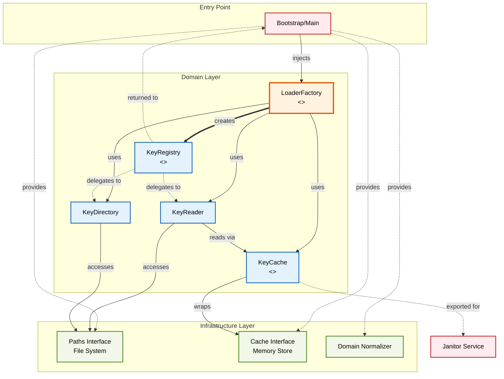
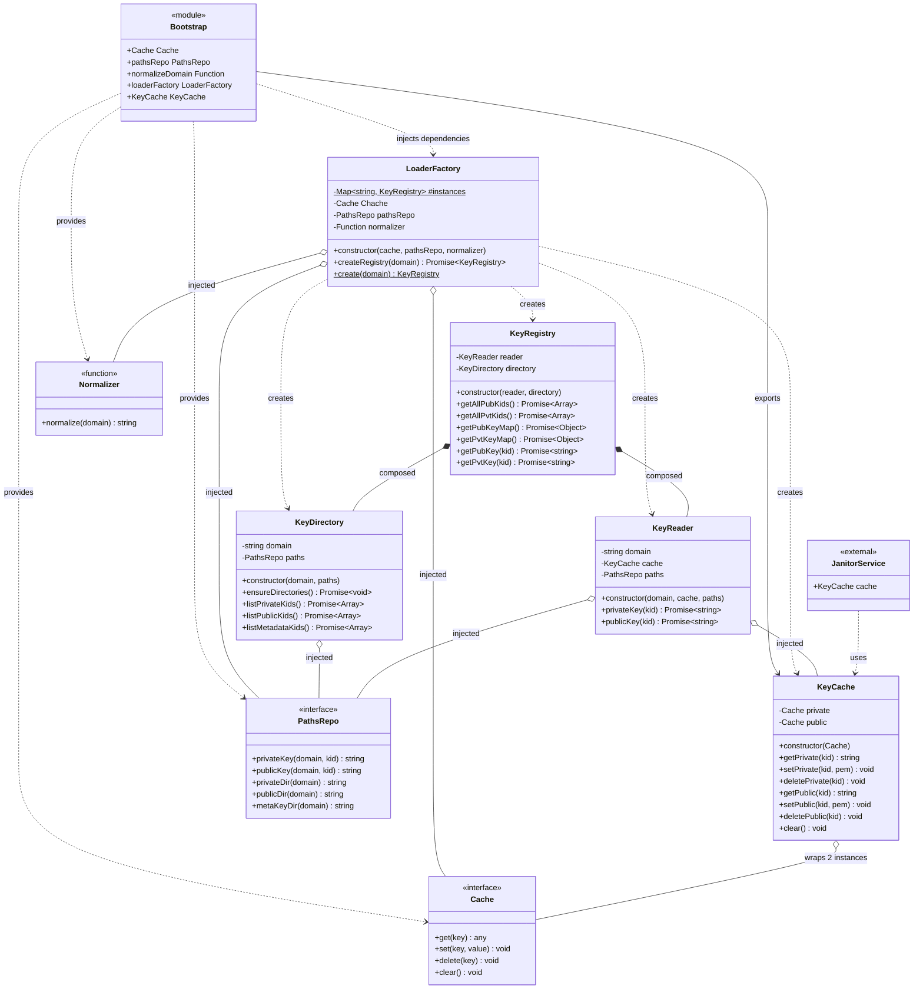
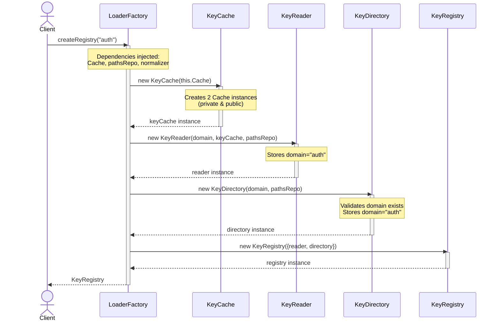
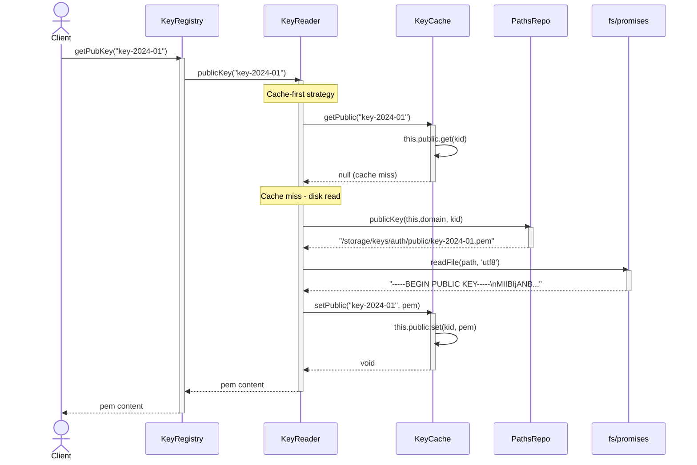
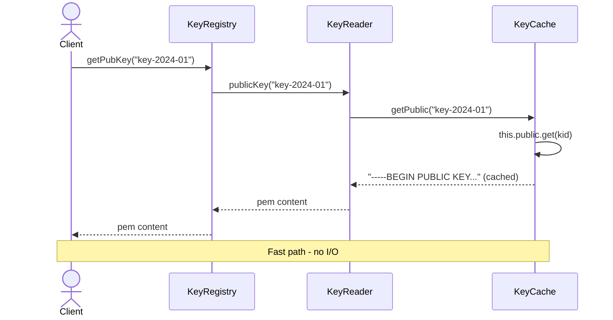
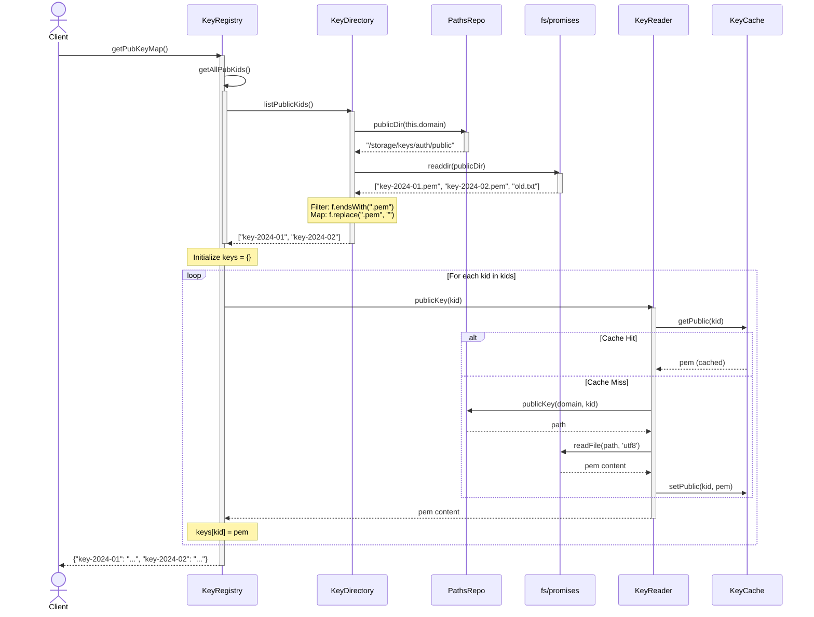
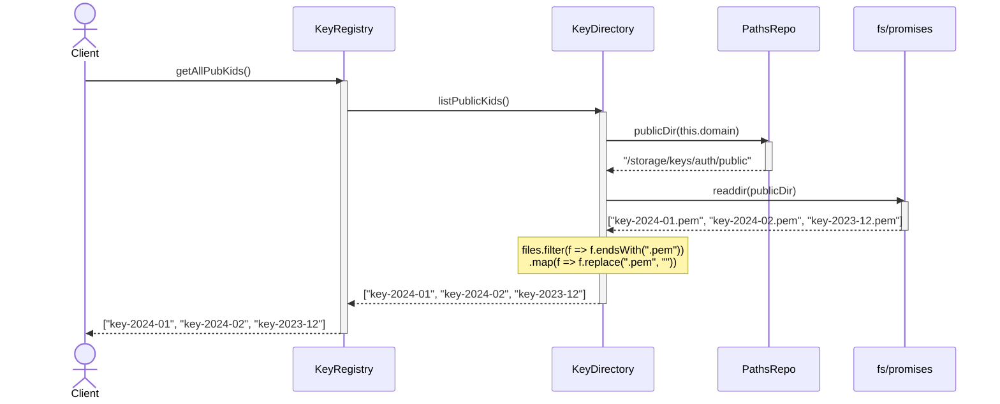
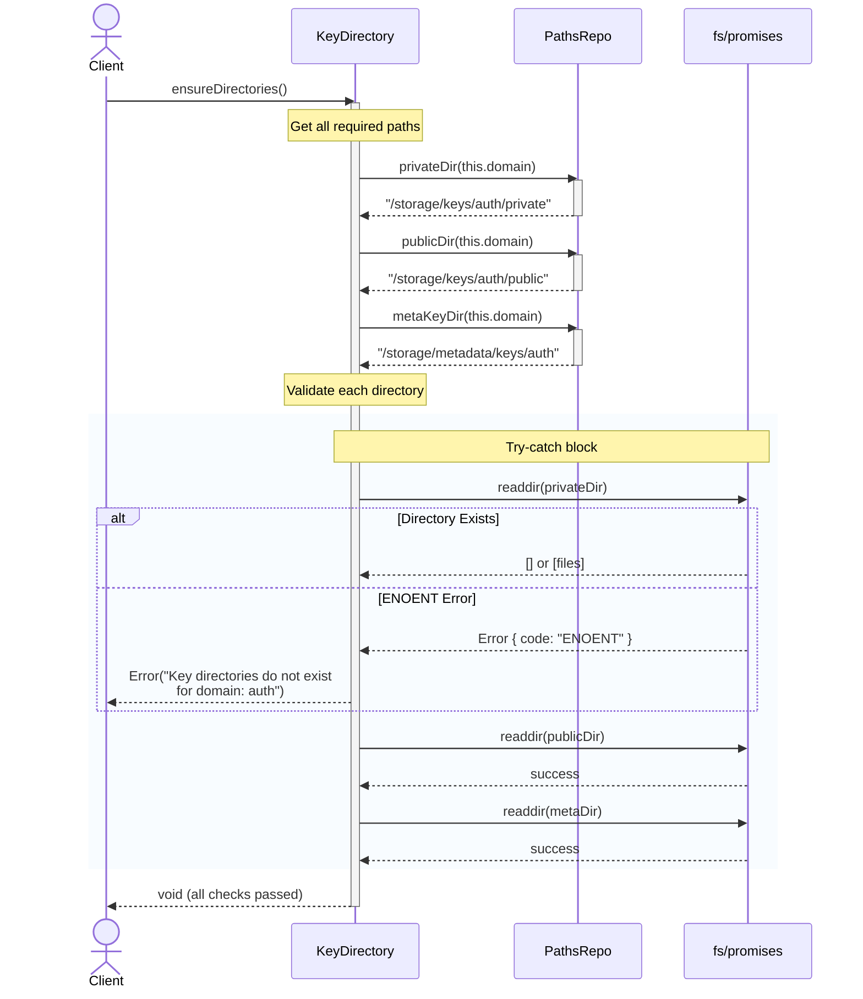

# Key-Manager Loader Structure

## Architectural Overview

This diagram represents the **Loader Mechanism** within the Key Manager domain. It visualizes the separation between the creation logic (Factory), the domain logic (Registry/Cache), and the underlying infrastructure.

## Architecture Explanation

### Layer Structure

The Key-Manager Loader follows a **three-layer architecture** that enforces separation of concerns:

#### 1. **Entry Point Layer** (Bootstrap/Main)

- Defined in `index.js`, serves as the single entry point for the loader system
- Injects dependencies into `LoaderFactory`: `Cache`, `pathsRepo`, and `normalizeDomain`
- Exports `KeyCache` for use by other services (e.g., Janitor)
- Creates and maintains a singleton `LoaderFactory` instance
- Acts as the composition root, wiring together the entire loader system

#### 2. **Domain Layer** (Core Business Logic)

The domain layer contains the core loader logic and is isolated from infrastructure concerns:

- **LoaderFactory** (Singleton Pattern)

  - Static Map `#instances` stores KeyRegistry instances per domain
  - Constructor accepts injected dependencies: `Cache`, `pathsRepo`, `normalizer`
  - `createRegistry(domain)` method instantiates and wires KeyReader, KeyDirectory, and KeyCache
  - `create(domain)` static method normalizes domain names and caches registry instances per domain
  - Ensures a single KeyRegistry instance exists for each domain throughout the application

- **KeyRegistry** (Aggregate Root)

  - Constructor receives injected `reader` and `directory` instances
  - Provides four key-retrieval methods: `getPubKey(kid)`, `getPvtKey(kid)`, `getPubKeyMap()`, `getPvtKeyMap()`
  - Provides two directory-listing methods: `getAllPubKids()`, `getAllPvtKids()`
  - Delegates all key reading operations to `KeyReader`
  - Delegates all directory operations to `KeyDirectory`
  - Returned to the caller as the primary public interface for registry operations

- **KeyReader**

  - Constructor receives injected `domain`, `cache`, and `paths` instances
  - Implements two core methods: `privateKey(kid)` and `publicKey(kid)`
  - Checks cache before file I/O to optimize performance
  - Uses native `fs/promises.readFile()` to read PEM files from storage
  - Automatically populates cache after successful file reads
  - Decouples key reading logic from infrastructure (file paths, cache mechanism)

- **KeyDirectory**

  - Constructor requires `domain` parameter (throws error if missing)
  - Provides directory validation via `ensureDirectories()` method
  - Lists keys via three methods: `listPrivateKids()`, `listPublicKids()`, `listMetadataKids()`
  - Parses `.pem` filenames to extract KID (key ID) identifiers
  - Parses `.json` filenames for metadata KID retrieval
  - Throws error if expected directories don't exist (generator's responsibility to create them)
  - Abstracts file system operations and naming conventions

- **KeyCache** (Public Facade)
  - Constructor accepts injected `Cache` class (not instance)
  - Maintains two separate Cache instances: `private` and `public`
  - Methods for private keys: `getPrivate(kid)`, `setPrivate(kid, pem)`, `deletePrivate(kid)`
  - Methods for public keys: `getPublic(kid)`, `setPublic(kid, pem)`, `deletePublic(kid)`
  - Provides `clear()` method to wipe both cache stores
  - Separates private and public key caching concerns for security
  - Prevents domain layer leakage of cache implementation details
  - Exported from index.js for use by other services (e.g., Janitor Service)

#### 3. **Infrastructure Layer** (Technical Implementation)

These are abstractions providing technical capabilities to the domain:

- **Cache Class** (Memory Store)

  - Injected from `src/utils/cache.js`
  - Used by KeyCache to create separate instances for private and public keys
  - Provides `get(key)`, `set(key, value)`, `delete(key)`, `clear()` interface

- **pathsRepo** (File System Abstraction)

  - Injected from `src/infrastructure/filesystem/index.js`
  - Methods: `privateKey(domain, kid)`, `publicKey(domain, kid)`, `privateDir(domain)`, `publicDir(domain)`, `metaKeyDir(domain)`
  - Abstracts file path resolution and directory naming conventions
  - Decouples domain logic from file system specifics

- **normalizeDomain** (Normalizer Function)
  - Imported from `src/utils/normalizer.js`
  - Used by LoaderFactory to normalize domain names before caching
  - Ensures consistent domain naming across the system

### Key Architectural Patterns

1. **Dependency Injection**: All dependencies flow from Bootstrap downward
2. **Abstraction Boundaries**: Domain layer depends on interfaces, not concrete infrastructure
3. **Facade Pattern**: KeyCache shields domain from cache implementation details
4. **Aggregate Root**: KeyRegistry is the single point of entry for registry operations
5. **Separation of Concerns**: Each component has a single, well-defined responsibility

### Data Flow

1. **Initialization**: `index.js` injects `Cache`, `pathsRepo`, and `normalizeDomain` into LoaderFactory singleton
2. **Registry Creation**: `LoaderFactory.create(domain)` normalizes domain and checks instance cache
3. **Component Wiring**: If new domain, factory creates KeyReader, KeyDirectory, and KeyCache with injected dependencies
4. **Registry Return**: Factory returns KeyRegistry aggregating the reader and directory
5. **Key Retrieval**: Caller invokes `registry.getPubKey(kid)` or `registry.getPvtKey(kid)`
6. **Cache Check**: KeyReader checks KeyCache before file I/O
7. **File Read**: If cache miss, KeyReader reads PEM file via pathsRepo
8. **Cache Store**: KeyReader populates cache with PEM content
9. **Return**: Key content returned to caller
10. **Directory Ops**: Caller can also invoke `registry.getAllPubKids()` which delegates to KeyDirectory

### Design Benefits

- **Testability**: Each layer can be tested independently with mocks
- **Maintainability**: Clear separation makes changes localized
- **Flexibility**: Infrastructure swaps don't affect domain logic
- **Scalability**: New loader strategies can be added without modifying existing code

## Class Diagram

This detailed class diagram shows the exact structure of each class, including properties, methods, and their relationships:

---

## Execution Flows

The loader system has **5 distinct execution flows** identified from the actual implementation:

### Flow Index

1. **Registry Creation Flow** - `LoaderFactory.createRegistry(domain)` creates and wires components
2. **Single Key Retrieval Flow** - `KeyRegistry.getPubKey(kid)` / `getPvtKey(kid)` with cache-first strategy
3. **Key Map Generation Flow** - `KeyRegistry.getPubKeyMap()` / `getPvtKeyMap()` batch loads all keys
4. **Directory Listing Flow** - `KeyRegistry.getAllPubKids()` / `getAllPvtKids()` lists available KIDs
5. **Directory Validation Flow** - `KeyDirectory.ensureDirectories()` validates directory structure

---

### Flow 1: Registry Creation Flow

**Source:** `loaderFactory.js` → `createRegistry(domain)`  
**Trigger:** First-time domain access through loader factory

**Implementation Details:**

- Factory instantiates KeyCache passing Cache class (not instance)
- KeyCache creates two separate cache instances internally
- KeyReader and KeyDirectory both receive domain string and pathsRepo
- KeyRegistry receives composed reader and directory via object destructuring
- No static caching happens in this flow (that's in `create()` static method)

---

### Flow 2: Single Key Retrieval Flow

**Source:** `KeyRegistry.js` → `getPubKey(kid)` delegates to `KeyReader.js` → `publicKey(kid)`  
**Trigger:** Application needs one specific key

---

**Cache Hit Scenario:**

**Implementation Notes:**

- `KeyReader` checks cache synchronously before async file read
- Uses `fs/promises.readFile()` for non-blocking I/O
- Cache is populated immediately after successful read
- Private keys follow identical flow via `privateKey(kid)` method

---

### Flow 3: Key Map Generation Flow

**Source:** `KeyRegistry.js` → `getPubKeyMap()` orchestrates directory + reader  
**Trigger:** Bulk key loading for JWKS or batch operations

**Implementation Details:**

- Uses `getAllPubKids()` internally which delegates to `listPublicKids()`
- Filters only `.pem` files, ignoring other file types
- Iterates sequentially with `for (const kid of kids)`
- Each iteration uses standard Key Retrieval Flow (benefits from caching)
- Returns plain object map: `{ [kid]: pemContent }`
- Private key map follows identical pattern via `getPvtKeyMap()`

---

### Flow 4: Directory Listing Flow

**Source:** `KeyRegistry.js` → `getAllPubKids()` delegates to `KeyDirectory.js` → `listPublicKids()`  
**Trigger:** List available key IDs without loading content

**Implementation Notes:**

- Direct file system scan via `readdir()`
- No caching layer - always reads directory
- File extension filtering: `.pem` for keys, `.json` for metadata
- Returns array of KID strings (extensions stripped)
- Used by Key Map Generation Flow as first step
- Also available: `getAllPvtKids()` and `listMetadataKids()`

---

### Flow 5: Directory Validation Flow

**Source:** `KeyDirectory.js` → `ensureDirectories()`  
**Trigger:** Explicit validation that directory structure exists

**Implementation Details:**

- Validates **3 required directories**: private, public, metadata
- Uses `readdir()` as existence check (throws if not found)
- Catches `ENOENT` specifically and wraps with descriptive error
- Error message explicitly states: "it's generator's responsibility to create directories"
- Does NOT create directories - read-only validation
- Returns void on success
- Called explicitly by consumers, not automatic

---

## Flow Patterns Summary

| Flow                 | Entry Point              | Cache | Disk I/O         | Iteration  | Return Type   |
| -------------------- | ------------------------ | ----- | ---------------- | ---------- | ------------- |
| Registry Creation    | `createRegistry(domain)` | No    | No               | No         | KeyRegistry   |
| Single Key Retrieval | `getPubKey(kid)`         | Yes   | Conditional      | No         | string (PEM)  |
| Key Map Generation   | `getPubKeyMap()`         | Yes   | Conditional      | Sequential | Object        |
| Directory Listing    | `getAllPubKids()`        | No    | Yes (readdir)    | No         | Array<string> |
| Directory Validation | `ensureDirectories()`    | No    | Yes (3x readdir) | No         | void          |

**Performance Characteristics:**

- **Registry Creation**: O(1) - simple object composition
- **Single Key Retrieval**:
  - Cache hit: O(1)
  - Cache miss: O(file_size) with disk I/O
- **Key Map Generation**: O(k × file_size) where k = key count in domain
- **Directory Listing**: O(k) where k = files in directory
- **Directory Validation**: O(1) - fixed 3 directory checks

**Caching Strategy:**

- Only KeyReader operations use cache (single/batch key retrieval)
- Directory operations always hit filesystem (listings, validation)
- Cache separation: private and public keys cached independently
- No TTL or expiration - cache lives until manual clear or process restart
