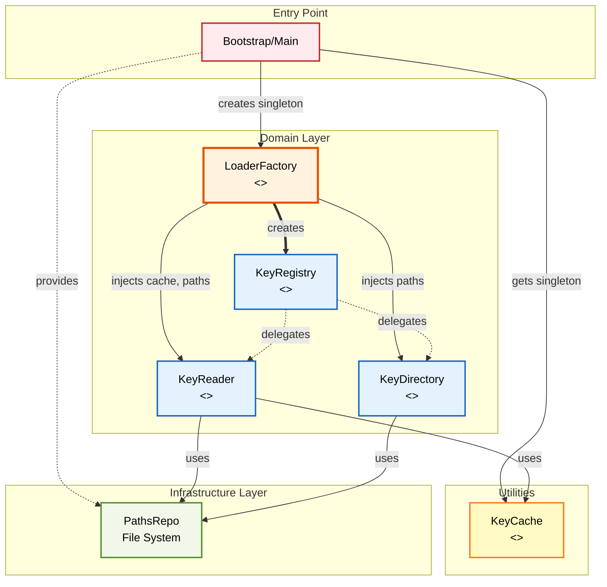
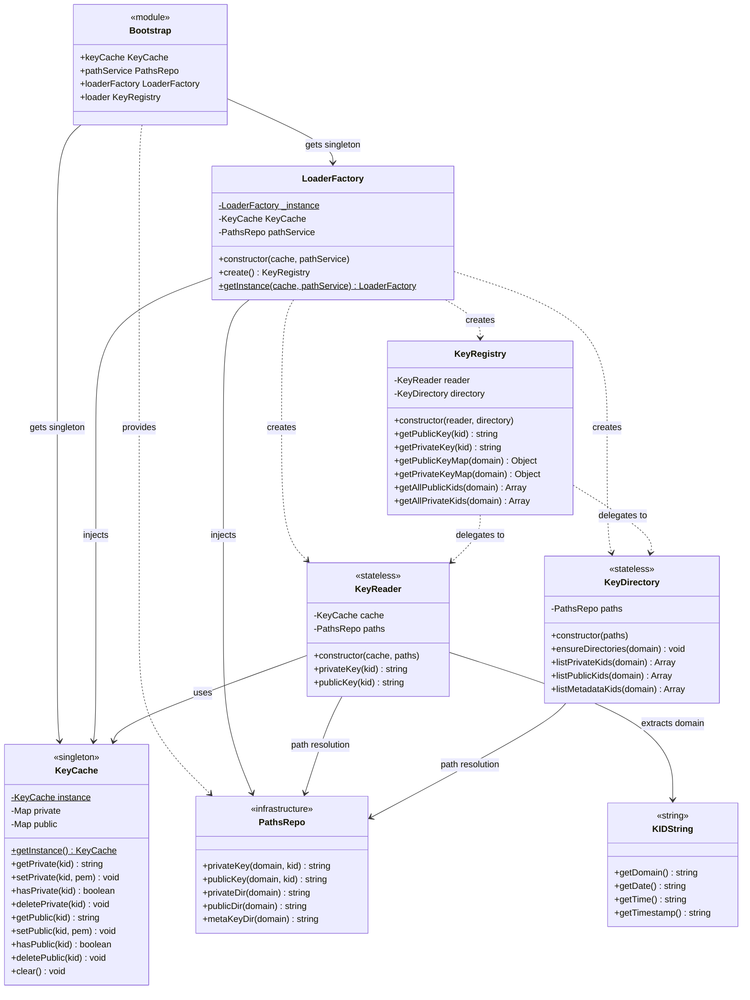
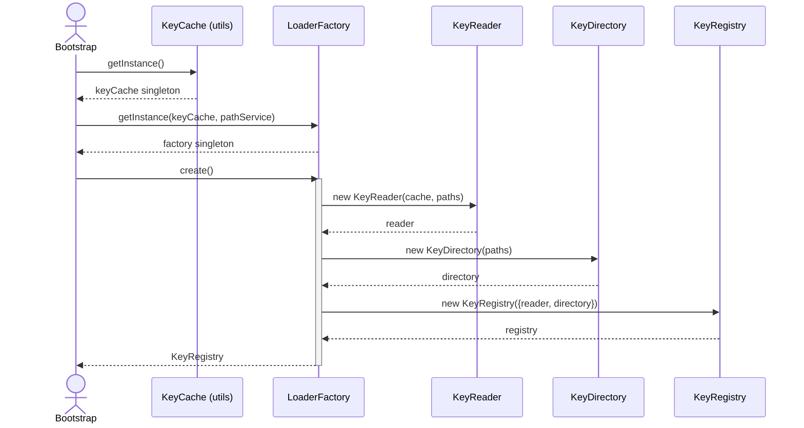
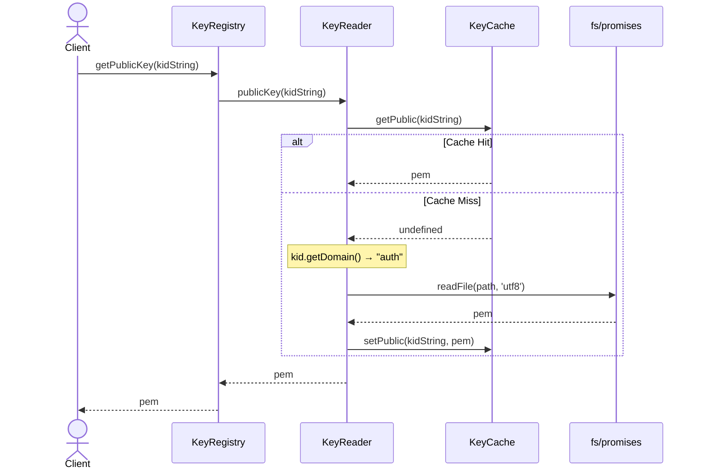
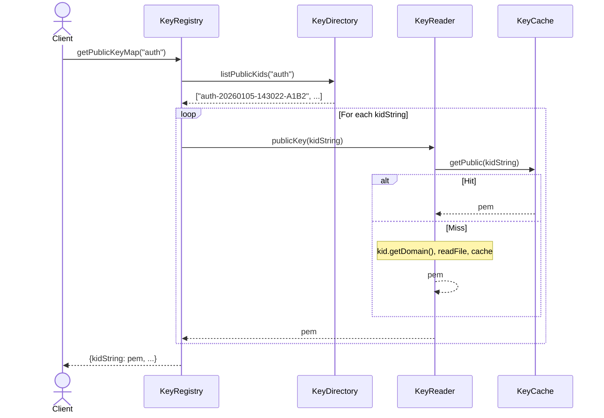
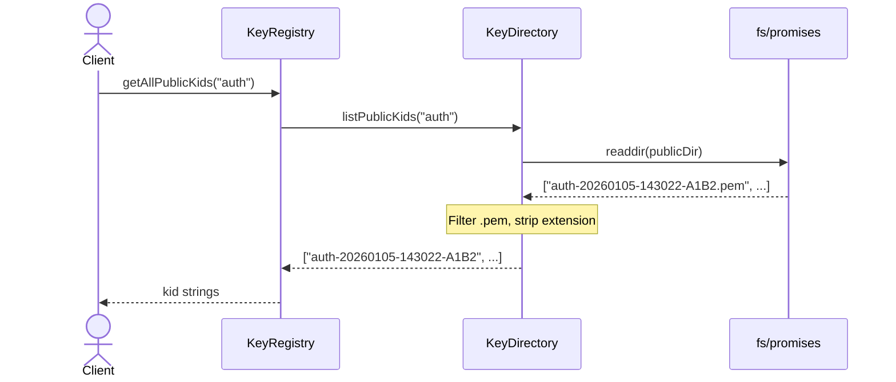
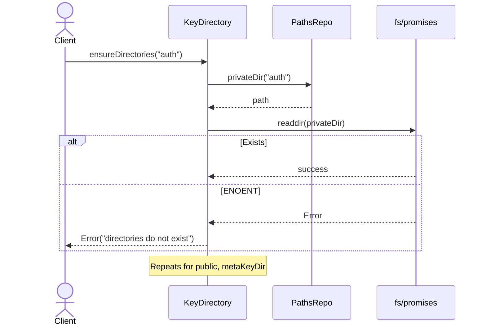

# Key-Manager Loader Structure

## Architectural Overview

This diagram represents the **Loader Mechanism** within the Key Manager domain. It visualizes the separation between the creation logic (Factory), the domain logic (Registry/Cache), and the underlying infrastructure.

## Architecture Explanation

### Layer Structure

The Key-Manager Loader follows a **three-layer architecture** that enforces separation of concerns:

#### 1. **Entry Point Layer** (Bootstrap/Main)

- Defined in `managerFactory.js`, serves as the composition root
- Imports `KeyCache` from `utils/KeyCache.js` - independent singleton utility
- Gets singleton `KeyCache` instance via `KeyCache.getInstance()`
- Creates `LoaderFactory` singleton via `LoaderFactory.getInstance(keyCache, pathService)`
- Factory creates single `KeyRegistry` that serves all domains
- KeyCache shared across Janitor, Builder, and other services

#### 2. **Domain Layer** (Core Business Logic)

The domain layer contains the core loader logic and is isolated from infrastructure concerns:

- **LoaderFactory** (Singleton Pattern)

  - Constructor accepts: `cache` (KeyCache singleton) and `pathService`
  - `create()` method instantiates KeyReader and KeyDirectory, returns KeyRegistry
  - Injects cache and paths into Reader; only paths into Directory
  - `getInstance(cache, pathService)` ensures single factory instance
  - Returns single domain-independent KeyRegistry

- **KeyRegistry** (Aggregate Root)

  - Constructor receives `reader` and `directory` via object destructuring
  - Single-key methods: `getPublicKey(kid)`, `getPrivateKey(kid)` - delegates to Reader
  - Map methods: `getPublicKeyMap(domain)`, `getPrivateKeyMap(domain)` - combines Directory + Reader
  - List methods: `getAllPublicKids(domain)`, `getAllPrivateKids(domain)` - delegates to Directory
  - Stateless - domain passed as parameter or extracted from kid string

- **KeyReader** (Stateless Service)

  - Constructor: `cache` (KeyCache) and `paths` (pathService)
  - Methods: `privateKey(kid)` and `publicKey(kid)`
  - Cache-first: checks `cache.getPrivate(kid)` / `cache.getPublic(kid)`
  - On miss: extracts domain via `kid.getDomain()`, reads file, caches result
  - Uses `fs/promises.readFile()` with path from `paths.privateKey(domain, kid)`
  - Stateless - no stored state

- **KeyDirectory** (Stateless Service)

  - Constructor: `paths` (pathService) only
  - Validation: `ensureDirectories(domain)` - checks 3 dirs exist, throws if missing
  - Listing: `listPrivateKids(domain)`, `listPublicKids(domain)`, `listMetadataKids(domain)`
  - Uses `fs/promises.readdir()`, filters `.pem` / `.json` files, strips extensions
  - Returns array of KID strings
  - Stateless - domain parameter per call

#### 3. **Infrastructure Layer** (Technical Implementation)

These are concrete implementations providing technical capabilities to the domain:

- **KeyCache** (Singleton Facade)

  - Located in `src/infrastructure/cache/KeyCache.js` (NOT domain layer)
  - **Singleton pattern** via `getInstance({ Cache })` static method
  - Constructor accepts injected `Cache` class and creates two instances
  - Maintains two separate Cache instances: `private` and `public`
  - Methods for private keys: `getPrivate(kid)`, `setPrivate(kid, pem)`, `deletePrivate(kid)`
  - Methods for public keys: `getPublic(kid)`, `setPublic(kid, pem)`, `deletePublic(kid)`
  - Provides `clear()` method to wipe both cache stores
  - **Shared singleton instance** injected into KeyReader, Janitor, and other services
  - Uses kid string (with properties) as cache key
  - Infrastructure component, not part of domain layer

- **Cache Class** (Memory Store)

  - Injected from `src/utils/cache.js`
  - Used by KeyCache to create separate instances for private and public keys
  - Provides `get(key)`, `set(key, value)`, `delete(key)`, `clear()` interface
  - Simple in-memory Map-based storage

- **pathService** (File System Abstraction)

  - Injected from `src/infrastructure/filesystem/index.js`
  - Methods: `privateKey(domain, kid)`, `publicKey(domain, kid)`, `privateDir(domain)`, `publicDir(domain)`, `metaKeyDir(domain)`
  - Abstracts file path resolution and directory naming conventions
  - Decouples domain logic from file system specifics
  - Accepts domain as parameter for each invocation

- **KID String** (Enhanced String with Properties)
  - Format: `{domain}-{YYYYMMDD}-{HHMMSS}-{HEX}` (generated externally)
  - **Not a class/object** - plain string with attached properties via `Object.defineProperties()`
  - Properties: `getDomain()`, `getDate()`, `getTime()`, `getTimestamp()`
  - Properties are non-enumerable, non-writable, non-configurable
  - Acts as both cache key and domain identifier
  - Used throughout loader as string, with domain extraction capability via `kid.getDomain()`

### Key Architectural Patterns

1. **Dependency Injection**: Dependencies flow from Bootstrap into Factory, then into domain components
2. **Singleton Pattern**: KeyCache (utilities) and LoaderFactory ensure single shared instances
3. **Stateless Services**: KeyReader and KeyDirectory store no state
4. **Domain Independence**: Domain resolved at runtime from parameters or kid.getDomain()
5. **Aggregate Root**: KeyRegistry orchestrates Reader and Directory
6. **Separation of Concerns**: Clear boundaries between domain, utilities, and infrastructure

### Data Flow

1. **Bootstrap** imports KeyCache from `utils/KeyCache.js`
2. **KeyCache** singleton created: `KeyCache.getInstance()`
3. **LoaderFactory** singleton created: `LoaderFactory.getInstance(keyCache, pathService)`
4. **Registry** created by factory: `factory.create()`
5. **Reader & Directory** instantiated with injected dependencies
6. **Key retrieval**: `registry.getPublicKey(kid)` → delegates to Reader
7. **Cache check**: Reader checks `cache.getPublic(kid)`
8. **Domain extraction**: On miss, `kid.getDomain()` extracts domain
9. **File read**: `readFile(paths.publicKey(domain, kid))`
10. **Cache update**: `cache.setPublic(kid, pem)`

### Design Benefits

- **Testability**: Each component easily mocked and tested independently
- **Simplicity**: Clear, minimal dependencies between layers
- **Performance**: Singleton KeyCache shared across all operations
- **Flexibility**: Domain-independent components work with any domain
- **Maintainability**: Stateless services, single responsibilities
- **Reusability**: KeyCache utility used by multiple services

## Class Diagram

This detailed class diagram shows the exact structure of each class, including properties, methods, and their relationships:

---

## Execution Flows

The loader system has **5 distinct execution flows** identified from the actual implementation:

### Flow Index

1. **Registry Creation Flow** - `LoaderFactory.createRegistry(domain)` creates and wires components
2. **Single Key Retrieval Flow** - `KeyRegistry.getPublicKey(kid)` / `getPrivateKey(kid)` with cache-first strategy
3. **Key Map Generation Flow** - `KeyRegistry.getPublicKeyMap()` / `getPrivateKeyMap()` batch loads all keys
4. **Directory Listing Flow** - `KeyRegistry.getAllPublicKids()` / `getAllPrivateKids()` lists available KIDs
5. **Directory Validation Flow** - `KeyDirectory.ensureDirectories()` validates directory structure

---

### Flow 1: Registry Creation Flow

**Source:** `loaderFactory.js` → `create()`  
**Trigger:** Loader initialization at application startup

**Implementation:**

- KeyCache from `utils/KeyCache.js` - singleton with two Maps (private/public)
- LoaderFactory singleton pattern - stores cache and pathService
- Factory `create()` instantiates Reader (cache + paths) and Directory (paths only)
- Returns single KeyRegistry serving all domains

---

### Flow 2: Single Key Retrieval Flow

**Source:** `KeyRegistry.js` → `getPublicKey(kid)` → `KeyReader.js` → `publicKey(kid)`

**Implementation:**

- Cache-first strategy: checks Map before file I/O
- On miss: extracts domain via `kid.getDomain()`, reads file, caches result
- Kid string format: `auth-20260105-143022-A1B2C3D4`

---

### Flow 3: Key Map Generation Flow

**Source:** `KeyRegistry.js` → `getPublicKeyMap(domain)`

**Implementation:**

- Directory lists all `.pem` files, strips extensions
- Registry loops through kids, retrieves each via Reader
- Returns object map of kid → pem

---

### Flow 4: Directory Listing Flow

**Source:** `KeyRegistry.js` → `getAllPublicKids(domain)` → `KeyDirectory.js` → `listPublicKids(domain)`

**Implementation:**

- Direct filesystem scan, no caching
- Filters `.pem` files, returns kid strings
- Also available: `getAllPrivateKids(domain)`, `listMetadataKids(domain)`

---

### Flow 5: Directory Validation Flow

**Source:** `KeyDirectory.js` → `ensureDirectories(domain)`

**Implementation:**

- Validates 3 directories: private, public, metadata
- Uses `readdir()` as existence check
- Throws if missing - generator's responsibility to create

---

## Flow Patterns Summary

| Flow                 | Entry Point                 | Cache     | Returns       |
| -------------------- | --------------------------- | --------- | ------------- |
| Registry Creation    | `factory.create()`          | No        | KeyRegistry   |
| Single Key Retrieval | `getPublicKey(kid)`         | Yes (Map) | string        |
| Key Map Generation   | `getPublicKeyMap(domain)`   | Yes       | Object        |
| Directory Listing    | `getAllPublicKids(domain)`  | No        | Array<string> |
| Directory Validation | `ensureDirectories(domain)` | No        | void          |

**Key Characteristics:**

- **Cache**: KeyCache singleton (Map-based) in utils layer
- **Stateless**: All domain components store no state
- **Domain Resolution**: Via parameters or `kid.getDomain()`
- **Single Instances**: One factory, one registry, one cache for all domains
