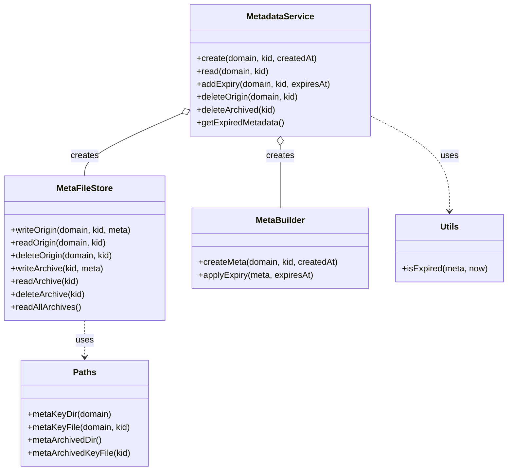

# Metadata Manager Structure

## Class Diagram

```mermaid
classDiagram
    classDef domain fill:#e3f2fd,stroke:#1565c0;
    classDef infra fill:#f1f8e9,stroke:#558b2f;
    classDef violation stroke:#ff0000,stroke-width:4px,stroke-dasharray: 5 5;

    class MetadataService {
        +create(domain, kid, createdAt)
        +read(domain, kid)
        +addExpiry(domain, kid, expiresAt)
        +deleteOrigin(domain, kid)
        +deleteArchived(kid)
        +getExpiredMetadata()
    }
    class MetaFileStore {
        +writeOrigin(domain, kid, meta)
        +readOrigin(domain, kid)
        +deleteOrigin(domain, kid)
        +writeArchive(kid, meta)
        +readArchive(kid)
        +deleteArchive(kid)
        +readAllArchives()
    }
    class MetaBuilder {
        +createMeta(domain, kid, createdAt)
        +applyExpiry(meta, expiresAt)
    }
    class Paths {
        +metaKeyDir(domain)
        +metaKeyFile(domain, kid)
        +metaArchivedDir()
        +metaArchivedKeyFile(kid)
    }
    class Utils {
        +isExpired(meta, now)
    }

    MetadataService o-- MetaFileStore : creates
    MetadataService o-- MetaBuilder : creates
    MetadataService ..> Utils : uses
    MetaFileStore ..> Paths : uses

    
```
