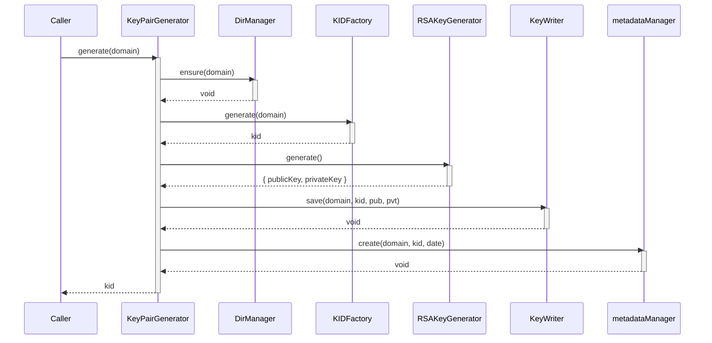

# Flow: Key Generation

Generated by Architectural Auditor.

**Function:** `KeyPairGenerator.generate(domain)`

```mermaid
sequenceDiagram
    participant Caller
    participant Gen as KeyPairGenerator
    participant Dir as DirManager
    participant KID as KIDFactory
    participant RSA as RSAKeyGenerator
    participant Writer as KeyWriter
    participant Meta as metadataManager

    Caller->>Gen: generate(domain)
    activate Gen

    Gen->>Dir: ensure(domain)
    activate Dir
    Dir-->>Gen: void
    deactivate Dir

    Gen->>KID: generate(domain)
    activate KID
    KID-->>Gen: kid
    deactivate KID

    Gen->>RSA: generate()
    activate RSA
    RSA-->>Gen: { publicKey, privateKey }
    deactivate RSA

    Gen->>Writer: save(domain, kid, pub, pvt)
    activate Writer
    Writer-->>Gen: void
    deactivate Writer

    Gen->>Meta: create(domain, kid, date)
    activate Meta
    Meta-->>Gen: void
    deactivate Meta

    Gen-->>Caller: kid
    deactivate Gen
```
