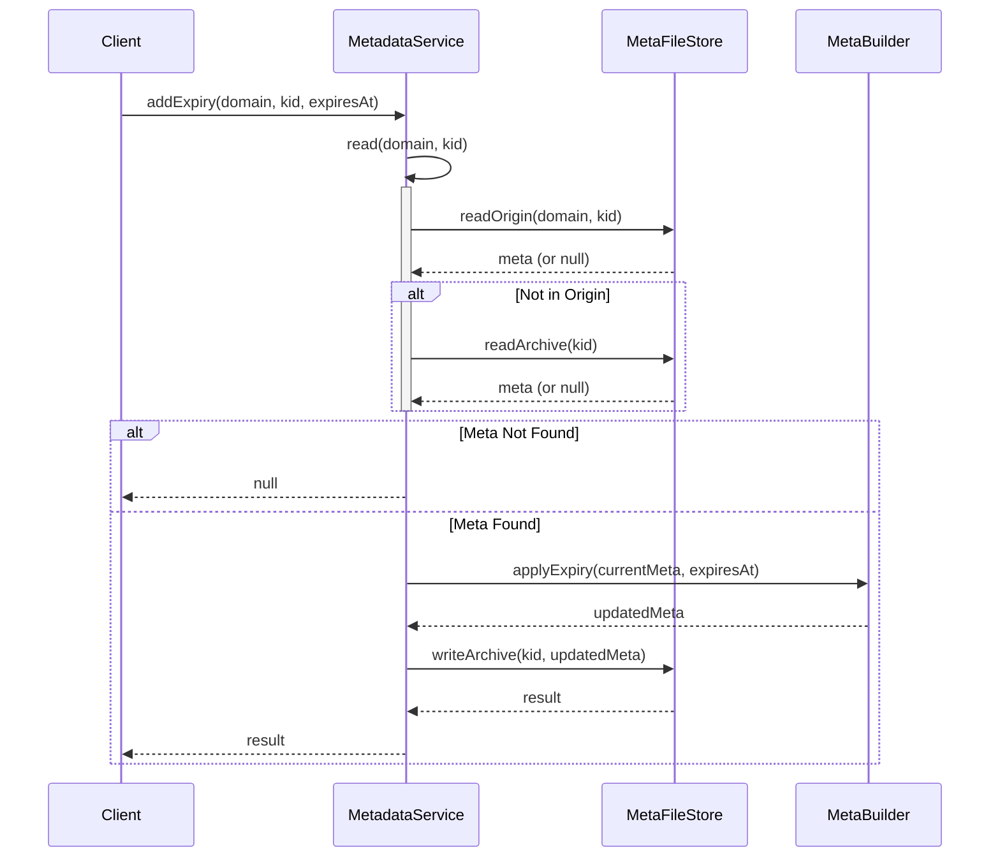

# Metadata Expiry Flow

## Sequence Diagram: `addExpiry`

```mermaid
sequenceDiagram
    participant Client
    participant Service as MetadataService
    participant Store as MetaFileStore
    participant Builder as MetaBuilder

    Client->>Service: addExpiry(domain, kid, expiresAt)

    %% Step 1: Read current
    Service->>Service: read(domain, kid)
    activate Service
    Service->>Store: readOrigin(domain, kid)
    Store-->>Service: meta (or null)

    alt Not in Origin
        Service->>Store: readArchive(kid)
        Store-->>Service: meta (or null)
    end
    deactivate Service

    alt Meta Not Found
        Service-->>Client: null
    else Meta Found
        %% Step 2: Apply Logic
        Service->>Builder: applyExpiry(currentMeta, expiresAt)
        Builder-->>Service: updatedMeta

        %% Step 3: Persist to Archive
        Service->>Store: writeArchive(kid, updatedMeta)
        Store-->>Service: result

        Service-->>Client: result
    end
```
