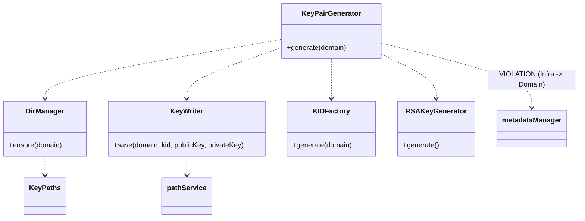

# Structure: Key Generation Module

Generated by Architectural Auditor.

```mermaid
classDiagram
    classDef domain fill:#e3f2fd,stroke:#1565c0;
    classDef infra fill:#f1f8e9,stroke:#558b2f;
    classDef violation stroke:#ff0000,stroke-width:4px,stroke-dasharray: 5 5;

    class KeyPairGenerator:::infra {
        +generate(domain)
    }
    class DirManager:::infra {
        +ensure(domain)$
    }
    class KeyWriter:::infra {
        +save(domain, kid, publicKey, privateKey)$
    }
    class KIDFactory:::infra {
        +generate(domain)$
    }
    class RSAKeyGenerator:::infra {
        +generate()$
    }
    class metadataManager:::domain {
    }
    class KeyPaths:::infra {
    }
    class pathService:::infra {
    }

    KeyPairGenerator ..> DirManager
    KeyPairGenerator ..> KIDFactory
    KeyPairGenerator ..> RSAKeyGenerator
    KeyPairGenerator ..> KeyWriter
    KeyPairGenerator ..> metadataManager : VIOLATION (Infra -> Domain)

    DirManager ..> KeyPaths
    KeyWriter ..> pathService
```
